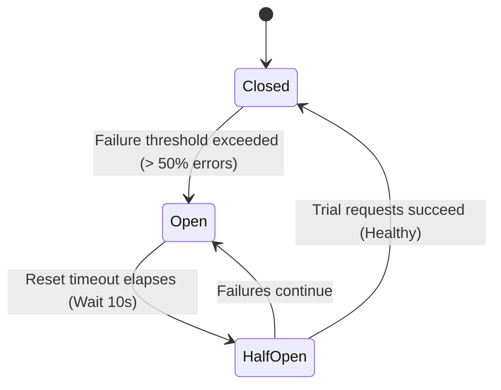

# Lesson 2: Inter-Service Microservices Communication (RestClient, WebClient, and FeignClient)

> 🌐 **Language / ភាសា:** 🇬🇧 **[English](README.md)** | 🇰🇭 [ភាសាខ្មែរ (Khmer)](README.kh.md)  
> 🧭 **Navigation:** [📚 Module Index](../README.md) | [← Previous Lesson](../01-microservices-step-by-step-guide/README.md) | [Next Lesson →](../03-deploy-aws-elastic-beanstalk/README.md)

> 📂 **Runnable Example Project:**  
> 👉 **Complete Project:** [OpenFeign Client & Eureka Discovery](../../examples/05-microservices-ecommerce)  
> 📄 **Source Code Files:** [`ProductClient.java`](../../examples/05-microservices-ecommerce/order-service/src/main/java/com/example/order/client/ProductClient.java) | [`OrderController.java`](../../examples/05-microservices-ecommerce/order-service/src/main/java/com/example/order/controller/OrderController.java) | [`ProductController.java`](../../examples/05-microservices-ecommerce/product-service/src/main/java/com/example/product/controller/ProductController.java)


## Table of Contents

- [1. Challenges of Inter-Service Communication](#1-challenges-of-inter-service-communication)
- [2. The Evolution of Spring HTTP Clients](#2-the-evolution-of-spring-http-clients)
- [3. Modern Fluent Synchronous Calls with `RestClient` (Spring Boot 3)](#3-modern-fluent-synchronous-calls-with-restclient-spring-boot-3)
- [4. Reactive Non-Blocking Calls with `WebClient`](#4-reactive-non-blocking-calls-with-webclient)
- [5. Declarative HTTP Clients via Spring Cloud OpenFeign](#5-declarative-http-clients-via-spring-cloud-openfeign)
- [6. Preventing Cascading Outages with Circuit Breakers (Resilience4j)](#6-preventing-cascading-outages-with-circuit-breakers-resilience4j)
- [7. Summary](#7-summary)

---

## 1. Challenges of Inter-Service Communication

In distributed microservice topologies, independent business modules (Orders, Customers, Inventory, Payments) reside in isolated network boundaries. Orchestrating an order placement workflow mandates traversing network boundaries via HTTP/REST:

Without architectural safeguards:
- **Network Latency Degradation:** Slow downstream endpoints cause thread pileups on upstream callers.
- **Cascading Failures:** An unhandled outage in one auxiliary service propagates upward, taking down the entire customer-facing platform.

---

## 2. The Evolution of Spring HTTP Clients

```
1. RestTemplate (Spring 3.0+) ──> [Blocking, Legacy, Maintenance Mode]
2. WebClient (Spring 5.0+)    ──> [Non-Blocking, Reactive Streams, requires WebFlux]
3. RestClient (Spring Boot 3.2+) ──> [Fluent API, Lightweight, Modern Synchronous Standard]
4. OpenFeign (Spring Cloud)   ──> [Declarative Interface, Zero-Boilerplate Web Mapping]
```

---

## 3. Modern Fluent Synchronous Calls with `RestClient` (Spring Boot 3)

Introduced in **Spring Boot 3.2** (Spring Framework 6.1), **`RestClient`** is the modern replacement for legacy `RestTemplate`. It provides the fluent, intuitive API of `WebClient` while operating seamlessly over standard synchronous, blocking I/O:

```java
package com.example.demo.client;

import org.springframework.stereotype.Service;
import org.springframework.web.client.RestClient;

@Service
public class CustomerServiceClient {

    private final RestClient restClient;

    public CustomerServiceClient(RestClient.Builder builder) {
        this.restClient = builder
                .baseUrl("http://customer-service:8081/api/v1")
                .build();
    }

    public CustomerResponse getCustomerById(Long customerId) {
        return restClient.get()
                .uri("/customers/{id}", customerId)
                .retrieve()
                .body(CustomerResponse.class); // Automatically maps JSON payload into Java Record
    }
}
```

---

## 4. Reactive Non-Blocking Calls with `WebClient`

When building high-concurrency systems requiring parallel dispatch across multiple endpoints, **`WebClient`** (from `spring-boot-starter-webflux`) is the premier non-blocking client:

```java
WebClient webClient = WebClient.create("https://api.external.com");

Mono<ProductResponse> productMono = webClient.get()
        .uri("/products/99")
        .retrieve()
        .bodyToMono(ProductResponse.class);
```

---

## 5. Declarative HTTP Clients via Spring Cloud OpenFeign

**OpenFeign** eliminates manual HTTP invocation code. Developers author an interface annotated with standard Spring MVC annotations, and Spring dynamically synthesizes the HTTP proxy client at runtime:

```java
package com.example.demo.client;

import org.springframework.cloud.openfeign.FeignClient;
import org.springframework.web.bind.annotation.GetMapping;
import org.springframework.web.bind.annotation.PathVariable;

@FeignClient(name = "customer-service", url = "http://localhost:8081/api/v1/customers")
public interface CustomerFeignClient {

    @GetMapping("/{id}")
    CustomerResponse getCustomerById(@PathVariable("id") Long id);
}
```

---

## 6. Preventing Cascading Outages with Circuit Breakers (Resilience4j)



- **Closed State:** Normal operation; all requests flow through to target downstream services.
- **Open State (Tripped):** Intercepts calls immediately, short-circuiting execution to a designated fallback method without wasting socket timeouts (Fast-Fail).
- **Half-Open State:** Periodically permits canary requests to probe whether downstream services have recovered.

```java
@CircuitBreaker(name = "customerService", fallbackMethod = "customerFallback")
public CustomerResponse getCustomerWithResilience(Long id) {
    return restClient.get().uri("/customers/{id}", id).retrieve().body(CustomerResponse.class);
}

// Fallback logic executed when downstream service is offline
public CustomerResponse customerFallback(Long id, Throwable t) {
    return new CustomerResponse(id, "Guest Customer (Fallback)", "N/A");
}
```

---

## 7. Summary

- Deprecate `RestTemplate` in greenfield architectures.
- Default to **`RestClient`** in Spring Boot 3 for synchronous client integrations.
- Utilize **`WebClient`** for high-throughput reactive event loops.
- Adopt **OpenFeign** for clean, declarative Spring Cloud service registries.
- Safeguard network boundaries with **Resilience4j Circuit Breakers** to mitigate cascading outages.

---
## 🧭 Lesson Navigation

| Previous Lesson | Module Index | Next Lesson |
| :--- | :---: | :--- |
| [← Microservices Architecture Step-by-Step Guide](../01-microservices-step-by-step-guide/README.md) | [📚 Module Index](../README.md) | [Deploying Spring Boot to AWS Elastic Beanstalk →](../03-deploy-aws-elastic-beanstalk/README.md) |
