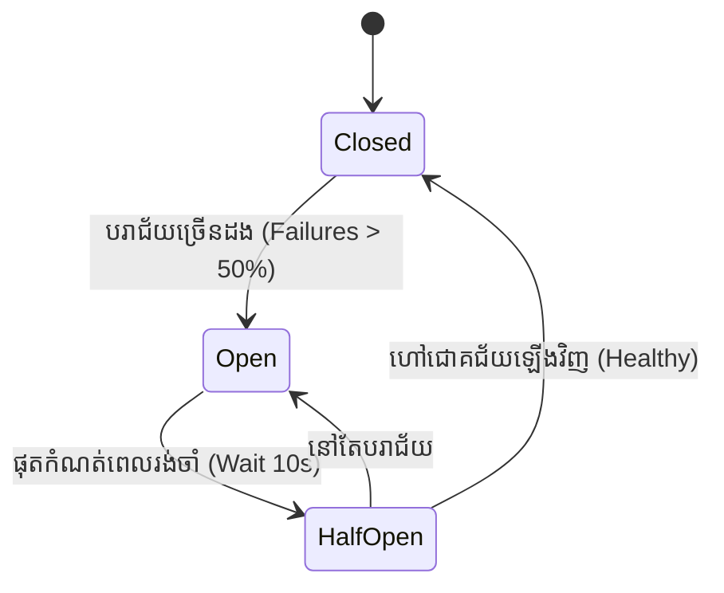

# មេរៀនទី ២: ការប្រាស្រ័យទាក់ទងគ្នាក្នុង Microservices (RestClient, WebClient, និង FeignClient)
> 🧭 **រុករក:** [📚 មាតិកា Module](../README.md) | [← មេរៀនមុន](../01-microservices-step-by-step-guide/README.md) | [មេរៀនបន្ទាប់ →](../03-deploy-aws-elastic-beanstalk/README.md)

> 📂 **កូដគំរូជាក់ស្តែង (Runnable Example Project):**  
> 👉 **គម្រោងពេញលេញ:** [OpenFeign Client & Eureka Discovery](../../examples/05-microservices-ecommerce)  
> 📄 **File កូដជាក់ស្តែង:** [`ProductClient.java`](../../examples/05-microservices-ecommerce/order-service/src/main/java/com/example/order/client/ProductClient.java) | [`OrderController.java`](../../examples/05-microservices-ecommerce/order-service/src/main/java/com/example/order/controller/OrderController.java) | [`ProductController.java`](../../examples/05-microservices-ecommerce/product-service/src/main/java/com/example/product/controller/ProductController.java)


## មាតិកា (Table of Contents)

- [1. បញ្ហាប្រឈមនៃការហៅឆ្លង Service ក្នុង Microservices](#1-បញ្ហាប្រឈមនៃការហៅឆ្លង-service-ក្នុង-microservices)
- [2. ការវិវត្តនៃ HTTP Clients ក្នុង Spring Boot](#2-ការវិវត្តនៃ-http-clients-ក្នុង-spring-boot)
- [3. ប្រើប្រាស់ `RestClient` ថ្មីក្នុង Spring Boot 3 (Fluent API)](#3-ប្រើប្រាស់-restclient-ថ្មីក្នុង-spring-boot-3-fluent-api)
- [4. ប្រើប្រាស់ `WebClient` សម្រាប់ Reactive Non-Blocking Calls](#4-ប្រើប្រាស់-webclient-សម្រាប់-reactive-non-blocking-calls)
- [5. ប្រើប្រាស់ Declarative FeignClient ជាមួយ Spring Cloud](#5-ប្រើប្រាស់-declarative-feignclient-ជាមួយ-spring-cloud)
- [6. ការពារប្រព័ន្ធកុំឱ្យដួលរលំជាមួយ Circuit Breaker (Resilience4j)](#6-ការពារប្រព័ន្ធកុំឱ្យដួលរលំជាមួយ-circuit-breaker-resilience4j)
- [7. សង្ខេប](#7-សង្ខេប)

---

## 1. បញ្ហាប្រឈមនៃការហៅឆ្លង Service ក្នុង Microservices

នៅក្នុងស្ថាបត្យកម្ម Microservices សេវាកម្មនីមួយៗ (Orders, Customers, Inventory, Payments) ដំណើរការលើ Server ដាច់ដោយឡែកពីគ្នា។ នៅពេល Order Service ត្រូវការព័ត៌មានអតិថិជនពី Customer Service វាតម្រូវឱ្យមានការហៅឆ្លងបណ្តាញ (Network HTTP Call)។

ប្រសិនបើគ្មានការរៀបចំឱ្យបានត្រឹមត្រូវ៖
- **Latency Spikes:** បណ្តាញយឺតធ្វើឱ្យ Request ទាំងមូលគាំង។
- **Cascading Failures:** Service មួយខូច ធ្វើឱ្យ Service ផ្សេងទៀតខូចតាមគ្នាទាំងអស់។

---

## 2. ការវិវត្តនៃ HTTP Clients ក្នុង Spring Boot

```
1. RestTemplate (Spring 3.0+) ──> [Blocking, ចាស់, Maintenance Mode]

2. WebClient (Spring 5.0+)    ──> [Non-Blocking, Reactive, ខ្លាំងតែត្រូវការ WebFlux]

3. RestClient (Spring Boot 3.2+) ──> [Fluent, សាមញ្ញ, ទំនើបបំផុតសម្រាប់ Sync API]

4. OpenFeign (Spring Cloud)   ──> [Declarative Interface, មិនបាច់សរសេរ URL កូដ]

```

---

## 3. ប្រើប្រាស់ `RestClient` ថ្មីក្នុង Spring Boot 3 (Fluent API)

ចាប់តាំងពី **Spring Boot 3.2** (Spring 6.1) មក Spring បានណែនាំ **`RestClient`** ដើម្បីជំនួស `RestTemplate` ដ៏ចំណាស់។ វាផ្តល់នូវ Fluent API ដ៏ស្រស់ស្អាតដូច `WebClient` តែដំណើរការលើ Synchronous Blocking ធម្មតា ដោយមិនបាច់ត្រូវការ WebFlux ឡើយ៖

```java
package com.example.demo.client;

import org.springframework.stereotype.Service;
import org.springframework.web.client.RestClient;

@Service
public class CustomerServiceClient {

    private final RestClient restClient;

    public CustomerServiceClient(RestClient.Builder builder) {
        this.restClient = builder
                .baseUrl("http://customer-service:8081/api/v1")
                .build();
    }

    public CustomerResponse getCustomerById(Long customerId) {
        return restClient.get()
                .uri("/customers/{id}", customerId)
                .retrieve()
                .body(CustomerResponse.class); // Deserialize JSON ទៅជា Java Record ដោយស្វ័យប្រវត្តិ
    }
}
```

---

## 4. ប្រើប្រាស់ `WebClient` សម្រាប់ Reactive Non-Blocking Calls

ប្រសិនបើអ្នកត្រូវការហៅ APIs ខាងក្រៅច្រើនក្នុងពេលដំណាលគ្នា (Parallel Calls) ឬប្រើប្រាស់ Reactive Programming នោះ **`WebClient`** គឺជាជម្រើសលេខមួយ៖

```java
WebClient webClient = WebClient.create("https://api.external.com");

Mono<ProductResponse> productMono = webClient.get()
        .uri("/products/99")
        .retrieve()
        .bodyToMono(ProductResponse.class);
```

---

## 5. ប្រើប្រាស់ Declarative FeignClient ជាមួយ Spring Cloud

**OpenFeign** ជួយឱ្យអ្នកមិនបាច់សរសេរកូដ HTTP Call សូម្បីមួយជួរ! អ្នកគ្រាន់តែបង្កើត Java Interface រួចដាក់ Spring MVC Annotations នោះ Spring នឹងបង្កើតកូដខាងក្នុងដោយស្វ័យប្រវត្តិ៖

```java
package com.example.demo.client;

import org.springframework.cloud.openfeign.FeignClient;
import org.springframework.web.bind.annotation.GetMapping;
import org.springframework.web.bind.annotation.PathVariable;

@FeignClient(name = "customer-service", url = "http://localhost:8081/api/v1/customers")
public interface CustomerFeignClient {

    @GetMapping("/{id}")
    CustomerResponse getCustomerById(@PathVariable("id") Long id);
}
```

---

## 6. ការពារប្រព័ន្ធកុំឱ្យដួលរលំជាមួយ Circuit Breaker (Resilience4j)



- **Closed State (ស្ថានភាពបិទ):** ប្រព័ន្ធដំណើរការធម្មតា Requests ឆ្លងកាត់បានទាំងអស់។
- **Open State (ស្ថានភាពបើក/កាត់សៀគ្វី):** បើ Service ខាងចុងគាំង នោះ Circuit Breaker នឹងកាត់ផ្តាច់ភ្លាមៗដោយមិនហៅទៅទៀតឡើយ ហើយឆ្លើយតប Fallback Method ភ្លាមៗ (Fast-Fail) ដើម្បីកុំឱ្យខាតបង់ CPU Thread។
- **Half-Open State:** សាកល្បងបញ្ជូន Request មួយចំនួនទៅមើលថាតើ Service នោះជាសះស្បើយវិញហើយឬនៅ។

```java
@CircuitBreaker(name = "customerService", fallbackMethod = "customerFallback")
public CustomerResponse getCustomerWithResilience(Long id) {
    return restClient.get().uri("/customers/{id}", id).retrieve().body(CustomerResponse.class);
}

// Fallback Method ដំណើរការពេល Service ខាងចុងខូច
public CustomerResponse customerFallback(Long id, Throwable t) {
    return new CustomerResponse(id, "Guest Customer (Fallback)", "N/A");
}
```

---

## 7. សង្ខេប

- ឈប់ប្រើ `RestTemplate` ក្នុងគម្រោងថ្មីៗ។
- ប្រើ **`RestClient`** ក្នុង Spring Boot 3 សម្រាប់ Synchronous API Calls ធម្មតា។
- ប្រើ **`WebClient`** សម្រាប់ High-concurrency / Reactive Streams។
- ប្រើ **OpenFeign** សម្រាប់ Microservices ដែលត្រូវការ Interface ស្អាត និង declarative។
- បំពាក់ **Circuit Breaker (Resilience4j)** ជានិច្ច ដើម្បីទប់ស្កាត់ Cascading Failures។

---
## 🧭 ការរុករកមេរៀន (Lesson Navigation)

| ថយក្រោយ (Previous) | មាតិកា Module (Index) | បន្ទាប់ (Next) |
| :--- | :---: | :--- |
| [← មគ្គុទ្ទេសក៍បង្កើត Microservices មួយជំហានម្តងៗ (Microservices Step-by-Step Guide)](../01-microservices-step-by-step-guide/README.md) | [📚 បញ្ជីមេរៀន Module](../README.md) | [ការ Deploy Spring Boot ទៅកាន់ AWS Elastic Beanstalk (Deploying to AWS) →](../03-deploy-aws-elastic-beanstalk/README.md) |
