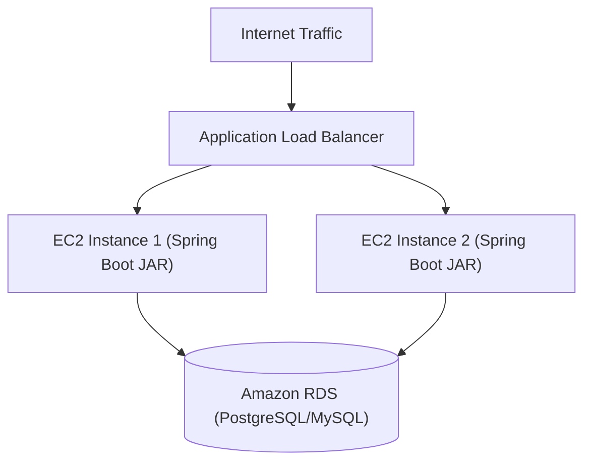

# Lesson 3: Deploying Spring Boot to AWS Elastic Beanstalk

> 🌐 **Language / ភាសា:** 🇬🇧 **[English](README.md)** | 🇰🇭 [ភាសាខ្មែរ (Khmer)](README.kh.md)  
> 🧭 **Navigation:** [📚 Module Index](../README.md) | [← Previous Lesson](../02-inter-service-communication/README.md) | [Next Lesson →](../04-microservices-sample-project/README.md)

---

## Table of Contents
1. [What is AWS Elastic Beanstalk?](#what-is-aws-elastic-beanstalk)
2. [Preparing Spring Boot for Production Deployment](#preparing-spring-boot)
3. [Building the Executable JAR with Maven](#building-the-jar)
4. [Deployment via AWS EB CLI](#deployment-via-eb-cli)
5. [Configuring Environment Variables and Amazon RDS](#configuring-environment-variables)
6. [Monitoring and Log Inspection](#monitoring-and-logs)

---

## What is AWS Elastic Beanstalk?
**AWS Elastic Beanstalk** is an AWS Platform-as-a-Service (PaaS) orchestration engine for deploying, scaling, and managing enterprise web services. Elastic Beanstalk automatically provisions underlying Amazon EC2 virtual instances, Application Load Balancers, health monitors, and Auto Scaling groups.



---

## Preparing Spring Boot for Production Deployment

Ensure Spring Boot dynamically binds to the `PORT` environment variable injected by Elastic Beanstalk:

```yaml
server:
  port: ${PORT:5000}
```

Build the self-contained executable JAR artifact:
```bash
./mvnw clean package -DskipTests
```
The output artifact is generated in `target/*.jar`.

---

## Deployment via AWS EB CLI

### 1. Install EB CLI:
```bash
pip install awsebcli --upgrade
```

### 2. Initialize the application:
```bash
eb init -p java-17 my-spring-boot-app --region us-east-1
```

### 3. Create the environment and deploy:
```bash
eb create my-prod-env --instance_type t3.micro
eb deploy
```

### 4. View the deployed application:
```bash
eb open
```

---

## Configuring Environment Variables and Amazon RDS
In the Elastic Beanstalk Console navigate to **Configuration** -> **Updates, monitoring, and logging** -> **Platform software**:
- `SPRING_PROFILES_ACTIVE`: `prod`
- `SPRING_DATASOURCE_URL`: `jdbc:postgresql://<rds-endpoint>:5432/mydb`
- `SPRING_DATASOURCE_USERNAME`: `<db-user>`
- `SPRING_DATASOURCE_PASSWORD`: `<db-password>`

---

## 🧭 Lesson Navigation

| Previous Lesson | Module Index | Next Lesson |
| :--- | :---: | :--- |
| [← Inter-Service Microservices Communication (RestClient, WebClient, and FeignClient)](../02-inter-service-communication/README.md) | [📚 Module Index](../README.md) | [Full Microservices Sample Project →](../04-microservices-sample-project/README.md) |
