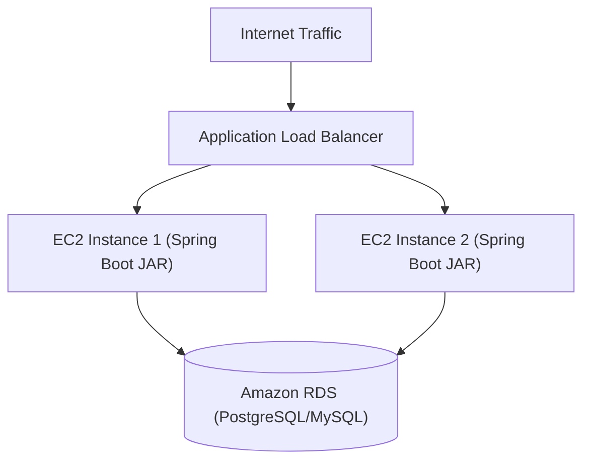

# មេរៀនទី ៣: ការ Deploy Spring Boot ទៅកាន់ AWS Elastic Beanstalk (Deploying to AWS)
> 🧭 **រុករក:** [📚 មាតិកា Module](../README.md) | [← មេរៀនមុន](../02-inter-service-communication/README.md) | [មេរៀនបន្ទាប់ →](../04-microservices-sample-project/README.md)

---

## មាតិកា (Table of Contents)
1. [តើអ្វីទៅជា AWS Elastic Beanstalk?](#តើអ្វីទៅជា-aws-elastic-beanstalk)
2. [ការរៀបចំ Spring Boot Application សម្រាប់ Production](#ការរៀបចំ-spring-boot)
3. [ការបង្កើត Executable JAR តាមរយៈ Maven Package](#ការបង្កើត-executable-jar)
4. [ការ Deploy តាមរយៈ AWS Web Management Console](#ការ-deploy-តាម-aws-console)
5. [ការ Deploy តាមរយៈ AWS EB CLI](#ការ-deploy-តាម-aws-eb-cli)
6. [ការកំណត់ Environment Variables និង Database (RDS)](#ការកំណត់-environment-variables)

---

## តើអ្វីទៅជា AWS Elastic Beanstalk?
**AWS Elastic Beanstalk** គឺជាសេវាកម្ម Platform as a Service (PaaS) របស់ Amazon Web Services ដែលជួយឱ្យ developer អាច deploy និង scale កម្មវិធី web applications (រួមទាំង Java Spring Boot) បានយ៉ាងរហ័ស ដោយ AWS គ្រប់គ្រងលើ Infrastructure ដូចជា EC2 instances, Load Balancer, Auto-scaling, និង OS patching ដោយស្វ័យប្រវត្តិ។



---

## ការរៀបចំ Executable JAR តាមរយៈ Maven

Spring Boot ត្រូវកំណត់ Port តាម Environment Variable `PORT` ដែល AWS Elastic Beanstalk ផ្តល់ឱ្យ (Default គឺ 5000 ឬ 8080)៖

```yaml
server:
  port: ${PORT:5000}
```

ដំណើរការ packaging៖
```bash
./mvnw clean package -DskipTests
```
អ្នកនឹងទទួលបាន JAR file នៅ `target/my-app-0.0.1-SNAPSHOT.jar`។

---

## ការ Deploy តាមរយៈ AWS EB CLI

### 1. តំឡើង EB CLI:
```bash
pip install awsebcli --upgrade
```

### 2. Initialize គម្រោង:
```bash
eb init -p java-17 my-spring-boot-app --region us-east-1
```

### 3. បង្កើត Environment និង Deploy:
```bash
eb create my-prod-env --instance_type t3.micro
eb deploy
```

### 4. បើកមើលកម្មវិធីផ្ទាល់:
```bash
eb open
```

---

## ការកំណត់ Environment Variables និង RDS
នៅក្នុង AWS Elastic Beanstalk Console -> **Configuration** -> **Software**:

- `SPRING_PROFILES_ACTIVE`: `prod`
- `SPRING_DATASOURCE_URL`: `jdbc:postgresql://<rds-endpoint>:5432/mydb`

- `SPRING_DATASOURCE_USERNAME`: `<db-user>`

- `SPRING_DATASOURCE_PASSWORD`: `<db-password>`

---

## 🧭 ការរុករកមេរៀន (Lesson Navigation)

| ថយក្រោយ (Previous) | មាតិកា Module (Index) | បន្ទាប់ (Next) |
| :--- | :---: | :--- |
| [← ការប្រាស្រ័យទាក់ទងគ្នាក្នុង Microservices (RestClient, WebClient, និង FeignClient)](../02-inter-service-communication/README.md) | [📚 បញ្ជីមេរៀន Module](../README.md) | [គម្រោងគំរូ Microservices ពេញលេញ (Full Microservices Sample Project) →](../04-microservices-sample-project/README.md) |
