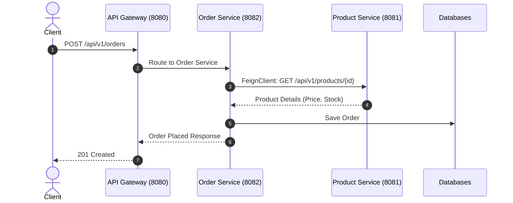

# មេរៀនទី ៤: គម្រោងគំរូ Microservices ពេញលេញ (Full Microservices Sample Project)

> 🌐 **ភាសា / Language:** 🇰🇭 **[ភាសាខ្មែរ (Khmer)](README.kh.md)** | 🇬🇧 [English](README.md)  
> 🧭 **រុករក:** [📚 មាតិកា Module](../README.kh.md) | [← មេរៀនមុន](../03-deploy-aws-elastic-beanstalk/README.kh.md) | [មេរៀនបន្ទាប់ →](../../08-spring-boot-with-kafka/01-kafka-producer/README.kh.md)

> 📂 **កូដគំរូជាក់ស្តែង (Runnable Example Project):**  
> 👉 **គម្រោងពេញលេញ:** [E-Commerce Microservices Multi-Module System](../../examples/05-microservices-ecommerce)  
> 📄 **File កូដជាក់ស្តែង:** [`docker-compose.yml`](../../examples/05-microservices-ecommerce/docker-compose.yml) | [`eureka-server/pom.xml`](../../examples/05-microservices-ecommerce/eureka-server/pom.xml) | [`api-gateway/pom.xml`](../../examples/05-microservices-ecommerce/api-gateway/pom.xml) | [`product-service/pom.xml`](../../examples/05-microservices-ecommerce/product-service/pom.xml) | [`order-service/pom.xml`](../../examples/05-microservices-ecommerce/order-service/pom.xml)


---

## មាតិកា (Table of Contents)
1. [ទិដ្ឋភាពទូទៅនៃគម្រោង E-Commerce Microservices](#ទិដ្ឋភាពទូទៅនៃគម្រោង)
2. [រចនាសម្ព័ន្ធ Multi-module Architecture](#រចនាសម្ព័ន្ធ-multi-module)
3. [ការបង្កើត Product Service](#ការបង្កើត-product-service)
4. [ការបង្កើត Order Service ជាមួយ FeignClient](#ការបង្កើត-order-service)
5. [Docker Compose សម្រាប់ Orchestrate Services ទាំងអស់](#docker-compose-orchestration)
6. [ការធ្វើតេស្តលំហូរការងារទាំងមូល (End-to-End Test)](#ការធ្វើតេស្ត)

---

## ទិដ្ឋភាពទូទៅនៃគម្រោង
នៅក្នុងគម្រោងបញ្ចប់ Module 7 នេះ យើងនឹងសាងសង់ **E-Commerce Microservices Platform** មួយពេញលេញដែលមានសេវាកម្មចំនួន ៤៖
1. **Eureka Server (Port 8761)**: Service Registry
2. **API Gateway (Port 8080)**: Reverse Proxy & Dynamic Routing
3. **Product Service (Port 8081)**: គ្រប់គ្រងទំនិញ
4. **Order Service (Port 8082)**: គ្រប់គ្រងការបញ្ជាទិញ (ហៅ FeignClient ទៅ Product Service)



---

## ការបង្កើត OpenFeign Client នៅក្នុង Order Service

```java
package com.example.orderservice.client;

import org.springframework.cloud.openfeign.FeignClient;
import org.springframework.web.bind.annotation.GetMapping;
import org.springframework.web.bind.annotation.PathVariable;

public record ProductDto(Long id, String name, double price, int stock) {}

@FeignClient(name = "PRODUCT-SERVICE")
public interface ProductClient {
    @GetMapping("/api/v1/products/{id}")
    ProductDto getProductById(@PathVariable("id") Long id);
}
```

---

## Order Service Business Logic

```java
@Service
public class OrderService {

    private final ProductClient productClient;
    private final OrderRepository orderRepo;

    public OrderService(ProductClient productClient, OrderRepository orderRepo) {
        this.productClient = productClient;
        this.orderRepo = orderRepo;
    }

    public OrderResponse createOrder(CreateOrderRequest req) {
        // ហៅ FeignClient ទៅកាន់ Product Service តាមរយៈ Eureka Discovery
        ProductDto product = productClient.getProductById(req.productId());
        
        if (product.stock() < req.quantity()) {
            throw new IllegalStateException("Not enough stock for product: " + product.name());
        }

        double total = product.price() * req.quantity();
        Order order = orderRepo.save(new Order(req.productId(), req.quantity(), total));
        
        return new OrderResponse(order.getId(), product.name(), order.getQuantity(), total);
    }
}
```

---

## Docker Compose សម្រាប់ Orchestrate ប្រព័ន្ធទាំងមូល

```yaml
version: '3.8'
services:
  eureka-server:
    build: ./eureka-server
    ports:
      - "8761:8761"

  api-gateway:
    build: ./api-gateway
    ports:
      - "8080:8080"
    depends_on:
      - eureka-server

  product-service:
    build: ./product-service
    ports:
      - "8081:8081"
    depends_on:
      - eureka-server

  order-service:
    build: ./order-service
    ports:
      - "8082:8082"
    depends_on:
      - eureka-server
      - product-service
```

---

## 🧭 ការរុករកមេរៀន (Lesson Navigation)

| ថយក្រោយ (Previous) | មាតិកា Module (Index) | បន្ទាប់ (Next) |
| :--- | :---: | :--- |
| [← ការ Deploy Spring Boot ទៅកាន់ AWS Elastic Beanstalk (Deploying to AWS)](../03-deploy-aws-elastic-beanstalk/README.kh.md) | [📚 បញ្ជីមេរៀន Module](../README.kh.md) | [ស្ថាបត្យកម្ម Event-Driven Messaging និង Kafka Producer ជាមួយ KafkaTemplate →](../../08-spring-boot-with-kafka/01-kafka-producer/README.kh.md) |
