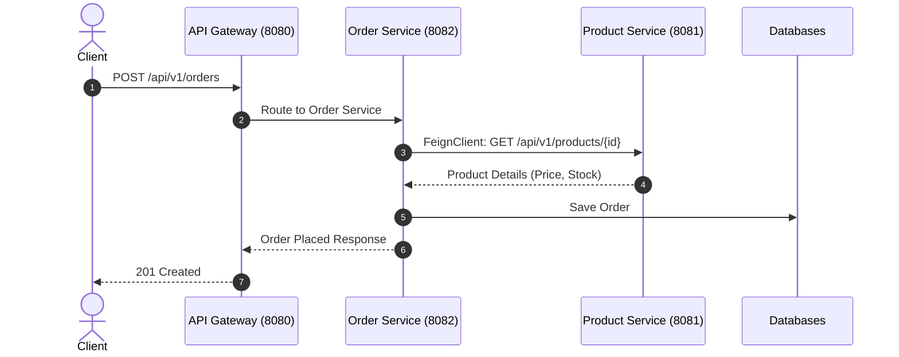

# Lesson 4: Full Microservices Sample Project

> 🌐 **Language / ភាសា:** 🇬🇧 **[English](README.md)** | 🇰🇭 [ភាសាខ្មែរ (Khmer)](README.kh.md)  
> 🧭 **Navigation:** [📚 Module Index](../README.md) | [← Previous Lesson](../03-deploy-aws-elastic-beanstalk/README.md) | [Next Lesson →](../../08-spring-boot-with-kafka/01-kafka-producer/README.md)

> 📂 **Runnable Example Project:**  
> 👉 **Complete Project:** [E-Commerce Microservices Multi-Module System](../../examples/05-microservices-ecommerce)  
> 📄 **Source Code Files:** [`docker-compose.yml`](../../examples/05-microservices-ecommerce/docker-compose.yml) | [`eureka-server/pom.xml`](../../examples/05-microservices-ecommerce/eureka-server/pom.xml) | [`api-gateway/pom.xml`](../../examples/05-microservices-ecommerce/api-gateway/pom.xml) | [`product-service/pom.xml`](../../examples/05-microservices-ecommerce/product-service/pom.xml) | [`order-service/pom.xml`](../../examples/05-microservices-ecommerce/order-service/pom.xml)


---

## Table of Contents
1. [E-Commerce Microservices Architecture Overview](#architecture-overview)
2. [Multi-Module Maven Structure](#multi-module-structure)
3. [Building the Product Service](#product-service)
4. [Building the Order Service with OpenFeign](#order-service)
5. [Docker Compose Orchestration](#docker-compose-orchestration)
6. [End-to-End Verification](#end-to-end-verification)

---

## Architecture Overview
In this capstone project for Module 7, we implement an **E-Commerce Microservices Platform** composed of four cooperating applications:
1. **Eureka Server (Port 8761)**: Service Discovery Registry
2. **API Gateway (Port 8080)**: Intelligent Edge Router
3. **Product Service (Port 8081)**: Catalog & Inventory Management
4. **Order Service (Port 8082)**: Order Processing leveraging OpenFeign for inter-service communication



---

## OpenFeign Client in Order Service

```java
package com.example.orderservice.client;

import org.springframework.cloud.openfeign.FeignClient;
import org.springframework.web.bind.annotation.GetMapping;
import org.springframework.web.bind.annotation.PathVariable;

public record ProductDto(Long id, String name, double price, int stock) {}

@FeignClient(name = "PRODUCT-SERVICE")
public interface ProductClient {
    @GetMapping("/api/v1/products/{id}")
    ProductDto getProductById(@PathVariable("id") Long id);
}
```

---

## Order Service Business Logic

```java
@Service
public class OrderService {

    private final ProductClient productClient;
    private final OrderRepository orderRepo;

    public OrderService(ProductClient productClient, OrderRepository orderRepo) {
        this.productClient = productClient;
        this.orderRepo = orderRepo;
    }

    public OrderResponse createOrder(CreateOrderRequest req) {
        ProductDto product = productClient.getProductById(req.productId());
        
        if (product.stock() < req.quantity()) {
            throw new IllegalStateException("Not enough stock for product: " + product.name());
        }

        double total = product.price() * req.quantity();
        Order order = orderRepo.save(new Order(req.productId(), req.quantity(), total));
        
        return new OrderResponse(order.getId(), product.name(), order.getQuantity(), total);
    }
}
```

---

## Docker Compose Orchestration

```yaml
version: '3.8'
services:
  eureka-server:
    build: ./eureka-server
    ports:
      - "8761:8761"

  api-gateway:
    build: ./api-gateway
    ports:
      - "8080:8080"
    depends_on:
      - eureka-server

  product-service:
    build: ./product-service
    ports:
      - "8081:8081"
    depends_on:
      - eureka-server

  order-service:
    build: ./order-service
    ports:
      - "8082:8082"
    depends_on:
      - eureka-server
      - product-service
```

---

## 🧭 Lesson Navigation

| Previous Lesson | Module Index | Next Lesson |
| :--- | :---: | :--- |
| [← Deploying Spring Boot to AWS Elastic Beanstalk](../03-deploy-aws-elastic-beanstalk/README.md) | [📚 Module Index](../README.md) | [Event-Driven Messaging Architecture and Kafka Producer with KafkaTemplate →](../../08-spring-boot-with-kafka/01-kafka-producer/README.md) |
