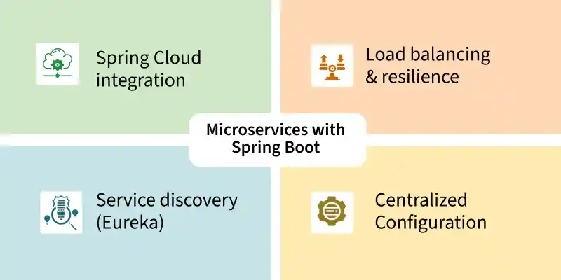
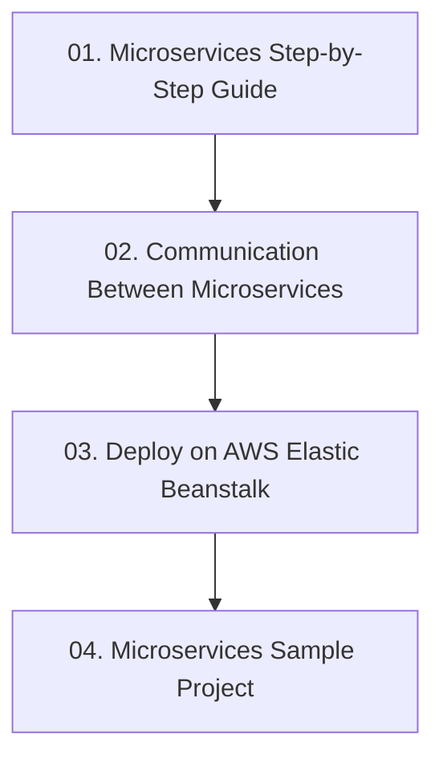

# Module 7: ស្ថាបត្យកម្ម Microservices ជាមួយ Spring Boot (Microservices)

> 🌐 **ភាសា / Language:** 🇰🇭 **[ភាសាខ្មែរ (Khmer)](README.kh.md)** | 🇬🇧 [English](README.md)

> 📂 **គម្រោងកូដគំរូជាក់ស្តែងសម្រាប់ Module នេះ (Runnable Project):**  
> 👉 **[E-Commerce Microservices Architecture (Spring Cloud)](../examples/05-microservices-ecommerce)**  
> គម្រោងពេញលេញ ៤ សេវាកម្ម (Eureka Server, API Gateway, Product Service, Order Service ជាមួយ OpenFeign) និង Docker Compose។

---

## 📖 សេចក្តីផ្តើមអំពី Module

ការកសាងប្រព័ន្ធ Microservices ខ្នាតធំ៖ មូលដ្ឋានគ្រឹះ Microservices, ការប្រាស្រ័យទាក់ទងគ្នា (RestClient, Feign), ការ Deploy លើ AWS Elastic Beanstalk, និងគម្រោង Microservices គំរូ។

---

## 🗺️ ផែនទីសិក្សាប្រចាំ Module (Learning Roadmap)

---

## 📚 បញ្ជីមេរៀនក្នុង Module (4 Lessons)

| មេរៀន (Lesson) | ប្រធានបទ (Topic) | ការពិពណ៌នា (Description) |
| :---: | :--- | :--- |
| **01** | [Microservices Step-by-Step Guide](01-microservices-step-by-step-guide/README.kh.md) | ការស្វែងយល់អំពី Microservices Architecture និងការបំបែក Domain |
| **02** | [Communication Between Microservices](02-inter-service-communication/README.kh.md) | ការហៅឆ្លង Service ជាមួយ RestClient, WebClient, និង OpenFeign |
| **03** | [Deploy on AWS Elastic Beanstalk](03-deploy-aws-elastic-beanstalk/README.kh.md) | ការវេចខ្ចប់ JAR និងការ Deploy ទៅកាន់ AWS Cloud |
| **04** | [Microservices Sample Project](04-microservices-sample-project/README.kh.md) | ស្ថាបត្យកម្មគម្រោងជាក់ស្តែង៖ Order, Product, និង Payment Services |

---

## 🧭 ការរុករក (Navigation)

| ថយក្រោយ (Previous) | មាតិកាចម្បង (Main Index) | បន្ទាប់ (Next Module) |
| :--- | :---: | :--- |
| [Module 6: Advanced Features](../06-advanced-spring-boot-features/README.kh.md) | [📚 មាតិកា Spring Boot](../README.kh.md) | [Module 8: Kafka Messaging →](../08-spring-boot-with-kafka/README.kh.md) |
