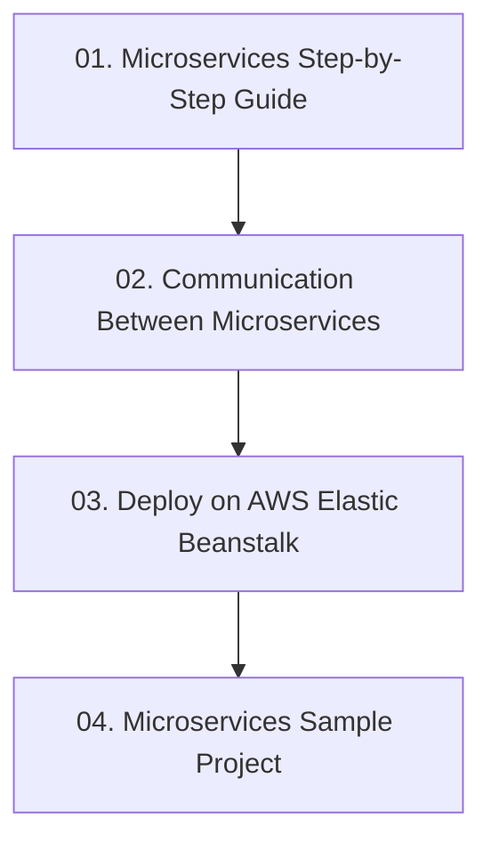

# Module 7: Microservices Architecture with Spring Boot

> 🌐 **Language / ភាសា:** 🇰🇭 [ភាសាខ្មែរ (Khmer)](README.kh.md) | 🇬🇧 **[English](README.md)**

> 📂 **Runnable Example Project for this Module:**  
> 👉 **[E-Commerce Microservices Architecture (Spring Cloud)](../examples/05-microservices-ecommerce)**  
> Complete 4-service platform (Eureka Server, API Gateway, Product Service, Order Service with OpenFeign) and Docker Compose.

---

## 📖 Module Overview

Architecting distributed systems: microservices principles, inter-service REST communication (RestClient, Feign), deploying to AWS Elastic Beanstalk, and sample project design.

---

## 🗺️ Module Learning Roadmap

---

## 📚 Lessons in This Module (4 Lessons)

| Lesson | Topic | Description |
| :---: | :--- | :--- |
| **01** | [Microservices Step-by-Step Guide](01-microservices-step-by-step-guide/README.md) | Step-by-step guide to microservices fundamentals and service boundaries |
| **02** | [Communication Between Microservices](02-inter-service-communication/README.md) | Synchronous inter-service communication: RestClient, WebClient, Feign |
| **03** | [Deploy on AWS Elastic Beanstalk](03-deploy-aws-elastic-beanstalk/README.md) | Packaging and deploying containerized microservices to AWS Beanstalk |
| **04** | [Microservices Sample Project](04-microservices-sample-project/README.md) | Architectural walkthrough of a multi-service eCommerce ecosystem |

---

## 🧭 Navigation

| Previous | Main Index | Next Module |
| :--- | :---: | :--- |
| [Module 6: Advanced Features](../06-advanced-spring-boot-features/README.md) | [📚 Spring Boot Home](../README.md) | [Module 8: Kafka Messaging →](../08-spring-boot-with-kafka/README.md) |
