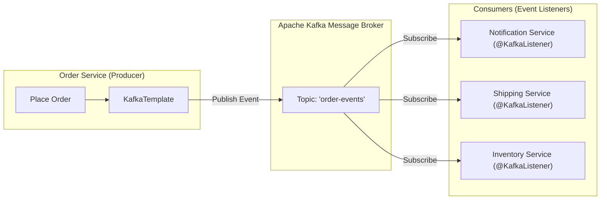

# មេរៀនទី ១: ស្ថាបត្យកម្ម Event-Driven Messaging និង Kafka Producer ជាមួយ KafkaTemplate

> 🌐 **ភាសា / Language:** 🇰🇭 **[ភាសាខ្មែរ (Khmer)](README.kh.md)** | 🇬🇧 [English](README.md)  
> 🧭 **រុករក:** [📚 មាតិកា Module](../README.kh.md) | [← មេរៀនមុន](../../07-microservices-with-spring-boot/04-microservices-sample-project/README.kh.md) | [មេរៀនបន្ទាប់ →](../02-kafka-consumer/README.kh.md)

> 📂 **កូដគំរូជាក់ស្តែង (Runnable Example Project):**  
> 👉 **គម្រោងពេញលេញ:** [Kafka Producer & Event Publication](../../examples/04-kafka-messaging)  
> 📄 **File កូដជាក់ស្តែង:** [`OrderEventProducer.java`](../../examples/04-kafka-messaging/src/main/java/com/example/kafka/producer/OrderEventProducer.java) | [`OrderCreatedEvent.java`](../../examples/04-kafka-messaging/src/main/java/com/example/kafka/event/OrderCreatedEvent.java) | [`OrderEventController.java`](../../examples/04-kafka-messaging/src/main/java/com/example/kafka/controller/OrderEventController.java)


## មាតិកា (Table of Contents)

- [1. ស្ថាបត្យកម្ម Event-Driven Architecture (EDA) vs Synchronous REST](#1-ស្ថាបត្យកម្ម-event-driven-architecture-eda-vs-synchronous-rest)
- [2. គោលគំនិតគ្រឹះនៃ Apache Kafka](#2-គោលគំនិតគ្រឹះនៃ-apache-kafka)
- [3. ការដំឡើង Dependency `spring-kafka`](#3-ការដំឡើង-dependency-spring-kafka)
- [4. ការកំណត់ Configuration ក្នុង `application.yml`](#4-ការកំណត់-configuration-ក្នុង-applicationyml)
- [5. ការបង្កើត Kafka Producer ដោយប្រើ `KafkaTemplate`](#5-ការបង្កើត-kafka-producer-ដោយប្រើ-kafkatemplate)
- [6. ការបង្កើត Kafka Consumer ដោយប្រើ `@KafkaListener`](#6-ការបង្កើត-kafka-consumer-ដោយប្រើ-kafkalistener)
- [7. សង្ខេប](#7-សង្ខេប)

---

## 1. ស្ថាបត្យកម្ម Event-Driven Architecture (EDA) vs Synchronous REST

នៅក្នុងប្រព័ន្ធ Microservices ប្រសិនបើយើងប្រើតែ HTTP REST ដើម្បីហៅពី Service មួយទៅ Service មួយទៀត (Synchronous):
- បើសិន Service ខាងចុងគាំង (Down) នោះ Service ខាងដើមនឹងគាំងតាម (Cascading Failure)។
- Client ត្រូវអង្គុយរង់ចាំយូររហូតដល់គ្រប់ Service ឆ្លើយតបចប់។

**Event-Driven Architecture (EDA)** ប្រើប្រាស់ Message Broker (ដូចជា **Apache Kafka**) ជាអន្តរការីកណ្តាល៖
- **Decoupled (មិនរណបគ្នា):** Order Service គ្រាន់តែបោះ Event ថា `"បានបង្កើត Order #123"` ចូល Kafka រួចត្រឡប់ទៅប្រាប់ User វិញភ្លាមៗ។
- **Resilient (ភាពធន់ខ្ពស់):** Notification Service ឬ Shipping Service អាចចូលមកទាញយក Event ទៅដំណើរការតាមសម្រួល ទោះបីជាពេលនោះ Server រវល់ខ្លាំង ឬដាច់ភ្លើងមួយភ្លែតក៏ដោយ ក៏ទិន្នន័យមិនបាត់បង់ឡើយ។



---

## 2. គោលគំនិតគ្រឹះនៃ Apache Kafka

- **Topic (ប្រធានបទ):** គឺជាបណ្តាញ ឬថតផ្ទុក Stream នៃសារ (Messages/Events) ជាក់លាក់មួយ (ឧ. `order-placed-topic`)។
- **Producer (អ្នកផលិត):** Application ដែលបញ្ជូន Messages ចូលទៅក្នុង Topic។
- **Consumer (អ្នកប្រើប្រាស់):** Application ដែលចាំស្តាប់ និងទាញយក Messages ពី Topic មកដំណើរការ។
- **Consumer Group:** ក្រុមនៃ Consumer Instances ដែលរួមគ្នាទាញ Data ពី Topic ដើម្បីចែករំលែកបន្ទុកការងារ (Load Balancing)។

---

## 3. ការដំឡើង Dependency `spring-kafka`

```xml
<dependency>
    <groupId>org.springframework.kafka</groupId>
    <artifactId>spring-kafka</artifactId>
</dependency>
```

---

## 4. ការកំណត់ Configuration ក្នុង `application.yml`

កំណត់ការតភ្ជាប់ទៅកាន់ Kafka Broker ព្រមទាំងកំណត់ Serializer/Deserializer សម្រាប់ JSON Payload៖

```yaml
spring:
  kafka:
    bootstrap-servers: localhost:9092
    producer:
      key-serializer: org.apache.kafka.common.serialization.StringSerializer
      value-serializer: org.springframework.kafka.support.serializer.JsonSerializer
    consumer:
      group-id: ecommerce-group
      auto-offset-reset: earliest
      key-deserializer: org.apache.kafka.common.serialization.StringDeserializer
      value-deserializer: org.springframework.kafka.support.serializer.JsonDeserializer
      properties:
        spring.json.trusted.packages: "com.example.demo.dto"
```

---

## 5. ការបង្កើត Kafka Producer ដោយប្រើ `KafkaTemplate`

### 1. Event Model (DTO):
```java
package com.example.demo.dto;

import java.math.BigDecimal;

public record OrderPlacedEvent(String orderId, String customerEmail, BigDecimal totalAmount) {}
```

### 2. Producer Service:
```java
package com.example.demo.kafka;

import com.example.demo.dto.OrderPlacedEvent;
import org.springframework.kafka.core.KafkaTemplate;
import org.springframework.stereotype.Service;

@Service
public class OrderEventProducer {

    private static final String TOPIC = "order-events";
    private final KafkaTemplate<String, OrderPlacedEvent> kafkaTemplate;

    public OrderEventProducer(KafkaTemplate<String, OrderPlacedEvent> kafkaTemplate) {
        this.kafkaTemplate = kafkaTemplate;
    }

    public void publishOrderPlaced(OrderPlacedEvent event) {
        System.out.println("🚀 កំពុងបញ្ជូន Event ទៅកាន់ Kafka Topic: " + event.orderId());
        // បញ្ជូន Message ដោយយក orderId ធ្វើជា Key
        kafkaTemplate.send(TOPIC, event.orderId(), event);
    }
}
```

---

## 6. ការបង្កើត Kafka Consumer ដោយប្រើ `@KafkaListener`

```java
package com.example.demo.kafka;

import com.example.demo.dto.OrderPlacedEvent;
import org.springframework.kafka.annotation.KafkaListener;
import org.springframework.stereotype.Service;

@Service
public class OrderEventConsumer {

    @KafkaListener(topics = "order-events", groupId = "ecommerce-group")
    public void consumeOrderEvent(OrderPlacedEvent event) {
        System.out.println("📥 ទទួលបាន Event ពី Kafka ដោយជោគជ័យ:");
        System.out.println("   - Order ID: " + event.orderId());
        System.out.println("   - អតិថិជន: " + event.customerEmail());
        System.out.println("   - ចំនួនទឹកប្រាក់: $" + event.totalAmount());

        // បន្តដំណើរការ Logic បន្ទាប់ ដូចជាផ្ញើ SMS ឬរៀបចំទំនិញដឹកជញ្ជូន...
    }
}
```

---

## 7. សង្ខេប

- **EDA** បំបែក Microservices ឱ្យឯករាជ្យដាច់ពីគ្នា (Decoupled & Asynchronous)។
- **Kafka** ដើរតួជា Distributed Log Streaming Broker ដែលមានល្បឿនលឿន និងអាចផ្ទុកទិន្នន័យរាប់លាន Messages ក្នុងមួយវិនាទី។
- Spring Boot ផ្តល់ `KafkaTemplate` សម្រាប់បាញ់ Event ចេញ និង `@KafkaListener` សម្រាប់ចាំស្តាប់ Event ដោយស្វ័យប្រវត្តិ។

---
## 🧭 ការរុករកមេរៀន (Lesson Navigation)

| ថយក្រោយ (Previous) | មាតិកា Module (Index) | បន្ទាប់ (Next) |
| :--- | :---: | :--- |
| [← គម្រោងគំរូ Microservices ពេញលេញ (Full Microservices Sample Project)](../../07-microservices-with-spring-boot/04-microservices-sample-project/README.kh.md) | [📚 បញ្ជីមេរៀន Module](../README.kh.md) | [ការបង្កើត Kafka Consumer ជាមួយ @KafkaListener (Kafka Consumer in Spring Boot) →](../02-kafka-consumer/README.kh.md) |
