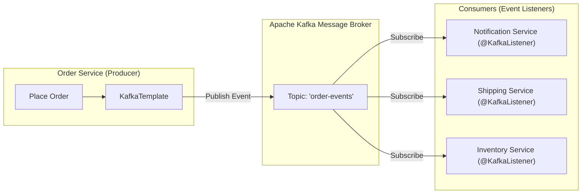

# Lesson 1: Event-Driven Messaging Architecture and Kafka Producer with KafkaTemplate

> 🌐 **Language / ភាសា:** 🇬🇧 **[English](README.md)** | 🇰🇭 [ភាសាខ្មែរ (Khmer)](README.kh.md)  
> 🧭 **Navigation:** [📚 Module Index](../README.md) | [← Previous Lesson](../../07-microservices-with-spring-boot/04-microservices-sample-project/README.md) | [Next Lesson →](../02-kafka-consumer/README.md)

> 📂 **Runnable Example Project:**  
> 👉 **Complete Project:** [Kafka Producer & Event Publication](../../examples/04-kafka-messaging)  
> 📄 **Source Code Files:** [`OrderEventProducer.java`](../../examples/04-kafka-messaging/src/main/java/com/example/kafka/producer/OrderEventProducer.java) | [`OrderCreatedEvent.java`](../../examples/04-kafka-messaging/src/main/java/com/example/kafka/event/OrderCreatedEvent.java) | [`OrderEventController.java`](../../examples/04-kafka-messaging/src/main/java/com/example/kafka/controller/OrderEventController.java)


## Table of Contents

- [1. Event-Driven Architecture (EDA) vs Synchronous REST](#1-event-driven-architecture-eda-vs-synchronous-rest)
- [2. Core Apache Kafka Concepts](#2-core-apache-kafka-concepts)
- [3. Adding the `spring-kafka` Starter](#3-adding-the-spring-kafka-starter)
- [4. Declaring Configuration in `application.yml`](#4-declaring-configuration-in-applicationyml)
- [5. Producing Events with `KafkaTemplate`](#5-producing-events-with-kafkatemplate)
- [6. Consuming Events with `@KafkaListener`](#6-consuming-events-with-kafkalistener)
- [7. Summary](#7-summary)

---

## 1. Event-Driven Architecture (EDA) vs Synchronous REST

In distributed microservices, relying solely on synchronous HTTP REST invocations introduces tight coupling:
- A downstream service outage triggers cascading failures across upstream components.
- The client connection blocks until the slowest participating downstream service responds.

**Event-Driven Architecture (EDA)** employs a distributed message broker (such as **Apache Kafka**) as a resilient communication buffer:
- **Decoupled:** The Order Service publishes an `"order-placed"` event to Kafka and returns an immediate response to the client.
- **Resilient & Elastic:** Downstream services (Notification, Shipping, Inventory) consume events asynchronously at their own processing cadence. Even during temporary service downtime, messages persist safely in Kafka logs without data loss.



---

## 2. Core Apache Kafka Concepts

- **Topic:** An append-only, distributed commit log partitioned across brokers (e.g., `order-events`).
- **Producer:** An application publishing record streams to target Kafka topics.
- **Consumer:** An application subscribing to topics to process incoming message feeds.
- **Consumer Group:** A coordinated group of consumer instances sharing topic partition workloads for horizontal scaling.

---

## 3. Adding the `spring-kafka` Starter

```xml
<dependency>
    <groupId>org.springframework.kafka</groupId>
    <artifactId>spring-kafka</artifactId>
</dependency>
```

---

## 4. Declaring Configuration in `application.yml`

Configure connection parameters along with JSON message serializers and deserializers:

```yaml
spring:
  kafka:
    bootstrap-servers: localhost:9092
    producer:
      key-serializer: org.apache.kafka.common.serialization.StringSerializer
      value-serializer: org.springframework.kafka.support.serializer.JsonSerializer
    consumer:
      group-id: ecommerce-group
      auto-offset-reset: earliest
      key-deserializer: org.apache.kafka.common.serialization.StringDeserializer
      value-deserializer: org.springframework.kafka.support.serializer.JsonDeserializer
      properties:
        spring.json.trusted.packages: "com.example.demo.dto"
```

---

## 5. Producing Events with `KafkaTemplate`

### 1. Event Payload DTO:
```java
package com.example.demo.dto;

import java.math.BigDecimal;

public record OrderPlacedEvent(String orderId, String customerEmail, BigDecimal totalAmount) {}
```

### 2. Producer Service:
```java
package com.example.demo.kafka;

import com.example.demo.dto.OrderPlacedEvent;
import org.springframework.kafka.core.KafkaTemplate;
import org.springframework.stereotype.Service;

@Service
public class OrderEventProducer {

    private static final String TOPIC = "order-events";
    private final KafkaTemplate<String, OrderPlacedEvent> kafkaTemplate;

    public OrderEventProducer(KafkaTemplate<String, OrderPlacedEvent> kafkaTemplate) {
        this.kafkaTemplate = kafkaTemplate;
    }

    public void publishOrderPlaced(OrderPlacedEvent event) {
        System.out.println("🚀 Publishing order event to Kafka topic: " + event.orderId());
        // Emit payload partitioned by orderId key
        kafkaTemplate.send(TOPIC, event.orderId(), event);
    }
}
```

---

## 6. Consuming Events with `@KafkaListener`

```java
package com.example.demo.kafka;

import com.example.demo.dto.OrderPlacedEvent;
import org.springframework.kafka.annotation.KafkaListener;
import org.springframework.stereotype.Service;

@Service
public class OrderEventConsumer {

    @KafkaListener(topics = "order-events", groupId = "ecommerce-group")
    public void consumeOrderEvent(OrderPlacedEvent event) {
        System.out.println("📥 Successfully received event from Kafka:");
        System.out.println("   - Order ID: " + event.orderId());
        System.out.println("   - Customer: " + event.customerEmail());
        System.out.println("   - Amount: $" + event.totalAmount());

        // Execute downstream workflows (e.g., dispatch SMS notification or queue fulfillment)
    }
}
```

---

## 7. Summary

- **EDA** unlocks decoupled, fault-tolerant inter-service communication across microservices.
- **Kafka** acts as a distributed, high-throughput streaming broker.
- Spring Boot provides `KafkaTemplate` for declarative event emission and `@KafkaListener` for seamless asynchronous subscription handling.

---
## 🧭 Lesson Navigation

| Previous Lesson | Module Index | Next Lesson |
| :--- | :---: | :--- |
| [← Full Microservices Sample Project](../../07-microservices-with-spring-boot/04-microservices-sample-project/README.md) | [📚 Module Index](../README.md) | [Kafka Consumer with @KafkaListener →](../02-kafka-consumer/README.md) |
