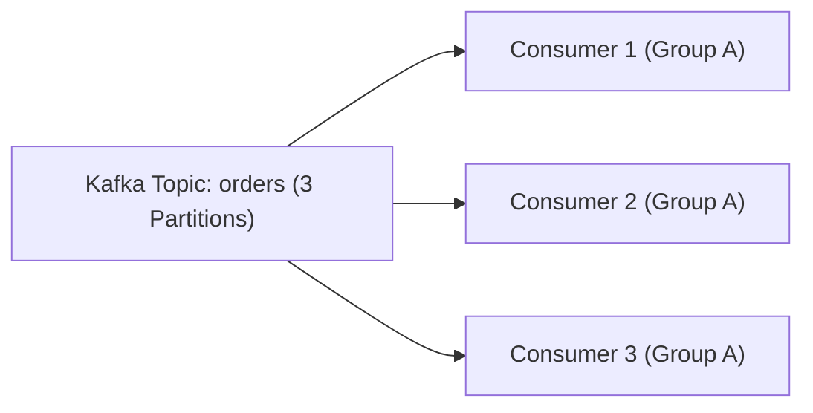

# Lesson 2: Kafka Consumer with @KafkaListener

> 🌐 **Language / ភាសា:** 🇬🇧 **[English](README.md)** | 🇰🇭 [ភាសាខ្មែរ (Khmer)](README.kh.md)  
> 🧭 **Navigation:** [📚 Module Index](../README.md) | [← Previous Lesson](../01-kafka-producer/README.md) | [Next Lesson →](../03-publish-json-messages/README.md)

> 📂 **Runnable Example Project:**  
> 👉 **Complete Project:** [Kafka Listener & Consumer Service](../../examples/04-kafka-messaging)  
> 📄 **Source Code Files:** [`OrderEventConsumer.java`](../../examples/04-kafka-messaging/src/main/java/com/example/kafka/consumer/OrderEventConsumer.java) | [`OrderCreatedEvent.java`](../../examples/04-kafka-messaging/src/main/java/com/example/kafka/event/OrderCreatedEvent.java) | [`application.yml`](../../examples/04-kafka-messaging/src/main/resources/application.yml)


---

## Table of Contents
1. [Introduction to Kafka Consumers](#introduction-to-kafka-consumers)
2. [Consumer Groups and Partition Balancing](#consumer-groups)
3. [Declarative Consumption with @KafkaListener](#declarative-consumption)
4. [Extracting Message Headers and Partition Metadata](#extracting-metadata)
5. [Acknowledgment Strategies (Manual vs Auto-Commit)](#acknowledgment-strategies)
6. [Dead Letter Topic (DLT) Error Handling](#dlt-error-handling)

---

## Introduction to Kafka Consumers
A Kafka Consumer subscribes to one or more topics and processes incoming records pulled from topic partitions. Spring Boot encapsulates the underlying Kafka consumer loop using the declarative `@KafkaListener` container abstraction.



---

## Configuring Consumer in application.yml

```yaml
spring:
  kafka:
    bootstrap-servers: localhost:9092
    consumer:
      group-id: order-processing-group
      auto-offset-reset: earliest
      key-deserializer: org.apache.kafka.common.serialization.StringDeserializer
      value-deserializer: org.apache.kafka.common.serialization.StringDeserializer
      enable-auto-commit: false
    listener:
      ack-mode: manual_immediate
```

---

## Declarative Consumption with @KafkaListener

```java
package com.example.consumer;

import org.slf4j.Logger;
import org.slf4j.LoggerFactory;
import org.springframework.kafka.annotation.KafkaListener;
import org.springframework.kafka.support.Acknowledgment;
import org.springframework.kafka.support.KafkaHeaders;
import org.springframework.messaging.handler.annotation.Header;
import org.springframework.messaging.handler.annotation.Payload;
import org.springframework.stereotype.Service;

@Service
public class OrderConsumer {

    private static final Logger log = LoggerFactory.getLogger(OrderConsumer.class);

    @KafkaListener(topics = "orders-topic", groupId = "order-processing-group")
    public void consumeOrder(
            @Payload String message,
            @Header(KafkaHeaders.RECEIVED_PARTITION) int partition,
            @Header(KafkaHeaders.OFFSET) long offset,
            Acknowledgment acknowledgment) {

        try {
            log.info("Received order: {} from partition: {} with offset: {}", message, partition, offset);
            
            // Execute business logic...
            
            // Acknowledge successful processing
            acknowledgment.acknowledge();
        } catch (Exception e) {
            log.error("Failed to process order message: {}", message, e);
        }
    }
}
```

---

## Dead Letter Topic (DLT) Error Handling

```java
@Bean
public DefaultErrorHandler errorHandler(KafkaTemplate<String, Object> template) {
    DeadLetterPublishingRecoverer recoverer = new DeadLetterPublishingRecoverer(template);
    FixedBackOff backOff = new FixedBackOff(1000L, 3);
    return new DefaultErrorHandler(recoverer, backOff);
}
```

---

## 🧭 Lesson Navigation

| Previous Lesson | Module Index | Next Lesson |
| :--- | :---: | :--- |
| [← Event-Driven Messaging Architecture and Kafka Producer with KafkaTemplate](../01-kafka-producer/README.md) | [📚 Module Index](../README.md) | [Publishing JSON Messages with Kafka →](../03-publish-json-messages/README.md) |
