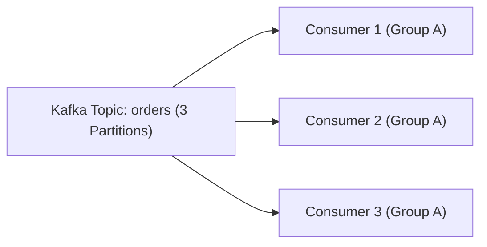

# មេរៀនទី ២: ការបង្កើត Kafka Consumer ជាមួយ @KafkaListener (Kafka Consumer in Spring Boot)
> 🧭 **រុករក:** [📚 មាតិកា Module](../README.md) | [← មេរៀនមុន](../01-kafka-producer/README.md) | [មេរៀនបន្ទាប់ →](../03-publish-json-messages/README.md)

> 📂 **កូដគំរូជាក់ស្តែង (Runnable Example Project):**  
> 👉 **គម្រោងពេញលេញ:** [Kafka Listener & Consumer Service](../../examples/04-kafka-messaging)  
> 📄 **File កូដជាក់ស្តែង:** [`OrderEventConsumer.java`](../../examples/04-kafka-messaging/src/main/java/com/example/kafka/consumer/OrderEventConsumer.java) | [`OrderCreatedEvent.java`](../../examples/04-kafka-messaging/src/main/java/com/example/kafka/event/OrderCreatedEvent.java) | [`application.yml`](../../examples/04-kafka-messaging/src/main/resources/application.yml)


---

## មាតិកា (Table of Contents)
1. [សេចក្តីផ្តើមអំពី Kafka Consumer](#សេចក្តីផ្តើមអំពី-kafka-consumer)
2. [Consumer Groups និង Partition Rebalancing](#consumer-groups)
3. [ការប្រើប្រាស់ @KafkaListener](#ការប្រើប្រាស់-kafkalistener)
4. [ការចាប់យក Metadata (Headers, Partition, Offset)](#ការចាប់យក-metadata)
5. [Acknowledgment Modes (Manual vs Auto Commit)](#acknowledgment-modes)
6. [Error Handling & Dead Letter Topic (DLT)](#error-handling--dlt)

---

## សេចក្តីផ្តើមអំពី Kafka Consumer
នៅក្នុង Apache Kafka, **Consumer** ទទួលខុសត្រូវក្នុងការអាន (pull/consume) សារ (messages/records) ពីមួយ ឬច្រើន Topics។ នៅក្នុង Spring Boot, យើងប្រើ annotation `@KafkaListener` ដើម្បីបង្កើត asynchronous message listener container ដោយស្វ័យប្រវត្តិ។



---

## ការកំណត់ Consumer ក្នុង application.yml

```yaml
spring:
  kafka:
    bootstrap-servers: localhost:9092
    consumer:
      group-id: order-processing-group
      auto-offset-reset: earliest
      key-deserializer: org.apache.kafka.common.serialization.StringDeserializer
      value-deserializer: org.apache.kafka.common.serialization.StringDeserializer
      enable-auto-commit: false # Manual Ack សម្រាប់ភាពជឿជាក់ខ្ពស់
    listener:
      ack-mode: manual_immediate
```

---

## ការប្រើប្រាស់ @KafkaListener

```java
package com.example.consumer;

import org.apache.kafka.clients.consumer.ConsumerRecord;
import org.slf4j.Logger;
import org.slf4j.LoggerFactory;
import org.springframework.kafka.annotation.KafkaListener;
import org.springframework.kafka.support.Acknowledgment;
import org.springframework.kafka.support.KafkaHeaders;
import org.springframework.messaging.handler.annotation.Header;
import org.springframework.messaging.handler.annotation.Payload;
import org.springframework.stereotype.Service;

@Service
public class OrderConsumer {

    private static final Logger log = LoggerFactory.getLogger(OrderConsumer.class);

    @KafkaListener(topics = "orders-topic", groupId = "order-processing-group")
    public void consumeOrder(
            @Payload String message,
            @Header(KafkaHeaders.RECEIVED_PARTITION) int partition,
            @Header(KafkaHeaders.OFFSET) long offset,
            Acknowledgment acknowledgment) {

        try {
            log.info("Received order: {} from partition: {} with offset: {}", message, partition, offset);
            
            // ដំណើរការ Business Logic...
            
            // Acknowledge ថាបានដំណើរការជោគជ័យ
            acknowledgment.acknowledge();
        } catch (Exception e) {
            log.error("Failed to process order message: {}", message, e);
            // មិន commit offset ដើម្បីឱ្យ retry ឬបញ្ជូនទៅ DLT
        }
    }
}
```

---

## Dead Letter Topic (DLT) Error Handling

Spring Kafka ផ្តល់នូវ `DefaultErrorHandler` ជាមួយ `DeadLetterPublishingRecoverer` ដើម្បីបញ្ជូន message ដែលមានបញ្ហា ទៅកាន់ DLT topic (ឧ. `orders-topic.DLT`) ក្រោយពី retry អស់ចំនួនកំណត់៖

```java
@Bean
public DefaultErrorHandler errorHandler(KafkaTemplate<String, Object> template) {
    DeadLetterPublishingRecoverer recoverer = new DeadLetterPublishingRecoverer(template);
    FixedBackOff backOff = new FixedBackOff(1000L, 3); // retry 3 ដង ចន្លោះ 1 វិនាទី
    return new DefaultErrorHandler(recoverer, backOff);
}
```

---

## 🧭 ការរុករកមេរៀន (Lesson Navigation)

| ថយក្រោយ (Previous) | មាតិកា Module (Index) | បន្ទាប់ (Next) |
| :--- | :---: | :--- |
| [← ស្ថាបត្យកម្ម Event-Driven Messaging និង Kafka Producer ជាមួយ KafkaTemplate](../01-kafka-producer/README.md) | [📚 បញ្ជីមេរៀន Module](../README.md) | [ការផ្ញើ JSON Messages តាមរយៈ Kafka (Publishing JSON Messages) →](../03-publish-json-messages/README.md) |
