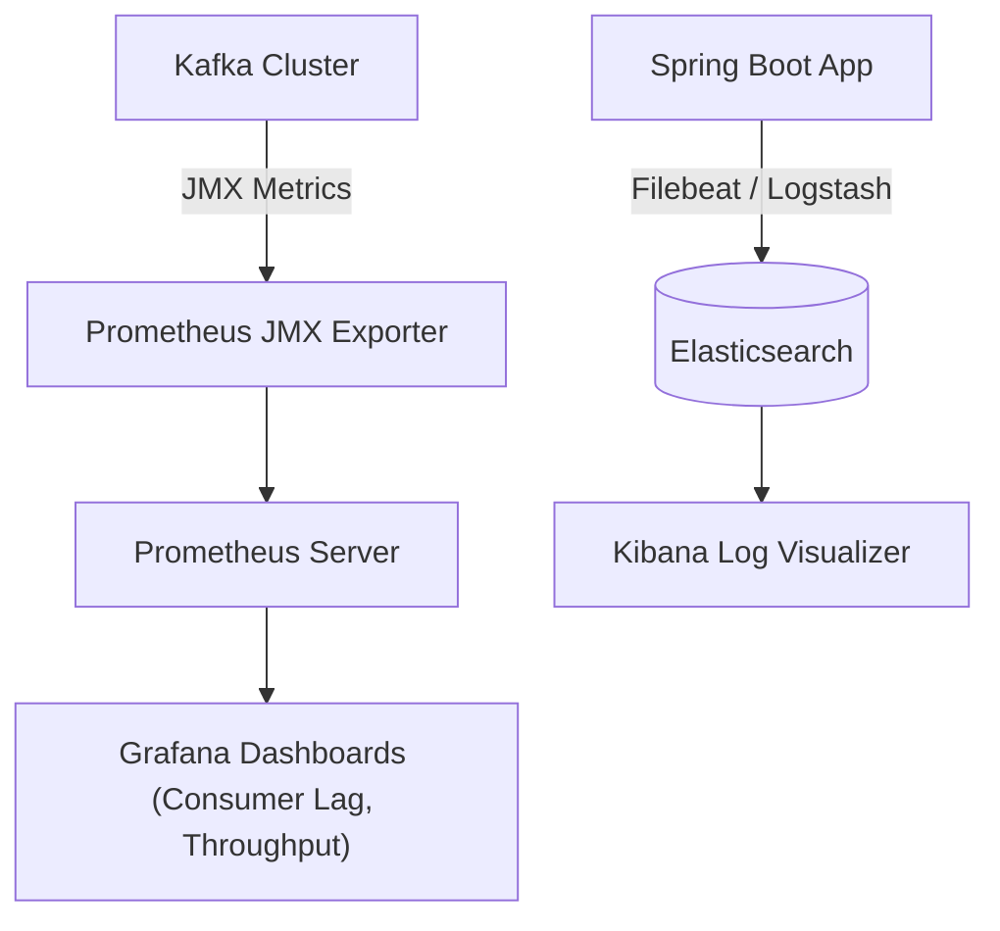

# មេរៀនទី ៨: ការតាមដាន Kafka Metrics ជាមួយ Elasticsearch និង Grafana (Kafka Observability)

> 🌐 **ភាសា / Language:** 🇰🇭 **[ភាសាខ្មែរ (Khmer)](README.kh.md)** | 🇬🇧 [English](README.md)  
> 🧭 **រុករក:** [📚 មាតិកា Module](../README.kh.md) | [← មេរៀនមុន](../07-create-configure-topics/README.kh.md) | [មេរៀនបន្ទាប់ →](../09-dynamic-kafka-listener/README.kh.md)

---

## មាតិកា (Table of Contents)
1. [ស្ថាបត្យកម្ម Full Observability សម្រាប់ Kafka](#ស្ថាបត្យកម្ម-observability)
2. [Consumer Lag និង Broker Metrics សំខាន់ៗ](#consumer-lag)
3. [Prometheus JMX Exporter Setup](#prometheus-jmx-exporter)
4. [ការរៀបចំ Grafana Dashboard](#grafana-dashboard)
5. [ការបញ្ជូន Logs ទៅកាន់ Elasticsearch & Kibana](#elasticsearch-logging)

---

## ស្ថាបត្យកម្ម Full Observability

---

## Key Kafka Metrics
- **Consumer Lag**: ចំនួន records ក្នុង partition ដែលផលិតលើសពីការ consume (សូចនាករដំបូងនៃការកកស្ទះ)។
- **BytesInPerSec / BytesOutPerSec**: Network throughput របស់ broker។
- **UnderReplicatedPartitions**: បង្ហាញពី failure នៃ replication nodes។

---

## 🧭 ការរុករកមេរៀន (Lesson Navigation)

| ថយក្រោយ (Previous) | មាតិកា Module (Index) | បន្ទាប់ (Next) |
| :--- | :---: | :--- |
| [← ការបង្កើត និងកំណត់រចនាសម្ព័ន្ធ Topics ដោយស្វ័យប្រវត្តិ (Programmatic Topic Configuration)](../07-create-configure-topics/README.kh.md) | [📚 បញ្ជីមេរៀន Module](../README.kh.md) | [ការបង្កើត Dynamic Kafka Listener Endpoint (Dynamic Kafka Listener Registration) →](../09-dynamic-kafka-listener/README.kh.md) |
