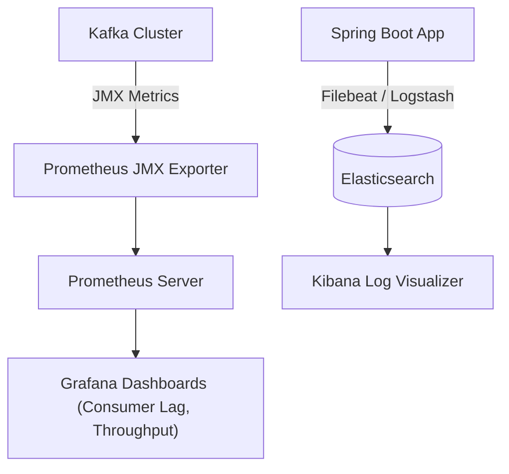

# Lesson 8: Kafka Observability with Elasticsearch, Prometheus, and Grafana

> 🌐 **Language / ភាសា:** 🇬🇧 **[English](README.md)** | 🇰🇭 [ភាសាខ្មែរ (Khmer)](README.kh.md)  
> 🧭 **Navigation:** [📚 Module Index](../README.md) | [← Previous Lesson](../07-create-configure-topics/README.md) | [Next Lesson →](../09-dynamic-kafka-listener/README.md)

---

## Table of Contents
1. [End-to-End Kafka Observability Architecture](#observability-architecture)
2. [Critical Broker and Consumer Lag Metrics](#critical-metrics)
3. [Prometheus JMX Exporter Integration](#prometheus-exporter)
4. [Grafana Operational Dashboards](#grafana-dashboards)
5. [Log Aggregation with Elasticsearch and Kibana](#elasticsearch-logging)

---

## End-to-End Observability Architecture

---

## Critical Metrics
- **Consumer Lag**: Unconsumed messages buffered in topic partitions.
- **BytesInPerSec / BytesOutPerSec**: Network throughput metrics.
- **UnderReplicatedPartitions**: Indicates partition replica synchronization health.

---

## 🧭 Lesson Navigation

| Previous Lesson | Module Index | Next Lesson |
| :--- | :---: | :--- |
| [← Creating and Configuring Kafka Topics Programmatically](../07-create-configure-topics/README.md) | [📚 Module Index](../README.md) | [Dynamic Kafka Listener Endpoint Registration →](../09-dynamic-kafka-listener/README.md) |
