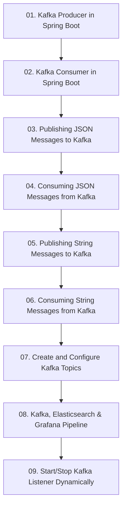

# Module 8: ស្ថាបត្យកម្ម Event-Driven ជាមួយ Apache Kafka (Spring Boot with Kafka)

> 🌐 **ភាសា / Language:** 🇰🇭 **[ភាសាខ្មែរ (Khmer)](README.kh.md)** | 🇬🇧 [English](README.md)

> 📂 **គម្រោងកូដគំរូជាក់ស្តែងសម្រាប់ Module នេះ (Runnable Project):**  
> 👉 **[Apache Kafka Event-Driven Messaging](../examples/04-kafka-messaging)**  
> គម្រោង Maven ពេញលេញរួមមាន Kafka Producer (KafkaTemplate), Consumer (@KafkaListener), JSON Domain Events, និង Docker Compose។

---

## 📖 សេចក្តីផ្តើមអំពី Module

ស្ថាបត្យកម្ម Asynchronous Event-Driven៖ Kafka Producers, Consumers, JSON/String Messages, Topic Configurations, Elasticsearch & Grafana integration, និង Dynamic Listeners។

---

## 🗺️ ផែនទីសិក្សាប្រចាំ Module (Learning Roadmap)

---

## 📚 បញ្ជីមេរៀនក្នុង Module (9 Lessons)

| មេរៀន (Lesson) | ប្រធានបទ (Topic) | ការពិពណ៌នា (Description) |
| :---: | :--- | :--- |
| **01** | [Kafka Producer in Spring Boot](01-kafka-producer/README.kh.md) | ការបង្កើត Kafka Producer និងការប្រើប្រាស់ KafkaTemplate |
| **02** | [Kafka Consumer in Spring Boot](02-kafka-consumer/README.kh.md) | ការបង្កើត Kafka Consumer ជាមួយ @KafkaListener |
| **03** | [Publishing JSON Messages to Kafka](03-publish-json-messages/README.kh.md) | ការបម្លែង Java Object ទៅជា JSON បញ្ជូនទៅ Kafka |
| **04** | [Consuming JSON Messages from Kafka](04-consume-json-messages/README.kh.md) | ការទទួល និង Deserializing JSON Event មកជា Java DTO |
| **05** | [Publishing String Messages to Kafka](05-publish-string-messages/README.kh.md) | ការផ្ញើសារជា Text/String ធម្មតាទៅកាន់ Topic |
| **06** | [Consuming String Messages from Kafka](06-consume-string-messages/README.kh.md) | ការចាប់យក Text Message ពី Topic តាម Consumer Group |
| **07** | [Create and Configure Kafka Topics](07-create-configure-topics/README.kh.md) | ការបង្កើត និងគ្រប់គ្រង Partitions & Replicas តាម Java Code |
| **08** | [Kafka, Elasticsearch & Grafana Pipeline](08-kafka-elasticsearch-grafana/README.kh.md) | Data Pipeline: ទាញទិន្នន័យពី Kafka រក្សាទុកក្នុង ES និង Plot លើ Grafana |
| **09** | [Start/Stop Kafka Listener Dynamically](09-dynamic-kafka-listener/README.kh.md) | ការគ្រប់គ្រង Lifecycle នៃ Kafka Listener Container ក្នុង Runtime |

---

## 🧭 ការរុករក (Navigation)

| ថយក្រោយ (Previous) | មាតិកាចម្បង (Main Index) | បន្ទាប់ (Next Module) |
| :--- | :---: | :--- |
| [Module 7: Microservices](../07-microservices-with-spring-boot/README.kh.md) | [📚 មាតិកា Spring Boot](../README.kh.md) | [Module 9: Aspect-Oriented Programming →](../09-spring-boot-with-aop/README.kh.md) |
