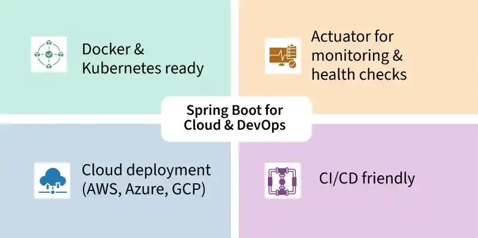
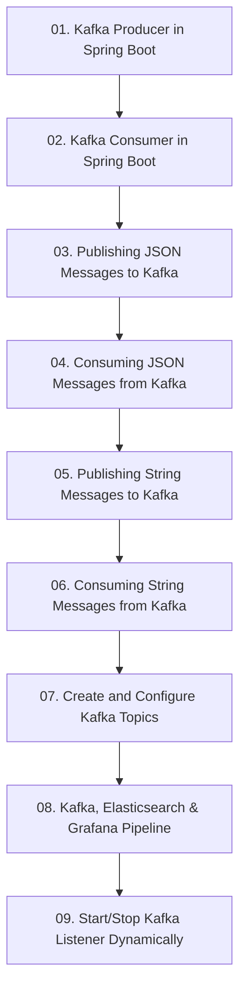

# Module 8: Event-Driven Messaging with Apache Kafka

> 🌐 **Language / ភាសា:** 🇰🇭 [ភាសាខ្មែរ (Khmer)](README.kh.md) | 🇬🇧 **[English](README.md)**

> 📂 **Runnable Example Project for this Module:**  
> 👉 **[Apache Kafka Event-Driven Messaging](../examples/04-kafka-messaging)**  
> Complete Maven project featuring Kafka Producer (KafkaTemplate), Consumer (@KafkaListener), JSON Domain Events, and Docker Compose.

---

## 📖 Module Overview

Asynchronous event streaming: Kafka producers, consumers, publishing JSON/String payloads, topic partitioning, Elasticsearch & Grafana observability, and dynamic listeners.

---

## 🗺️ Module Learning Roadmap

---

## 📚 Lessons in This Module (9 Lessons)

| Lesson | Topic | Description |
| :---: | :--- | :--- |
| **01** | [Kafka Producer in Spring Boot](01-kafka-producer/README.md) | Configuring KafkaTemplate and emitting streaming records |
| **02** | [Kafka Consumer in Spring Boot](02-kafka-consumer/README.md) | Consuming topic events asynchronously with @KafkaListener |
| **03** | [Publishing JSON Messages to Kafka](03-publish-json-messages/README.md) | Serializing domain objects into JSON payloads for Kafka topics |
| **04** | [Consuming JSON Messages from Kafka](04-consume-json-messages/README.md) | Deserializing incoming JSON payloads into strongly-typed objects |
| **05** | [Publishing String Messages to Kafka](05-publish-string-messages/README.md) | Publishing plain-text string payloads to Kafka topics |
| **06** | [Consuming String Messages from Kafka](06-consume-string-messages/README.md) | Consuming string messages across consumer group partitions |
| **07** | [Create and Configure Kafka Topics](07-create-configure-topics/README.md) | Programmatic topic creation and partition replication configuration |
| **08** | [Kafka, Elasticsearch & Grafana Pipeline](08-kafka-elasticsearch-grafana/README.md) | Building a real-time data pipeline from Kafka to Elasticsearch & Grafana |
| **09** | [Start/Stop Kafka Listener Dynamically](09-dynamic-kafka-listener/README.md) | Dynamically starting, pausing, and resuming Kafka listeners at runtime |

---

## 🧭 Navigation

| Previous | Main Index | Next Module |
| :--- | :---: | :--- |
| [Module 7: Microservices](../07-microservices-with-spring-boot/README.md) | [📚 Spring Boot Home](../README.md) | [Module 9: Aspect-Oriented Programming →](../09-spring-boot-with-aop/README.md) |
