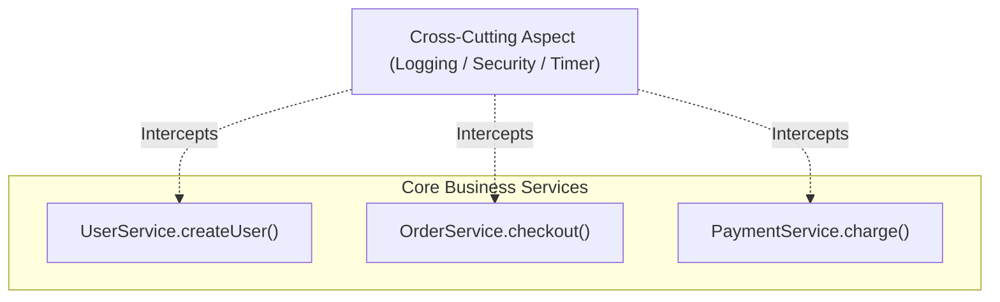

# មេរៀនទី ១: ការគ្រប់គ្រង Cross-Cutting Concerns ជាមួយ Aspect-Oriented Programming (AOP)

> 🌐 **ភាសា / Language:** 🇰🇭 **[ភាសាខ្មែរ (Khmer)](README.kh.md)** | 🇬🇧 [English](README.md)  
> 🧭 **រុករក:** [📚 មាតិកា Module](../README.kh.md) | [← មេរៀនមុន](../../08-spring-boot-with-kafka/09-dynamic-kafka-listener/README.kh.md) | [មេរៀនបន្ទាប់ →](../02-aop-advices-overview/README.kh.md)

## មាតិកា (Table of Contents)

- [1. តើ Aspect-Oriented Programming (AOP) ជាអ្វី?](#1-តើ-aspect-oriented-programming-aop-ជាអ្វី)
- [2. គោលគំនិត និងពាក្យគន្លឹះសំខាន់ៗក្នុង AOP](#2-គោលគំនិត-និងពាក្យគន្លឹះសំខាន់ៗក្នុង-aop)
- [3. ប្រភេទនៃ Advices ទាំង ៥ (`@Before`, `@After`, `@Around`, ...)](#3-ប្រភេទនៃ-advices-ទាំង-៥-before-after-around-)
- [4. Pointcut Expressions (`execution(...)`)](#4-pointcut-expressions-execution)
- [5. ឧទាហរណ៍ជាក់ស្តែង៖ បង្កើត `@LogExecutionTime` វាស់ស្ទង់ល្បឿន Method](#5-ឧទាហរណ៍ជាក់ស្តែង-បង្កើត-logexecutiontime-វាស់ស្ទង់ល្បឿន-method)
- [6. សង្ខេប](#6-សង្ខេប)

---

## 1. តើ Aspect-Oriented Programming (AOP) ជាអ្វី?

នៅក្នុងការអភិវឌ្ឍប្រព័ន្ធ មានការងារមួយចំនួនដែលត្រូវធ្វើដដែលៗនៅគ្រប់ទីកន្លែង ដូចជា៖
- ការកត់ត្រា Log (Logging)
- ការវាស់ស្ទង់ពេលវេលាដំណើរការកូដ (Performance Profiling)
- ការត្រួតពិនិត្យសិទ្ធិ (Security / Authorization)
- ការគ្រប់គ្រង Transaction (`@Transactional`)

ការងារទាំងនេះត្រូវបានហៅថា **Cross-Cutting Concerns** (កង្វល់កាត់ទទឹង)។ ប្រសិនបើយើងសរសេរកូដ Log ឬ Timer នៅរាល់ Method ទាំងអស់ក្នុង Service នោះកូដរបស់យើងនឹងច្របូកច្របល់ និងពិបាកថែទាំបំផុត។

**AOP** អនុញ្ញាតឱ្យយើងទាញកូដទាំងនោះចេញ ហើយដាក់ក្នុង **Aspect** តែមួយកន្លែង ដោយមិនចាំបាច់កែប្រែ Business Logic Method ដើមឡើយ!



---

## 2. គោលគំនិត និងពាក្យគន្លឹះសំខាន់ៗក្នុង AOP

1. **Aspect (ទិដ្ឋភាព):** Class ពិសេសដែលផ្ទុកនូវ Cross-cutting Logic (ឧ. `LoggingAspect`)។
2. **Join Point (ចំណុចប្រសព្វ):** ចំណុចជាក់លាក់មួយនៅក្នុងដំណើរការកម្មវិធីដែលយើងអាចស្ទាក់ចាប់បាន (ក្នុង Spring AOP ជាទូទៅគឺ Method Execution)។
3. **Pointcut (ចំណុចកំណត់គោលដៅ):** Expression (កន្សោម) ដែលកំណត់ថា Method ណាខ្លះដែលត្រូវស្ទាក់ចាប់ (ដូចជា រាល់ Method ក្នុង package `service`)។
4. **Advice (សកម្មភាពអនុវត្ត):** សកម្មភាពជាក់ស្តែងដែលត្រូវធ្វើ (តើត្រូវធ្វើមុន Method រត់, ក្រោយ Method រត់, ឬរុំព័ទ្ធ Method?)។

---

## 3. ប្រភេទនៃ Advices ទាំង ៥

| Advice Annotation | ពេលណាដែលវាដំណើរការ |
| :--- | :--- |
| **`@Before`** | ដំណើរការ **មុនពេល** Method គោលដៅចាប់ផ្តើមរត់ |
| **`@AfterReturning`** | ដំណើរការ **ក្រោយពេល** Method គោលដៅរត់ចប់ជោគជ័យ (អាចចាប់ Return value បាន) |
| **`@AfterThrowing`** | ដំណើរការ **នៅពេល** Method គោលដៅបោះ Exception |
| **`@After` (Finally)** | ដំណើរការក្រោយ Method រត់ចប់ជានិច្ច (ទោះជោគជ័យ ឬបោះ Exception ក៏ដោយ) |
| **`@Around`** | **ខ្លាំងក្លាបំផុត!** រុំព័ទ្ធ Method ទាំងស្រុង អាចសម្រេចចិត្តថាតើត្រូវឱ្យ Method រត់ ឬអត់ និងកែប្រែ Return Value បាន |

---

## 4. Pointcut Expressions (`execution(...)`)

ទម្រង់ទូទៅ៖
```text
execution(modifiers-pattern? ret-type-pattern declaring-type-pattern?name-pattern(param-pattern) throws-pattern?)
```

- `execution(* com.example.service.*.*(..))`: ចាប់យកគ្រប់ Method ទាំងអស់ដែលមានក្នុងគ្រប់ Class នៃ Package `com.example.service`។
- `@annotation(com.example.annotation.LogExecutionTime)`: ចាប់តែ Method ណាដែលមានបិទ Annotation `@LogExecutionTime` ប៉ុណ្ណោះ!

---

## 5. ឧទាហរណ៍ជាក់ស្តែង៖ បង្កើត `@LogExecutionTime` វាស់ស្ទង់ល្បឿន Method

### ជំហានទី ១៖ បញ្ចូល Dependency ក្នុង `pom.xml`
```xml
<dependency>
    <groupId>org.springframework.boot</groupId>
    <artifactId>spring-boot-starter-aop</artifactId>
</dependency>
```

### ជំហានទី ២៖ បង្កើត Custom Annotation
```java
package com.example.demo.annotation;

import java.lang.annotation.*;

@Target(ElementType.METHOD)
@Retention(RetentionPolicy.RUNTIME)
public @interface LogExecutionTime {}
```

### ជំហានទី ៣៖ បង្កើត Aspect Class ជាមួយ `@Around`
```java
package com.example.demo.aspect;

import org.aspectj.lang.ProceedingJoinPoint;
import org.aspectj.lang.annotation.Around;
import org.aspectj.lang.annotation.Aspect;
import org.slf4j.Logger;
import org.slf4j.LoggerFactory;
import org.springframework.stereotype.Component;

@Aspect
@Component
public class PerformanceTrackerAspect {

    private static final Logger log = LoggerFactory.getLogger(PerformanceTrackerAspect.class);

    @Around("@annotation(com.example.demo.annotation.LogExecutionTime)")
    public Object trackTime(ProceedingJoinPoint joinPoint) throws Throwable {
        long startTime = System.currentTimeMillis();

        // ដំណើរការ Method គោលដៅ
        Object result = joinPoint.proceed();

        long timeTaken = System.currentTimeMillis() - startTime;
        log.info("⏱️ Method [{}] ចំណាយពេលដំណើរការ: {} ms", joinPoint.getSignature().toShortString(), timeTaken);

        return result;
    }
}
```

### ជំហានទី ៤៖ យកទៅប្រើប្រាស់ក្នុង Service
```java
@Service
public class ReportService {

    @LogExecutionTime
    public void generateHeavyReport() throws InterruptedException {
        Thread.sleep(850); // ក្លែងធ្វើជាការងារយឺត
        System.out.println("របាយការណ៍ត្រូវបានបង្កើតចប់សព្វគ្រប់!");
    }
}
```
*(ពេលហៅ Method នេះ Console នឹងបង្ហាញ: `⏱️ Method [ReportService.generateHeavyReport()] ចំណាយពេលដំណើរការ: 852 ms` ដោយស្វ័យប្រវត្តិ!)*

---

## 6. សង្ខេប

- AOP ដោះស្រាយបញ្ហា **Cross-Cutting Concerns** (Logging, Metrics, Security) ឱ្យដាច់ចេញពី Business Logic។
- `@Around` ផ្តល់នូវការគ្រប់គ្រងពេញលេញបំផុតតាមរយៈ `ProceedingJoinPoint.proceed()`។
- បង្កើត Custom Annotation (ដូចជា `@LogExecutionTime`) រួមជាមួយ AOP គឺជាស្ទីលសរសេរកូដកម្រិត Senior ដ៏ស្អាតបំផុត (Clean Architecture)។


---
## 🧭 ការរុករកមេរៀន (Lesson Navigation)

| ថយក្រោយ (Previous) | មាតិកា Module (Index) | បន្ទាប់ (Next) |
| :--- | :---: | :--- |
| [← ការបង្កើត Dynamic Kafka Listener Endpoint (Dynamic Kafka Listener Registration)](../../08-spring-boot-with-kafka/09-dynamic-kafka-listener/README.kh.md) | [📚 បញ្ជីមេរៀន Module](../README.kh.md) | [ទិដ្ឋភាពទូទៅនៃប្រភេទ AOP Advices ទាំង ៥ (Overview of AOP Advices) →](../02-aop-advices-overview/README.kh.md) |
