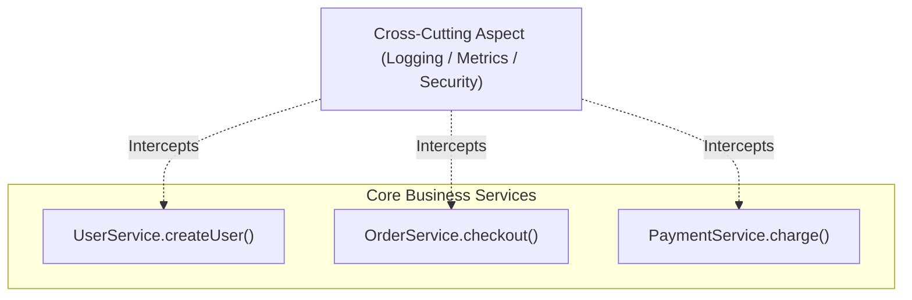

# Lesson 1: Managing Cross-Cutting Concerns with Aspect-Oriented Programming (AOP)

> 🌐 **Language / ភាសា:** 🇬🇧 **[English](README.md)** | 🇰🇭 [ភាសាខ្មែរ (Khmer)](README.kh.md)  
> 🧭 **Navigation:** [📚 Module Index](../README.md) | [← Previous Lesson](../../08-spring-boot-with-kafka/09-dynamic-kafka-listener/README.md) | [Next Lesson →](../02-aop-advices-overview/README.md)

## Table of Contents

- [1. What is Aspect-Oriented Programming (AOP)?](#1-what-is-aspect-oriented-programming-aop)
- [2. Core Concepts and Terminology](#2-core-concepts-and-terminology)
- [3. The 5 Types of AOP Advices (`@Before`, `@After`, `@Around`, ...)](#3-the-5-types-of-aop-advices-before-after-around-)
- [4. Pointcut Expression Syntax (`execution(...)`)](#4-pointcut-expression-syntax-execution)
- [5. Practical Production Example: `@LogExecutionTime` Performance Profiler](#5-practical-production-example-logexecutiontime-performance-profiler)
- [6. Summary](#6-summary)

---

## 1. What is Aspect-Oriented Programming (AOP)?

In enterprise systems, multiple requirements span horizontally across disparate layers:
- Diagnostic logging (Audit trails)
- Performance timing and latency profiling
- Role-based authorization assertions
- Transaction coordination (`@Transactional`)

These concerns are designated **Cross-Cutting Concerns**. Embedding boilerplate metrics and audit logic repeatedly inside core domain services introduces tight coupling and maintenance overhead.

**AOP** externalizes these auxiliary behaviors into centralized **Aspects**, intercepting execution graphs transparently without altering domain code.



---

## 2. Core Concepts and Terminology

1. **Aspect:** A modular class encapsulating a distinct cross-cutting concern (e.g., `SecurityAspect`, `AuditAspect`).
2. **Join Point:** A candidate execution point in the runtime program flow (in Spring AOP, this is invariably method execution).
3. **Pointcut:** A predicate expression matching specific Join Points (e.g., all methods within the `com.example.service` package).
4. **Advice:** The executable logic dispatched at a matched Join Point.

---

## 3. The 5 Types of AOP Advices

| Advice Annotation | Invocation Lifecycle |
| :--- | :--- |
| **`@Before`** | Runs **prior to** target method invocation |
| **`@AfterReturning`** | Runs **after** the target method returns successfully (captures return payload) |
| **`@AfterThrowing`** | Runs **if** the target method raises an uncaught exception |
| **`@After` (Finally)** | Runs **unconditionally** after target method exit (success or error) |
| **`@Around`** | **Most powerful:** Surrounds method invocation entirely; controls execution via `ProceedingJoinPoint` and can modify arguments or return values |

---

## 4. Pointcut Expression Syntax (`execution(...)`)

Standard execution signature pattern:
```text
execution(modifiers-pattern? ret-type-pattern declaring-type-pattern?name-pattern(param-pattern) throws-pattern?)
```

- `execution(* com.example.service.*.*(..))`: Matches all methods within classes under `com.example.service`.
- `@annotation(com.example.annotation.LogExecutionTime)`: Targets methods annotated explicitly with `@LogExecutionTime`.

---

## 5. Practical Production Example: `@LogExecutionTime` Performance Profiler

### Step 1: Add Spring Boot AOP Starter
```xml
<dependency>
    <groupId>org.springframework.boot</groupId>
    <artifactId>spring-boot-starter-aop</artifactId>
</dependency>
```

### Step 2: Define Custom Marker Annotation
```java
package com.example.demo.annotation;

import java.lang.annotation.*;

@Target(ElementType.METHOD)
@Retention(RetentionPolicy.RUNTIME)
public @interface LogExecutionTime {}
```

### Step 3: Implement Aspect Class with `@Around`
```java
package com.example.demo.aspect;

import org.aspectj.lang.ProceedingJoinPoint;
import org.aspectj.lang.annotation.Around;
import org.aspectj.lang.annotation.Aspect;
import org.slf4j.Logger;
import org.slf4j.LoggerFactory;
import org.springframework.stereotype.Component;

@Aspect
@Component
public class PerformanceTrackerAspect {

    private static final Logger log = LoggerFactory.getLogger(PerformanceTrackerAspect.class);

    @Around("@annotation(com.example.demo.annotation.LogExecutionTime)")
    public Object trackTime(ProceedingJoinPoint joinPoint) throws Throwable {
        long startTime = System.currentTimeMillis();

        // Delegate execution to the underlying target method
        Object result = joinPoint.proceed();

        long timeTaken = System.currentTimeMillis() - startTime;
        log.info("⏱️ Method [{}] completed execution in: {} ms", joinPoint.getSignature().toShortString(), timeTaken);

        return result;
    }
}
```

### Step 4: Apply to Domain Services
```java
@Service
public class ReportService {

    @LogExecutionTime
    public void generateHeavyReport() throws InterruptedException {
        Thread.sleep(850); // Simulate intensive analytics workload
        System.out.println("Analytics report generated successfully!");
    }
}
```
*(Invoking this service automatically logs: `⏱️ Method [ReportService.generateHeavyReport()] completed execution in: 852 ms`)*.

---

## 6. Summary

- AOP decouples **Cross-Cutting Concerns** (logging, metrics, security) from core domain services.
- `@Around` grants total invocation governance via `ProceedingJoinPoint.proceed()`.
- Combining custom runtime annotations with AOP aspects produces expressive, clean architecture patterns.


---
## 🧭 Lesson Navigation

| Previous Lesson | Module Index | Next Lesson |
| :--- | :---: | :--- |
| [← Dynamic Kafka Listener Endpoint Registration](../../08-spring-boot-with-kafka/09-dynamic-kafka-listener/README.md) | [📚 Module Index](../README.md) | [Overview of AOP Advices →](../02-aop-advices-overview/README.md) |
