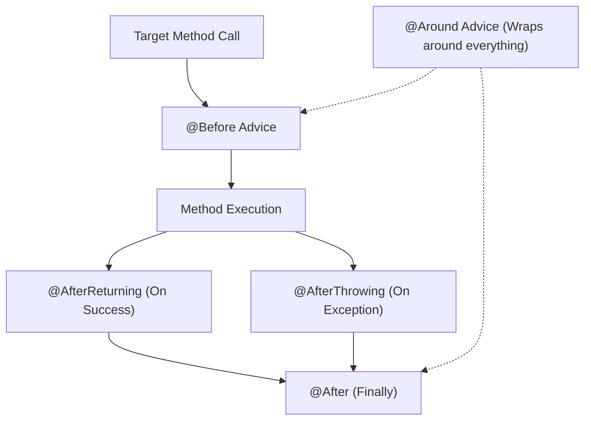

# មេរៀនទី ២: ទិដ្ឋភាពទូទៅនៃប្រភេទ AOP Advices ទាំង ៥ (Overview of AOP Advices)

> 🌐 **ភាសា / Language:** 🇰🇭 **[ភាសាខ្មែរ (Khmer)](README.kh.md)** | 🇬🇧 [English](README.md)  
> 🧭 **រុករក:** [📚 មាតិកា Module](../README.kh.md) | [← មេរៀនមុន](../01-aop-introduction/README.kh.md) | [មេរៀនបន្ទាប់ →](../03-before-advice/README.kh.md)

---

## មាតិកា (Table of Contents)
1. [តើអ្វីទៅជា Advice នៅក្នុង AOP?](#តើអ្វីទៅជា-advice)
2. [ប្រភេទ Advices ទាំង ៥ នៅក្នុង Spring AOP](#ប្រភេទ-advices-ទាំង-៥)
3. [លំដាប់លំហូរដំណើរការនៃ Advices (Execution Flow Diagram)](#លំហូរដំណើរការ)
4. [ការជ្រើសរើស Advice ឱ្យត្រូវតាមតម្រូវការ](#ការជ្រើសរើស)

---

## តើអ្វីទៅជា Advice?
**Advice** គឺជាសកម្មភាព (action/logic) ជាក់ស្តែងដែល Aspect ត្រូវអនុវត្តនៅ Join Point ណាមួយ (ឧទាហរណ៍ មុនពេល ក្រោយពេល ឬពេលមាន Error កើតឡើងក្នុង method)។

---

## ប្រភេទ Advices ទាំង ៥

| Advice | Annotation | ពេលវេលាដំណើរការ |
| :--- | :--- | :--- |
| **Before** | `@Before` | ដំណើរការ *មុនពេល* Target Method ចាប់ផ្តើម |
| **After Returning** | `@AfterReturning` | ដំណើរការ *ក្រោយពេល* Target Method បញ្ចប់ដោយជោគជ័យ |
| **After Throwing** | `@AfterThrowing` | ដំណើរការ *នៅពេលដែល* Target Method បោះ Exception |
| **After (Finally)** | `@After` | ដំណើរការជានិច្ច ក្រោយ method បញ្ចប់ (ទោះជោគជ័យ ឬបោះ exception) |
| **Around** | `@Around` | ព័ទ្ធជុំវិញ Target Method ទាំងមូល (អាចកែប្រែ return value ឬបញ្ឈប់ការ execute) |

---

## 🧭 ការរុករកមេរៀន (Lesson Navigation)

| ថយក្រោយ (Previous) | មាតិកា Module (Index) | បន្ទាប់ (Next) |
| :--- | :---: | :--- |
| [← ការគ្រប់គ្រង Cross-Cutting Concerns ជាមួយ Aspect-Oriented Programming (AOP)](../01-aop-introduction/README.kh.md) | [📚 បញ្ជីមេរៀន Module](../README.kh.md) | [ការប្រើប្រាស់ @Before Advice (Before Advice in Spring Boot) →](../03-before-advice/README.kh.md) |
