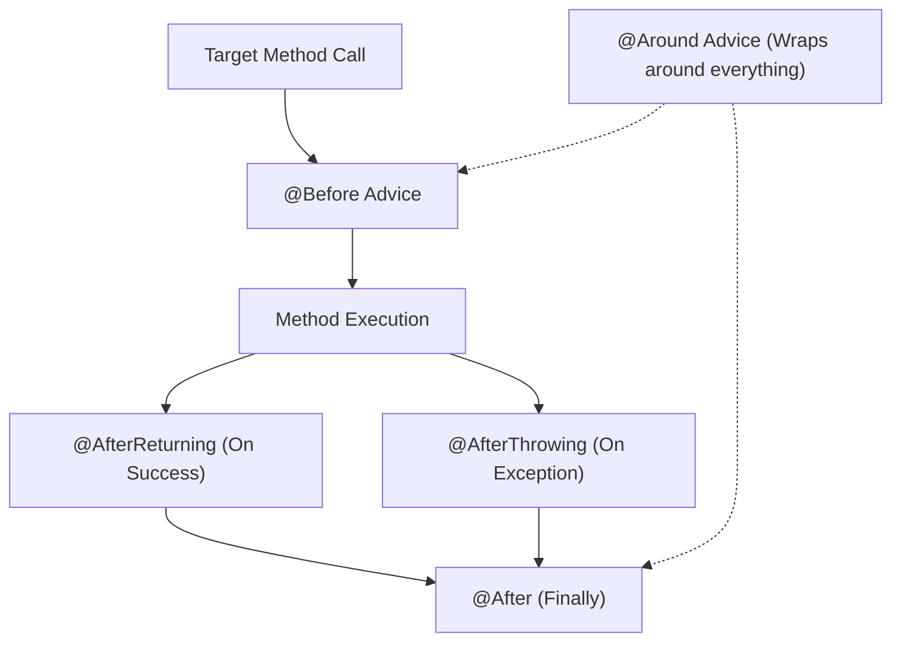

# Lesson 2: Overview of AOP Advices

> 🌐 **Language / ភាសា:** 🇬🇧 **[English](README.md)** | 🇰🇭 [ភាសាខ្មែរ (Khmer)](README.kh.md)  
> 🧭 **Navigation:** [📚 Module Index](../README.md) | [← Previous Lesson](../01-aop-introduction/README.md) | [Next Lesson →](../03-before-advice/README.md)

---

## Table of Contents
1. [What is an AOP Advice?](#what-is-advice)
2. [The 5 Core Spring AOP Advices](#the-5-advices)
3. [Advice Execution Lifecycle Diagram](#lifecycle-diagram)
4. [Selecting the Right Advice for Use Cases](#selecting-the-right-advice)

---

## What is an Advice?
In Aspect-Oriented Programming, an **Advice** represents the actual code or cross-cutting action executed at a designated join point matching an execution pointcut.

---

## The 5 Core Spring AOP Advices

| Advice Type | Annotation | Invocation Point |
| :--- | :--- | :--- |
| **Before** | `@Before` | Executes *before* join point execution |
| **After Returning** | `@AfterReturning` | Executes *after* normal method completion |
| **After Throwing** | `@AfterThrowing` | Executes *if* target throws an exception |
| **After (Finally)** | `@After` | Executes regardless of outcome (like `finally`) |
| **Around** | `@Around` | Wraps join point, with authority to suppress or modify execution |

---

## 🧭 Lesson Navigation

| Previous Lesson | Module Index | Next Lesson |
| :--- | :---: | :--- |
| [← Managing Cross-Cutting Concerns with Aspect-Oriented Programming (AOP)](../01-aop-introduction/README.md) | [📚 Module Index](../README.md) | [Using @Before Advice in Spring Boot →](../03-before-advice/README.md) |
