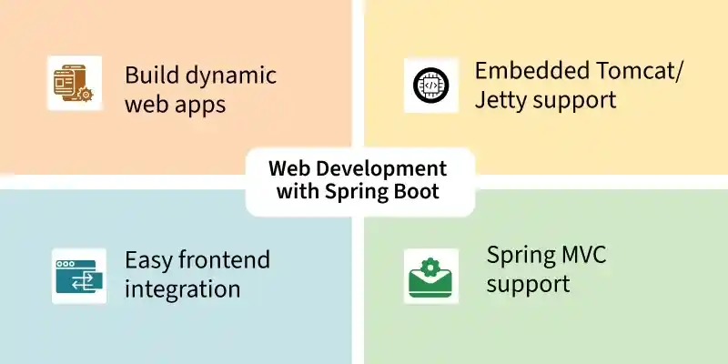
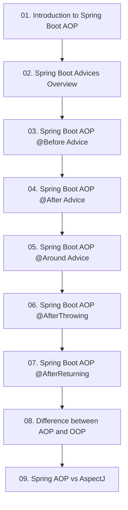

# Module 9: Aspect-Oriented Programming (AOP) in Spring Boot

> 🌐 **Language / ភាសា:** 🇰🇭 [ភាសាខ្មែរ (Khmer)](README.kh.md) | 🇬🇧 **[English](README.md)**

## 📖 Module Overview

Decoupling cross-cutting concerns: AOP architecture, all 5 advice types (@Before, @After, @Around, @AfterReturning, @AfterThrowing), pointcuts, AOP vs OOP, and Spring AOP vs AspectJ.

---

## 🗺️ Module Learning Roadmap

---

## 📚 Lessons in This Module (9 Lessons)

| Lesson | Topic | Description |
| :---: | :--- | :--- |
| **01** | [Introduction to Spring Boot AOP](01-aop-introduction/README.md) | Foundations of Aspect-Oriented Programming in Spring Boot |
| **02** | [Spring Boot Advices Overview](02-aop-advices-overview/README.md) | Comparative guide to all 5 AOP advice types in a unified project |
| **03** | [Spring Boot AOP @Before Advice](03-before-advice/README.md) | Executing interceptor logic prior to target method execution |
| **04** | [Spring Boot AOP @After Advice](04-after-advice/README.md) | Unconditional post-execution cleanup with @After advice |
| **05** | [Spring Boot AOP @Around Advice](05-around-advice/README.md) | Surrounding method execution with ProceedingJoinPoint and @Around |
| **06** | [Spring Boot AOP @AfterThrowing](06-after-throwing-advice/README.md) | Intercepting and auditing thrown exceptions with @AfterThrowing |
| **07** | [Spring Boot AOP @AfterReturning](07-after-returning-advice/README.md) | Capturing and inspecting successful method outputs with @AfterReturning |
| **08** | [Difference between AOP and OOP](08-aop-vs-oop/README.md) | Comparing Object-Oriented Programming (OOP) and Aspect-Oriented (AOP) |
| **09** | [Spring AOP vs AspectJ](09-aop-vs-aspectj/README.md) | Evaluating Spring runtime proxy AOP against full-blown AspectJ weaving |

---

## 🧭 Navigation

| Previous | Main Index | Next Module |
| :--- | :---: | :--- |
| [Module 8: Kafka Messaging](../08-spring-boot-with-kafka/README.md) | [📚 Spring Boot Home](../README.md) | [Module 10: Spring Boot Testing →](../10-spring-boot-testing/README.md) |
