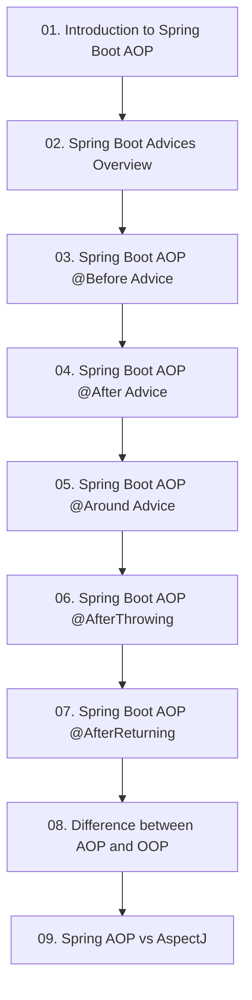

# Module 9: Aspect-Oriented Programming ក្នុង Spring Boot (Spring Boot with AOP)

## 📖 សេចក្តីផ្តើមអំពី Module

ការគ្រប់គ្រង Cross-Cutting Concerns៖ គោលការណ៍ AOP, Advices ទាំង ៥ (@Before, @After, @Around, @AfterReturning, @AfterThrowing), Pointcuts, AOP vs OOP, និង AOP vs AspectJ។

---

## 🗺️ ផែនទីសិក្សាប្រចាំ Module (Learning Roadmap)

---

## 📚 បញ្ជីមេរៀនក្នុង Module (9 Lessons)

| មេរៀន (Lesson) | ប្រធានបទ (Topic) | ការពិពណ៌នា (Description) |
| :---: | :--- | :--- |
| **01** | [Introduction to Spring Boot AOP](01-aop-introduction/README.md) | មូលដ្ឋានគ្រឹះ AOP, Aspect, JoinPoint, Pointcut, និង Advice |
| **02** | [Spring Boot Advices Overview](02-aop-advices-overview/README.md) | ការប្រើប្រាស់ Advices ទាំង ៥ ក្នុងគម្រោង AOP ជាក់ស្តែង |
| **03** | [Spring Boot AOP @Before Advice](03-before-advice/README.md) | ការដំណើរការកូដមុនពេល Method រត់ (Validation, Logging) |
| **04** | [Spring Boot AOP @After Advice](04-after-advice/README.md) | ការដំណើរការកូដក្រោយពេល Method រត់ចប់ (Finally cleanup) |
| **05** | [Spring Boot AOP @Around Advice](05-around-advice/README.md) | Advice ខ្លាំងបំផុតសម្រាប់វាស់ស្ទង់ Latency និងកែប្រែ Arguments |
| **06** | [Spring Boot AOP @AfterThrowing](06-after-throwing-advice/README.md) | ការចាប់ Exception និងការកត់ត្រា Error Logs ស្វ័យប្រវត្តិ |
| **07** | [Spring Boot AOP @AfterReturning](07-after-returning-advice/README.md) | ការចាប់ Return Value របស់ Method ពេលដំណើរការជោគជ័យ |
| **08** | [Difference between AOP and OOP](08-aop-vs-oop/README.md) | ការប្រៀបធៀបស្ថាបត្យកម្ម Object-Oriented និង Aspect-Oriented |
| **09** | [Spring AOP vs AspectJ](09-aop-vs-aspectj/README.md) | ការប្រៀបធៀប Proxy-based AOP និង Bytecode Weaving របស់ AspectJ |

---

## 🧭 ការរុករក (Navigation)

| ថយក្រោយ (Previous) | មាតិកាចម្បង (Main Index) | បន្ទាប់ (Next Module) |
| :--- | :---: | :--- |
| [Module 8: Kafka Messaging](../08-spring-boot-with-kafka/README.md) | [📚 មាតិកា Spring Boot](../README.md) | [Module 10: Spring Boot Testing →](../10-spring-boot-testing/README.md) |
