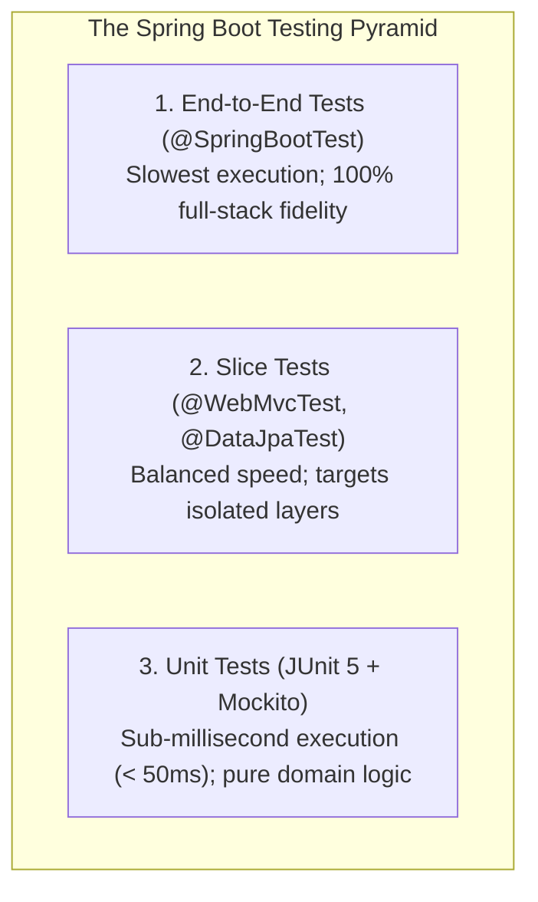

# Lesson 1: Unit Testing Spring Boot Applications with JUnit 5 & AssertJ

> 🌐 **Language / ភាសា:** 🇬🇧 **[English](README.md)** | 🇰🇭 [ភាសាខ្មែរ (Khmer)](README.kh.md)  
> 🧭 **Navigation:** [📚 Module Index](../README.md) | [← Previous Lesson](../../09-spring-boot-with-aop/09-aop-vs-aspectj/README.md) | [Next Lesson →](../02-testing-with-mockito/README.md)

## Table of Contents

- [1. The Testing Pyramid in Spring Boot](#1-the-testing-pyramid-in-spring-boot)
- [2. Tooling in `spring-boot-starter-test`](#2-tooling-in-spring-boot-starter-test)
- [3. Unit Testing the Service Layer with Mockito](#3-unit-testing-the-service-layer-with-mockito)
- [4. Controller Sliced Testing with `@WebMvcTest` and `MockMvc`](#4-controller-sliced-testing-with-webmvctest-and-mockmvc)
- [5. Repository Sliced Testing with `@DataJpaTest`](#5-repository-sliced-testing-with-datajpatest)
- [6. Full End-to-End Integration Testing with `@SpringBootTest`](#6-full-end-to-end-integration-testing-with-springboottest)
- [7. Summary](#7-summary)

---

## 1. The Testing Pyramid in Spring Boot

Automated test suites represent the demarcation between ad-hoc scripting and enterprise-grade software engineering. Thorough test coverage provides unwavering confidence during major architectural refactorings and dependency upgrades.



---

## 2. Tooling in `spring-boot-starter-test`

Spring Boot automatically bundles a comprehensive, battle-tested testing stack within `spring-boot-starter-test`:
- **JUnit 5:** The contemporary standard testing engine for Java.
- **Mockito:** Industry-standard mocking framework for synthesizing test doubles.
- **AssertJ:** Fluent assertion library (e.g., `assertThat(result).isNotNull()`).
- **MockMvc:** Web layer simulation client bypassing live HTTP socket connections.

---

## 3. Unit Testing the Service Layer with Mockito

Unit tests execute within a plain JVM process, completely isolated from databases and Spring contexts:

```java
package com.example.demo.service;

import com.example.demo.dto.ProductResponse;
import com.example.demo.entity.Product;
import com.example.demo.repository.ProductRepository;
import org.junit.jupiter.api.DisplayName;
import org.junit.jupiter.api.Test;
import org.junit.jupiter.api.extension.ExtendWith;
import org.mockito.InjectMocks;
import org.mockito.Mock;
import org.mockito.junit.jupiter.MockitoExtension;

import java.math.BigDecimal;
import java.util.Optional;

import static org.assertj.core.api.Assertions.assertThat;
import static org.mockito.Mockito.*;

@ExtendWith(MockitoExtension.class)
class ProductServiceTest {

    @Mock
    private ProductRepository productRepository; // Synthesize mock double

    @InjectMocks
    private ProductService productService; // Inject mock into service

    @Test
    @DisplayName("Successfully retrieve product by identifier")
    void shouldReturnProductWhenIdExists() {
        // 1. Given (Arrange)
        Product mockProduct = new Product("MacBook M3", new BigDecimal("1999.00"));
        when(productRepository.findById(1L)).thenReturn(Optional.of(mockProduct));

        // 2. When (Act)
        ProductResponse result = productService.getById(1L);

        // 3. Then (Assert)
        assertThat(result).isNotNull();
        assertThat(result.name()).isEqualTo("MacBook M3");
        verify(productRepository, times(1)).findById(1L); // Confirm exact invocation count
    }
}
```

---

## 4. Controller Sliced Testing with `@WebMvcTest` and `MockMvc`

`@WebMvcTest` instantiates only the web layer (controllers, interceptors, JSON converters) while mocking the service layer, keeping test execution blazingly fast:

```java
package com.example.demo.controller;

import com.example.demo.dto.ProductResponse;
import com.example.demo.service.ProductService;
import org.junit.jupiter.api.Test;
import org.springframework.beans.factory.annotation.Autowired;
import org.springframework.boot.test.autoconfigure.web.servlet.WebMvcTest;
import org.springframework.boot.test.mock.mockito.MockBean;
import org.springframework.http.MediaType;
import org.springframework.test.web.servlet.MockMvc;

import java.math.BigDecimal;

import static org.mockito.Mockito.when;
import static org.springframework.test.web.servlet.request.MockMvcRequestBuilders.get;
import static org.springframework.test.web.servlet.result.MockMvcResultMatchers.*;

@WebMvcTest(ProductController.class)
class ProductControllerTest {

    @Autowired
    private MockMvc mockMvc;

    @MockBean
    private ProductService productService;

    @Test
    void shouldReturn200AndProductJson() throws Exception {
        when(productService.getById(1L))
                .thenReturn(new ProductResponse(1L, "iPhone 16", new BigDecimal("999.00")));

        mockMvc.perform(get("/api/v1/products/1")
                .accept(MediaType.APPLICATION_JSON))
                .andExpect(status().isOk())
                .andExpect(jsonPath("$.id").value(1))
                .andExpect(jsonPath("$.name").value("iPhone 16"));
    }
}
```

---

## 5. Repository Sliced Testing with `@DataJpaTest`

`@DataJpaTest` configures an embedded in-memory database (H2) and manages transactions that roll back automatically after each test execution:

```java
@DataJpaTest
class ProductRepositoryTest {

    @Autowired
    private ProductRepository productRepository;

    @Test
    void shouldFindProductByName() {
        Product p = new Product("iPad Air", new BigDecimal("599.00"));
        productRepository.save(p);

        List<Product> results = productRepository.findByName("iPad Air");
        assertThat(results).isNotEmpty();
        assertThat(results.get(0).getName()).isEqualTo("iPad Air");
    }
}
```

---

## 6. Full End-to-End Integration Testing with `@SpringBootTest`

`@SpringBootTest` bootstraps the complete production Spring ApplicationContext across an embedded servlet container:

```java
@SpringBootTest(webEnvironment = SpringBootTest.WebEnvironment.RANDOM_PORT)
class FullIntegrationTest {

    @Autowired
    private TestRestTemplate restTemplate;

    @Test
    void testFullApplicationFlow() {
        ResponseEntity<String> response = restTemplate.getForEntity("/actuator/health", String.class);
        assertThat(response.getStatusCode()).isEqualTo(HttpStatus.OK);
        assertThat(response.getBody()).contains("\"status\":\"UP\"");
    }
}
```

---

## 7. Summary

- Adhere to the **Testing Pyramid**: prioritize unit tests, balance with layer slices, and minimize slow end-to-end runs.
- Use **Mockito** for blazingly fast unit testing of domain services.
- Utilize **`@WebMvcTest` & `MockMvc`** to validate HTTP status codes, deserialization, and JSON path contracts.
- Apply **`@DataJpaTest`** for query verification against embedded relational stores.
- Reserve **`@SpringBootTest`** for high-confidence end-to-end deployment smoke tests.


---
## 🧭 Lesson Navigation

| Previous Lesson | Module Index | Next Lesson |
| :--- | :---: | :--- |
| [← Spring AOP vs AspectJ](../../09-spring-boot-with-aop/09-aop-vs-aspectj/README.md) | [📚 Module Index](../README.md) | [Unit Testing with Mockito →](../02-testing-with-mockito/README.md) |
