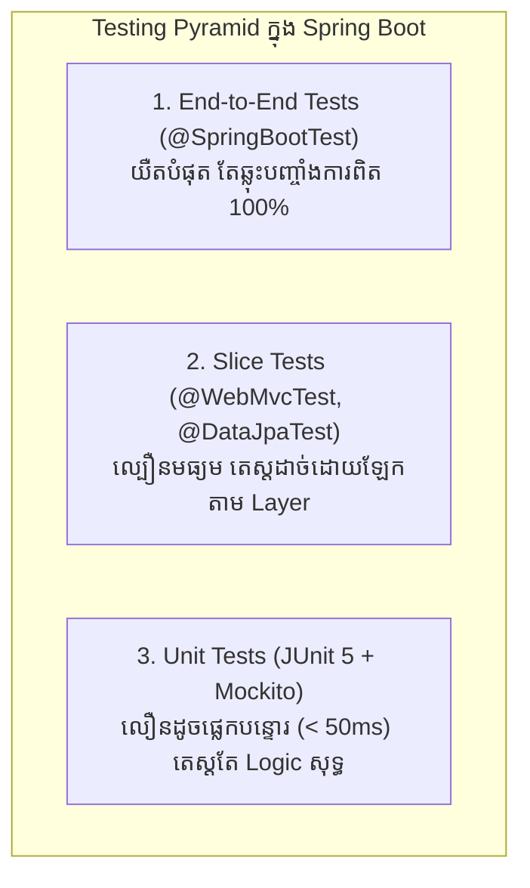

# មេរៀនទី ១: ការធ្វើតេស្តកម្មវិធី Spring Boot ជាមួយ JUnit 5 និង AssertJ (Unit Testing)
> 🧭 **រុករក:** [📚 មាតិកា Module](../README.md) | [← មេរៀនមុន](../../09-spring-boot-with-aop/09-aop-vs-aspectj/README.md) | [មេរៀនបន្ទាប់ →](../02-testing-with-mockito/README.md)

## មាតិកា (Table of Contents)

- [1. ពីរ៉ាមីតនៃការធ្វើតេស្ត (The Testing Pyramid)](#1-ពីរ៉ាមីតនៃការធ្វើតេស្ត-the-testing-pyramid)
- [2. បណ្ណាល័យក្នុង `spring-boot-starter-test`](#2-បណ្ណាល័យក្នុង-spring-boot-starter-test)
- [3. Unit Testing Service Layer ជាមួយ Mockito](#3-unit-testing-service-layer-ជាមួយ-mockito)
- [4. Controller Sliced Testing ជាមួយ `@WebMvcTest` និង `MockMvc`](#4-controller-sliced-testing-ជាមួយ-webmvctest-និង-mockmvc)
- [5. Repository Sliced Testing ជាមួយ `@DataJpaTest`](#5-repository-sliced-testing-ជាមួយ-datajpatest)
- [6. Full End-to-End Testing ជាមួយ `@SpringBootTest`](#6-full-end-to-end-testing-ជាមួយ-springboottest)
- [7. សង្ខេប](#7-សង្ខេប)

---

## 1. ពីរ៉ាមីតនៃការធ្វើតេស្ត (The Testing Pyramid)

ការធ្វើតេស្តដោយស្វ័យប្រវត្តិ (Automated Testing) គឺជាភាពខុសគ្នារវាង Junior Developer និង Senior/Lead Engineer។ វាកាត់បន្ថយ Bug និងផ្តល់ទំនុកចិត្ត 100% ពេលយើងកែ Code ឬ Refactor។



---

## 2. បណ្ណាល័យក្នុង `spring-boot-starter-test`

នៅពេលបង្កើត Project ថ្មី Spring Boot បានបំពាក់ Starter Test មកជាមួយស្រាប់ ដែលមានបណ្ណាល័យលំដាប់ពិភពលោកដូចជា៖
- **JUnit 5:** Core Testing Framework ក្នុង Java
- **Mockito:** បណ្ណាល័យបង្កើត Mock Objects ក្លែងក្លាយ
- **AssertJ:** Fluent assertions (ឧ. `assertThat(result).isNotNull()`)
- **MockMvc:** ឧបករណ៍ក្លែងធ្វើជា HTTP Request ដោយមិនបាច់បើក Tomcat Server ពិត

---

## 3. Unit Testing Service Layer ជាមួយ Mockito

Unit Test ត្រូវតែលឿន និងឯករាជ្យដាច់ពី Database។ យើងប្រើ Mockito ដើម្បី Mock `ProductRepository` ក្លែងក្លាយ៖

```java
package com.example.demo.service;

import com.example.demo.dto.ProductResponse;
import com.example.demo.entity.Product;
import com.example.demo.repository.ProductRepository;
import org.junit.jupiter.api.DisplayName;
import org.junit.jupiter.api.Test;
import org.junit.jupiter.api.extension.ExtendWith;
import org.mockito.InjectMocks;
import org.mockito.Mock;
import org.mockito.junit.jupiter.MockitoExtension;

import java.math.BigDecimal;
import java.util.Optional;

import static org.assertj.core.api.Assertions.assertThat;
import static org.mockito.Mockito.*;

@ExtendWith(MockitoExtension.class)
class ProductServiceTest {

    @Mock
    private ProductRepository productRepository; // បង្កើត Mock ក្លែងក្លាយ

    @InjectMocks
    private ProductService productService; // ចាក់ Mock ចូលក្នុង Service

    @Test
    @DisplayName("តេស្តទាញយកផលិតផលតាម ID ជោគជ័យ")
    void shouldReturnProductWhenIdExists() {
        // 1. Given (រៀបចំទិន្នន័យសន្មត)
        Product mockProduct = new Product("MacBook M3", new BigDecimal("1999.00"));
        when(productRepository.findById(1L)).thenReturn(Optional.of(mockProduct));

        // 2. When (ដំណើរការ Method ពិត)
        ProductResponse result = productService.getById(1L);

        // 3. Then (ផ្ទៀងផ្ទាត់លទ្ធផល)
        assertThat(result).isNotNull();
        assertThat(result.name()).isEqualTo("MacBook M3");
        verify(productRepository, times(1)).findById(1L); // ផ្ទៀងផ្ទាត់ថាហៅ DB តែម្តងគត់
    }
}
```

---

## 4. Controller Sliced Testing ជាមួយ `@WebMvcTest` និង `MockMvc`

`@WebMvcTest` បើកតែ Web Layer (Controllers, Filters) ប៉ុណ្ណោះ ដោយមិនបើក Database ឬ Service ពិតឡើយ ដែលធ្វើឱ្យ Test រត់លឿនបំផុត៖

```java
package com.example.demo.controller;

import com.example.demo.dto.ProductResponse;
import com.example.demo.service.ProductService;
import org.junit.jupiter.api.Test;
import org.springframework.beans.factory.annotation.Autowired;
import org.springframework.boot.test.autoconfigure.web.servlet.WebMvcTest;
import org.springframework.boot.test.mock.mockito.MockBean;
import org.springframework.http.MediaType;
import org.springframework.test.web.servlet.MockMvc;

import java.math.BigDecimal;

import static org.mockito.Mockito.when;
import static org.springframework.test.web.servlet.request.MockMvcRequestBuilders.get;
import static org.springframework.test.web.servlet.result.MockMvcResultMatchers.*;

@WebMvcTest(ProductController.class)
class ProductControllerTest {

    @Autowired
    private MockMvc mockMvc;

    @MockBean
    private ProductService productService;

    @Test
    void shouldReturn200AndProductJson() throws Exception {
        when(productService.getById(1L))
                .thenReturn(new ProductResponse(1L, "iPhone 16", new BigDecimal("999.00")));

        mockMvc.perform(get("/api/v1/products/1")
                .accept(MediaType.APPLICATION_JSON))
                .andExpect(status().isOk())
                .andExpect(jsonPath("$.id").value(1))
                .andExpect(jsonPath("$.name").value("iPhone 16"));
    }
}
```

---

## 5. Repository Sliced Testing ជាមួយ `@DataJpaTest`

`@DataJpaTest` បើកដំណើរការ Embedded H2 Database ដោយស្វ័យប្រវត្តិដើម្បីតេស្ត Queries ក្នុង `JpaRepository`៖

```java
@DataJpaTest
class ProductRepositoryTest {

    @Autowired
    private ProductRepository productRepository;

    @Test
    void shouldFindProductByName() {
        Product p = new Product("iPad Air", new BigDecimal("599.00"));
        productRepository.save(p);

        List<Product> results = productRepository.findByName("iPad Air");
        assertThat(results).isNotEmpty();
        assertThat(results.get(0).getName()).isEqualTo("iPad Air");
    }
}
```

---

## 6. Full End-to-End Testing ជាមួយ `@SpringBootTest`

`@SpringBootTest` ដំណើរការ Spring Context ទាំងមូលរួមទាំង Embedded Web Server លើ Random Port៖

```java
@SpringBootTest(webEnvironment = SpringBootTest.WebEnvironment.RANDOM_PORT)
class FullIntegrationTest {

    @Autowired
    private TestRestTemplate restTemplate;

    @Test
    void testFullApplicationFlow() {
        ResponseEntity<String> response = restTemplate.getForEntity("/actuator/health", String.class);
        assertThat(response.getStatusCode()).isEqualTo(HttpStatus.OK);
        assertThat(response.getBody()).contains("\"status\":\"UP\"");
    }
}
```

---

## 7. សង្ខេប

- អនុវត្តតាម **Testing Pyramid**: Unit Tests ច្រើនបំផុត, Sliced Tests មធ្យម, និង End-to-End Tests តិចតួច។
- ប្រើ **Mockito** សម្រាប់ Unit Test Service Layer ដោយកាត់ផ្តាច់ Database។
- ប្រើ **`@WebMvcTest` & `MockMvc`** សម្រាប់តេស្ត HTTP Status និង JSON Responses។
- ប្រើ **`@DataJpaTest`** សម្រាប់តេស្ត Custom Repository Queries ជាមួយ Embedded Database។
- ប្រើ **`@SpringBootTest`** សម្រាប់ Full Integration Test មុនពេល Release ឡើង Production។


---
## 🧭 ការរុករកមេរៀន (Lesson Navigation)

| ថយក្រោយ (Previous) | មាតិកា Module (Index) | បន្ទាប់ (Next) |
| :--- | :---: | :--- |
| [← ការប្រៀបធៀប Spring AOP និង AspectJ (Spring AOP vs AspectJ)](../../09-spring-boot-with-aop/09-aop-vs-aspectj/README.md) | [📚 បញ្ជីមេរៀន Module](../README.md) | [ការធ្វើ Unit Testing ជាមួយ Mockito (Unit Testing with Mockito) →](../02-testing-with-mockito/README.md) |
