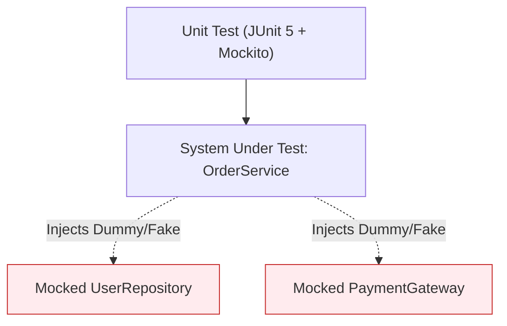

# មេរៀនទី ២: ការធ្វើ Unit Testing ជាមួយ Mockito (Unit Testing with Mockito)

> 🌐 **ភាសា / Language:** 🇰🇭 **[ភាសាខ្មែរ (Khmer)](README.kh.md)** | 🇬🇧 [English](README.md)  
> 🧭 **រុករក:** [📚 មាតិកា Module](../README.kh.md) | [← មេរៀនមុន](../01-unit-testing-junit/README.kh.md) | [មេរៀនបន្ទាប់ →](../03-integration-testing-mockmvc/README.kh.md)

---

## មាតិកា (Table of Contents)
1. [តើអ្វីទៅជា Mocking និង Mockito?](#តើអ្វីទៅជា-mocking)
2. [Annotations សំខាន់ៗ: @Mock, @InjectMocks, @Spy](#annotations-សំខាន់ៗ)
3. [Stubbing Methods (when...thenReturn / doThrow)](#stubbing-methods)
4. [ការផ្ទៀងផ្ទាត់ការហៅ Method (verify, times, never)](#ការផ្ទៀងផ្ទាត់)
5. [ឧទាហរណ៍ជាក់ស្តែង: Testing Service Layer ដោយ Mock Repository](#ឧទាហរណ៍ជាក់ស្តែង)

---

## តើអ្វីទៅជា Mocking និង Mockito?
នៅក្នុង **Unit Testing**, យើងចង់ធ្វើតេស្ត Business Logic នៃ Class តែមួយគត់ដាច់ដោយឡែក (Isolation) ដោយមិនចង់ឱ្យវាភ្ជាប់ទៅកាន់ Database, External Network API ឬ Email Server ពិតប្រាកដឡើយ។ **Mockito** គឺជា Java Mocking Framework ដ៏ពេញនិយមបំផុតដែលជួយបង្កើត Fake/Mock Objects សម្រាប់ជំនួស Dependencies ទាំងនោះ។



---

## Annotations សំខាន់ៗ

- `@Mock`: បង្កើត Mock Object ក្លែងក្លាយ។
- `@InjectMocks`: ចាក់បញ្ចូល Mock Objects ទាំងអស់ចូលទៅក្នុង Class ដែលយើងកំពុងធ្វើតេស្ត។
- `@ExtendWith(MockitoExtension.class)`: បើកដំណើរការ Mockito annotations ជាមួយ JUnit 5។

---

## ឧទាហរណ៍ជាក់ស្តែង: Testing UserService

```java
package com.example.service;

import com.example.dto.CreateUserRequest;
import com.example.dto.UserResponse;
import com.example.model.User;
import com.example.repository.UserRepository;
import org.junit.jupiter.api.BeforeEach;
import org.junit.jupiter.api.DisplayName;
import org.junit.jupiter.api.Test;
import org.junit.jupiter.api.extension.ExtendWith;
import org.mockito.InjectMocks;
import org.mockito.Mock;
import org.mockito.junit.jupiter.MockitoExtension;
import java.util.Optional;

import static org.assertj.core.api.Assertions.assertThat;
import static org.assertj.core.api.Assertions.assertThatThrownBy;
import static org.mockito.ArgumentMatchers.any;
import static org.mockito.Mockito.*;

@ExtendWith(MockitoExtension.class)
class UserServiceTest {

    @Mock
    private UserRepository userRepository;

    @InjectMocks
    private UserService userService;

    private User sampleUser;

    @BeforeEach
    void setUp() {
        sampleUser = new User(1L, "dara", "dara@example.com");
    }

    @Test
    @DisplayName("createUser() គួរតែ save និង return UserDTO ពេល email មិនទាន់មាន")
    void shouldCreateUserSuccessfully() {
        // Given (Stubbing)
        when(userRepository.findByEmail("dara@example.com")).thenReturn(Optional.empty());
        when(userRepository.save(any(User.class))).thenReturn(sampleUser);

        // When
        CreateUserRequest request = new CreateUserRequest("dara", "dara@example.com");
        UserResponse response = userService.createUser(request);

        // Then
        assertThat(response).isNotNull();
        assertThat(response.id()).isEqualTo(1L);
        assertThat(response.username()).isEqualTo("dara");

        // Verify that save was called exactly 1 time
        verify(userRepository, times(1)).save(any(User.class));
    }

    @Test
    @DisplayName("createUser() គួរតែបោះ IllegalArgumentException ពេល email មានរួចហើយ")
    void shouldThrowExceptionWhenEmailExists() {
        // Given
        when(userRepository.findByEmail("dara@example.com")).thenReturn(Optional.of(sampleUser));

        // When & Then
        CreateUserRequest request = new CreateUserRequest("dara", "dara@example.com");
        assertThatThrownBy(() -> userService.createUser(request))
                .isInstanceOf(IllegalArgumentException.class)
                .hasMessageContaining("Email already registered");

        // Verify save was NEVER called
        verify(userRepository, never()).save(any(User.class));
    }
}
```

---

## 🧭 ការរុករកមេរៀន (Lesson Navigation)

| ថយក្រោយ (Previous) | មាតិកា Module (Index) | បន្ទាប់ (Next) |
| :--- | :---: | :--- |
| [← ការធ្វើតេស្តកម្មវិធី Spring Boot ជាមួយ JUnit 5 និង AssertJ (Unit Testing)](../01-unit-testing-junit/README.kh.md) | [📚 បញ្ជីមេរៀន Module](../README.kh.md) | [ការធ្វើ Integration Testing លើ REST Controller ជាមួយ MockMvc (Integration Testing with MockMvc) →](../03-integration-testing-mockmvc/README.kh.md) |
