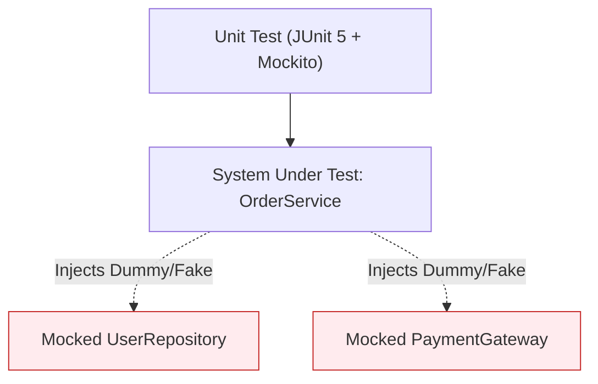

# Lesson 2: Unit Testing with Mockito

> 🌐 **Language / ភាសា:** 🇬🇧 **[English](README.md)** | 🇰🇭 [ភាសាខ្មែរ (Khmer)](README.kh.md)  
> 🧭 **Navigation:** [📚 Module Index](../README.md) | [← Previous Lesson](../01-unit-testing-junit/README.md) | [Next Lesson →](../03-integration-testing-mockmvc/README.md)

---

## Table of Contents
1. [What is Mocking and Mockito?](#what-is-mocking)
2. [Core Annotations: @Mock, @InjectMocks, @Spy](#core-annotations)
3. [Stubbing Method Behaviors (when...thenReturn / doThrow)](#stubbing)
4. [Verification Semantics (verify, times, never)](#verification)
5. [Comprehensive Service Layer Test Example](#comprehensive-example)

---

## What is Mocking and Mockito?
In **Unit Testing**, isolation is paramount. The system under test (SUT) must be tested independently of external databases, third-party REST APIs, or file systems. **Mockito** allows you to generate simulated proxy objects (mocks) to emulate dependency responses and verify collaborative interactions.



---

## Core Annotations

- `@Mock`: Synthesizes a mock instance of the declared class or interface.
- `@InjectMocks`: Instantiates the target class and injects all created mocks into its constructor/fields.
- `@ExtendWith(MockitoExtension.class)`: Integrates Mockito lifecycle extensions with JUnit 5.

---

## Comprehensive Service Layer Test Example

```java
package com.example.service;

import com.example.dto.CreateUserRequest;
import com.example.dto.UserResponse;
import com.example.model.User;
import com.example.repository.UserRepository;
import org.junit.jupiter.api.BeforeEach;
import org.junit.jupiter.api.DisplayName;
import org.junit.jupiter.api.Test;
import org.junit.jupiter.api.extension.ExtendWith;
import org.mockito.InjectMocks;
import org.mockito.Mock;
import org.mockito.junit.jupiter.MockitoExtension;
import java.util.Optional;

import static org.assertj.core.api.Assertions.assertThat;
import static org.assertj.core.api.Assertions.assertThatThrownBy;
import static org.mockito.ArgumentMatchers.any;
import static org.mockito.Mockito.*;

@ExtendWith(MockitoExtension.class)
class UserServiceTest {

    @Mock
    private UserRepository userRepository;

    @InjectMocks
    private UserService userService;

    private User sampleUser;

    @BeforeEach
    void setUp() {
        sampleUser = new User(1L, "dara", "dara@example.com");
    }

    @Test
    @DisplayName("createUser() should persist user and return DTO when email is unique")
    void shouldCreateUserSuccessfully() {
        // Given
        when(userRepository.findByEmail("dara@example.com")).thenReturn(Optional.empty());
        when(userRepository.save(any(User.class))).thenReturn(sampleUser);

        // When
        CreateUserRequest request = new CreateUserRequest("dara", "dara@example.com");
        UserResponse response = userService.createUser(request);

        // Then
        assertThat(response).isNotNull();
        assertThat(response.id()).isEqualTo(1L);
        assertThat(response.username()).isEqualTo("dara");

        verify(userRepository, times(1)).save(any(User.class));
    }

    @Test
    @DisplayName("createUser() should throw IllegalArgumentException when email exists")
    void shouldThrowExceptionWhenEmailExists() {
        // Given
        when(userRepository.findByEmail("dara@example.com")).thenReturn(Optional.of(sampleUser));

        // When & Then
        CreateUserRequest request = new CreateUserRequest("dara", "dara@example.com");
        assertThatThrownBy(() -> userService.createUser(request))
                .isInstanceOf(IllegalArgumentException.class)
                .hasMessageContaining("Email already registered");

        verify(userRepository, never()).save(any(User.class));
    }
}
```

---

## 🧭 Lesson Navigation

| Previous Lesson | Module Index | Next Lesson |
| :--- | :---: | :--- |
| [← Unit Testing Spring Boot Applications with JUnit 5 & AssertJ](../01-unit-testing-junit/README.md) | [📚 Module Index](../README.md) | [REST Controller Integration Testing with MockMvc →](../03-integration-testing-mockmvc/README.md) |
