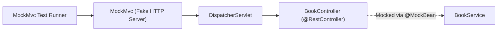

# មេរៀនទី ៣: ការធ្វើ Integration Testing លើ REST Controller ជាមួយ MockMvc (Integration Testing with MockMvc)

> 🌐 **ភាសា / Language:** 🇰🇭 **[ភាសាខ្មែរ (Khmer)](README.kh.md)** | 🇬🇧 [English](README.md)  
> 🧭 **រុករក:** [📚 មាតិកា Module](../README.kh.md) | [← មេរៀនមុន](../02-testing-with-mockito/README.kh.md) | [មេរៀនបន្ទាប់ →](../04-zerocode-testing/README.kh.md)

---

## មាតិកា (Table of Contents)
1. [តើអ្វីទៅជា MockMvc?](#តើអ្វីទៅជា-mockmvc)
2. [@WebMvcTest vs @SpringBootTest](#webmvctest-vs-springboottest)
3. [ការបង្កើត MockMvc Requests (perform, get, post)](#ការបង្កើត-mockmvc-requests)
4. [ការផ្ទៀងផ្ទាត់ Response (status, jsonPath, content)](#ការផ្ទៀងផ្ទាត់-response)
5. [ឧទាហរណ៍ពេញលេញលើ REST Controller](#ឧទាហរណ៍ពេញលេញ)

---

## តើអ្វីទៅជា MockMvc?
**MockMvc** គឺជាឧបករណ៍ដ៏មានឥទ្ធិពលក្នុង Spring Test Framework ដែលអនុវត្តការធ្វើតេស្ត HTTP Endpoints ដោយមិនចាំបាច់បើកដំណើរការ Embedded Servlet Container (Tomcat) ពិតប្រាកដឡើយ។ វាដំណើរការលឿនបំផុត និងអាចធ្វើតេស្ត Routing, Validation, Serialization, និង Exception Handling គ្រប់ជ្រុងជ្រោយ។



---

## ឧទាហរណ៍ពេញលេញជាមួយ @WebMvcTest

```java
package com.example.controller;

import com.example.dto.BookResponse;
import com.example.dto.CreateBookRequest;
import com.example.service.BookService;
import com.fasterxml.jackson.databind.ObjectMapper;
import org.junit.jupiter.api.DisplayName;
import org.junit.jupiter.api.Test;
import org.springframework.beans.factory.annotation.Autowired;
import org.springframework.boot.test.autoconfigure.web.servlet.WebMvcTest;
import org.springframework.boot.test.mock.mockito.MockBean;
import org.springframework.http.MediaType;
import org.springframework.test.web.servlet.MockMvc;
import java.math.BigDecimal;
import java.util.List;

import static org.mockito.ArgumentMatchers.any;
import static org.mockito.Mockito.when;
import static org.springframework.test.web.servlet.request.MockMvcRequestBuilders.*;
import static org.springframework.test.web.servlet.result.MockMvcResultMatchers.*;

@WebMvcTest(BookController.class)
class BookControllerTest {

    @Autowired
    private MockMvc mockMvc;

    @Autowired
    private ObjectMapper objectMapper;

    @MockBean
    private BookService bookService;

    @Test
    @DisplayName("GET /api/v1/books គួរតែ return HTTP 200 និង JSON Array")
    void shouldReturnAllBooks() throws Exception {
        BookResponse book1 = new BookResponse(1L, "Spring Boot", "Craig", "123", BigDecimal.valueOf(29.99));
        when(bookService.getAllBooks()).thenReturn(List.of(book1));

        mockMvc.perform(get("/api/v1/books")
                .contentType(MediaType.APPLICATION_JSON))
                .andExpect(status().isOk())
                .andExpect(content().contentType(MediaType.APPLICATION_JSON))
                .andExpect(jsonPath("$.size()").value(1))
                .andExpect(jsonPath("$[0].title").value("Spring Boot"))
                .andExpect(jsonPath("$[0].price").value(29.99));
    }

    @Test
    @DisplayName("POST /api/v1/books គួរតែ return HTTP 201 Created ពេលទិន្នន័យត្រឹមត្រូវ")
    void shouldCreateBook() throws Exception {
        CreateBookRequest request = new CreateBookRequest("Clean Code", "Robert", "456", BigDecimal.valueOf(35.00));
        BookResponse created = new BookResponse(2L, "Clean Code", "Robert", "456", BigDecimal.valueOf(35.00));

        when(bookService.createBook(any(CreateBookRequest.class))).thenReturn(created);

        mockMvc.perform(post("/api/v1/books")
                .contentType(MediaType.APPLICATION_JSON)
                .content(objectMapper.writeValueAsString(request)))
                .andExpect(status().isCreated())
                .andExpect(jsonPath("$.id").value(2L))
                .andExpect(jsonPath("$.title").value("Clean Code"));
    }
}
```

---

## 🧭 ការរុករកមេរៀន (Lesson Navigation)

| ថយក្រោយ (Previous) | មាតិកា Module (Index) | បន្ទាប់ (Next) |
| :--- | :---: | :--- |
| [← ការធ្វើ Unit Testing ជាមួយ Mockito (Unit Testing with Mockito)](../02-testing-with-mockito/README.kh.md) | [📚 បញ្ជីមេរៀន Module](../README.kh.md) | [ការធ្វើ Declarative API Testing ជាមួយ ZeroCode (ZeroCode Testing Framework) →](../04-zerocode-testing/README.kh.md) |
