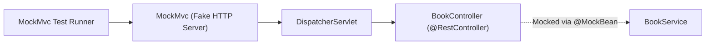

# Lesson 3: REST Controller Integration Testing with MockMvc

> 🌐 **Language / ភាសា:** 🇬🇧 **[English](README.md)** | 🇰🇭 [ភាសាខ្មែរ (Khmer)](README.kh.md)  
> 🧭 **Navigation:** [📚 Module Index](../README.md) | [← Previous Lesson](../02-testing-with-mockito/README.md) | [Next Lesson →](../04-zerocode-testing/README.md)

---

## Table of Contents
1. [What is MockMvc?](#what-is-mockmvc)
2. [@WebMvcTest vs @SpringBootTest](#slicing-vs-full)
3. [Building MockMvc Invocations (perform, get, post)](#building-requests)
4. [Validating Assertions with jsonPath and status](#validating-assertions)
5. [Complete REST Controller Test Suite](#complete-test-suite)

---

## What is MockMvc?
**MockMvc** provides end-to-end testing for Spring MVC controllers without firing up an actual HTTP server. By simulating the full `DispatcherServlet` pipeline, you verify route mapping, payload serialization, bean validation, and security constraints with sub-second execution speeds.



---

## Complete @WebMvcTest Example

```java
package com.example.controller;

import com.example.dto.BookResponse;
import com.example.dto.CreateBookRequest;
import com.example.service.BookService;
import com.fasterxml.jackson.databind.ObjectMapper;
import org.junit.jupiter.api.DisplayName;
import org.junit.jupiter.api.Test;
import org.springframework.beans.factory.annotation.Autowired;
import org.springframework.boot.test.autoconfigure.web.servlet.WebMvcTest;
import org.springframework.boot.test.mock.mockito.MockBean;
import org.springframework.http.MediaType;
import org.springframework.test.web.servlet.MockMvc;
import java.math.BigDecimal;
import java.util.List;

import static org.mockito.ArgumentMatchers.any;
import static org.mockito.Mockito.when;
import static org.springframework.test.web.servlet.request.MockMvcRequestBuilders.*;
import static org.springframework.test.web.servlet.result.MockMvcResultMatchers.*;

@WebMvcTest(BookController.class)
class BookControllerTest {

    @Autowired
    private MockMvc mockMvc;

    @Autowired
    private ObjectMapper objectMapper;

    @MockBean
    private BookService bookService;

    @Test
    @DisplayName("GET /api/v1/books should return HTTP 200 and JSON Array")
    void shouldReturnAllBooks() throws Exception {
        BookResponse book1 = new BookResponse(1L, "Spring Boot", "Craig", "123", BigDecimal.valueOf(29.99));
        when(bookService.getAllBooks()).thenReturn(List.of(book1));

        mockMvc.perform(get("/api/v1/books")
                .contentType(MediaType.APPLICATION_JSON))
                .andExpect(status().isOk())
                .andExpect(content().contentType(MediaType.APPLICATION_JSON))
                .andExpect(jsonPath("$.size()").value(1))
                .andExpect(jsonPath("$[0].title").value("Spring Boot"))
                .andExpect(jsonPath("$[0].price").value(29.99));
    }

    @Test
    @DisplayName("POST /api/v1/books should return HTTP 201 Created on valid input")
    void shouldCreateBook() throws Exception {
        CreateBookRequest request = new CreateBookRequest("Clean Code", "Robert", "456", BigDecimal.valueOf(35.00));
        BookResponse created = new BookResponse(2L, "Clean Code", "Robert", "456", BigDecimal.valueOf(35.00));

        when(bookService.createBook(any(CreateBookRequest.class))).thenReturn(created);

        mockMvc.perform(post("/api/v1/books")
                .contentType(MediaType.APPLICATION_JSON)
                .content(objectMapper.writeValueAsString(request)))
                .andExpect(status().isCreated())
                .andExpect(jsonPath("$.id").value(2L))
                .andExpect(jsonPath("$.title").value("Clean Code"));
    }
}
```

---

## 🧭 Lesson Navigation

| Previous Lesson | Module Index | Next Lesson |
| :--- | :---: | :--- |
| [← Unit Testing with Mockito](../02-testing-with-mockito/README.md) | [📚 Module Index](../README.md) | [Declarative API Testing with ZeroCode →](../04-zerocode-testing/README.md) |
