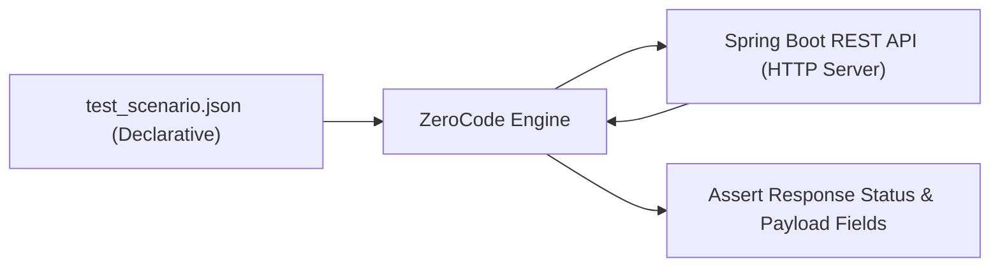

# មេរៀនទី ៤: ការធ្វើ Declarative API Testing ជាមួយ ZeroCode (ZeroCode Testing Framework)

> 🌐 **ភាសា / Language:** 🇰🇭 **[ភាសាខ្មែរ (Khmer)](README.kh.md)** | 🇬🇧 [English](README.md)  
> 🧭 **រុករក:** [📚 មាតិកា Module](../README.kh.md) | [← មេរៀនមុន](../03-integration-testing-mockmvc/README.kh.md) | [មេរៀនបន្ទាប់ →](../README.kh.md)

---

## មាតិកា (Table of Contents)
1. [តើអ្វីទៅជា ZeroCode Framework?](#តើអ្វីទៅជា-zerocode)
2. [ហេតុអ្វីត្រូវជ្រើសរើស Declarative JSON Testing?](#ហេតុអ្វី)
3. [Maven Dependency Setup](#maven-dependency-setup)
4. [ការបង្កើត JSON Test Scenarios](#ការបង្កើត-json-test)
5. [ការដំណើរការ ZeroCode Tests ជាមួយ JUnit 5 Runner](#ការដំណើរការ)

---

## តើអ្វីទៅជា ZeroCode Framework?
**ZeroCode** គឺជា Open-Source Framework សម្រាប់ធ្វើ Declarative API Testing (REST, SOAP, Kafka, GraphQL) ដោយពុំចាំបាច់សរសេរបន្ទាត់ Java Code ស្មុគស្មាញឡើយ។ Test Cases ទាំងមូលត្រូវបានសរសេរជាទម្រង់ **JSON Format** យ៉ាងងាយស្រួល ដែលជួយឱ្យទាំង Developers និង QA Engineers អាចសហការគ្នាបានយ៉ាងរលូន។



---

## Maven Dependency Setup

```xml
<dependency>
    <groupId>org.jsmart</groupId>
    <artifactId>zerocode-tdd</artifactId>
    <version>1.3.43</version>
    <scope>test</scope>
</dependency>
```

---

## ការបង្កើត JSON Test Scenario

ដាក់ file នៅ `src/test/resources/tests/get_all_books_test.json`៖

```json
{
  "scenarioName": "Fetch all books and verify response",
  "steps": [
    {
      "name": "get_books_step",
      "url": "/api/v1/books",
      "operation": "GET",
      "request": {},
      "assertions": {
        "status": 200,
        "body": [
          {
            "id": 1,
            "title": "Spring Boot in Action"
          }
        ]
      }
    }
  ]
}
```

---

## ការដំណើរការជាមួយ JUnit Test Runner

```java
package com.example.zerocode;

import org.jsmart.zerocode.core.domain.JsonTestCase;
import org.jsmart.zerocode.core.domain.TargetEnv;
import org.jsmart.zerocode.core.runner.ZeroCodeUnitRunner;
import org.junit.Test;
import org.junit.runner.RunWith;

@TargetEnv("host.properties")
@RunWith(ZeroCodeUnitRunner.class)
public class BookApiZeroCodeTest {

    @Test
    @JsonTestCase("tests/get_all_books_test.json")
    public void testGetAllBooks() {
        // ZeroCode executes JSON scenario declarations automatically
    }
}
```

---

## 🧭 ការរុករកមេរៀន (Lesson Navigation)

| ថយក្រោយ (Previous) | មាតិកា Module (Index) | បន្ទាប់ (Next) |
| :--- | :---: | :--- |
| [← ការធ្វើ Integration Testing លើ REST Controller ជាមួយ MockMvc (Integration Testing with MockMvc)](../03-integration-testing-mockmvc/README.kh.md) | [📚 បញ្ជីមេរៀន Module](../README.kh.md) | [មាតិកា Module →](../README.kh.md) |
