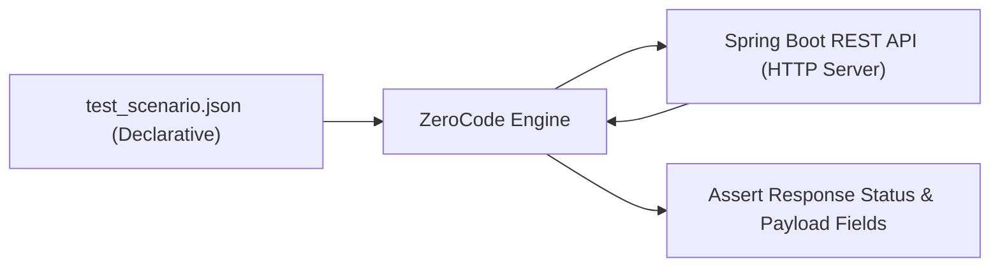

# Lesson 4: Declarative API Testing with ZeroCode

> 🌐 **Language / ភាសា:** 🇬🇧 **[English](README.md)** | 🇰🇭 [ភាសាខ្មែរ (Khmer)](README.kh.md)  
> 🧭 **Navigation:** [📚 Module Index](../README.md) | [← Previous Lesson](../03-integration-testing-mockmvc/README.md) | [Next Lesson →](../README.md)

---

## Table of Contents
1. [What is the ZeroCode Testing Framework?](#what-is-zerocode)
2. [Advantages of Declarative JSON-Based API Testing](#advantages)
3. [Maven Dependency Setup](#maven-dependency-setup)
4. [Writing JSON Test Scenarios](#json-scenarios)
5. [Running ZeroCode Tests with JUnit Runners](#test-runners)

---

## What is the ZeroCode Testing Framework?
**ZeroCode** is an open-source test-automation framework that enables declarative, code-free API contract, integration, and load testing (REST, Kafka, GraphQL, Databases). Scenarios, expectations, and assertions are declared cleanly in **human-readable JSON**.



---

## Maven Dependency Setup

```xml
<dependency>
    <groupId>org.jsmart</groupId>
    <artifactId>zerocode-tdd</artifactId>
    <version>1.3.43</version>
    <scope>test</scope>
</dependency>
```

---

## Writing JSON Test Scenarios

Save scenario in `src/test/resources/tests/get_all_books_test.json`:

```json
{
  "scenarioName": "Fetch all books and verify response",
  "steps": [
    {
      "name": "get_books_step",
      "url": "/api/v1/books",
      "operation": "GET",
      "request": {},
      "assertions": {
        "status": 200,
        "body": [
          {
            "id": 1,
            "title": "Spring Boot in Action"
          }
        ]
      }
    }
  ]
}
```

---

## Running ZeroCode Tests with JUnit Runners

```java
package com.example.zerocode;

import org.jsmart.zerocode.core.domain.JsonTestCase;
import org.jsmart.zerocode.core.domain.TargetEnv;
import org.jsmart.zerocode.core.runner.ZeroCodeUnitRunner;
import org.junit.Test;
import org.junit.runner.RunWith;

@TargetEnv("host.properties")
@RunWith(ZeroCodeUnitRunner.class)
public class BookApiZeroCodeTest {

    @Test
    @JsonTestCase("tests/get_all_books_test.json")
    public void testGetAllBooks() {
        // ZeroCode executes JSON scenario declarations automatically
    }
}
```

---

## 🧭 Lesson Navigation

| Previous Lesson | Module Index | Next Lesson |
| :--- | :---: | :--- |
| [← REST Controller Integration Testing with MockMvc](../03-integration-testing-mockmvc/README.md) | [📚 Module Index](../README.md) | [Module Index →](../README.md) |
