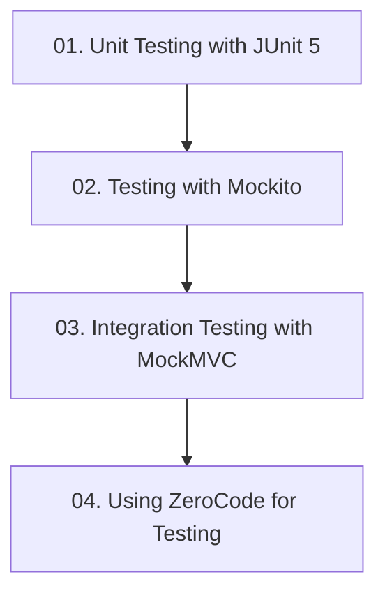

# Module 10: ការធ្វើតេស្តកម្មវិធី Spring Boot (Spring Boot Testing)

## 📖 សេចក្តីផ្តើមអំពី Module

ធានាគុណភាពកូដកម្រិតវិស្វកម្ម៖ Unit Testing ជាមួយ JUnit 5, Mockito Test Doubles, Integration Testing ជាមួយ MockMVC, និង ZeroCode Testing Framework។

---

## 🗺️ ផែនទីសិក្សាប្រចាំ Module (Learning Roadmap)

---

## 📚 បញ្ជីមេរៀនក្នុង Module (4 Lessons)

| មេរៀន (Lesson) | ប្រធានបទ (Topic) | ការពិពណ៌នា (Description) |
| :---: | :--- | :--- |
| **01** | [Unit Testing with JUnit 5](01-unit-testing-junit/README.md) | មូលដ្ឋានគ្រឹះ JUnit 5, Assertions, Test Lifecycle (@BeforeEach, @Test) |
| **02** | [Testing with Mockito](02-testing-with-mockito/README.md) | ការ Mock Dependencies ជាមួយ @Mock, @InjectMocks, when().thenReturn() |
| **03** | [Integration Testing with MockMVC](03-integration-testing-mockmvc/README.md) | ការក្លែងធ្វើជា HTTP Request និងផ្ទៀងផ្ទាត់ JSON Response ជាមួយ MockMvc |
| **04** | [Using ZeroCode for Testing](04-zerocode-testing/README.md) | ការធ្វើតេស្ត REST APIs ដោយប្រើ declarative JSON tests ជាមួយ ZeroCode |

---

## 🧭 ការរុករក (Navigation)

| ថយក្រោយ (Previous) | មាតិកាចម្បង (Main Index) | បន្ទាប់ (Next Module) |
| :--- | :---: | :--- |
| [Module 9: Aspect-Oriented Programming](../09-spring-boot-with-aop/README.md) | [📚 មាតិកា Spring Boot](../README.md) | *បញ្ចប់វគ្គសិក្សា Spring Boot (End of Curriculum)* |
