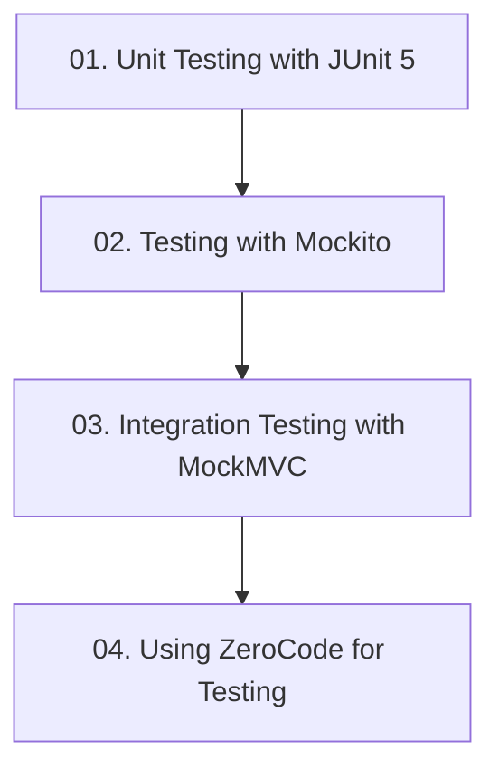

# Module 10: Automated Testing in Spring Boot

> 🌐 **Language / ភាសា:** 🇰🇭 [ភាសាខ្មែរ (Khmer)](README.kh.md) | 🇬🇧 **[English](README.md)**

## 📖 Module Overview

Production-grade automated testing: Unit testing with JUnit 5, mock objects via Mockito, web layer integration testing with MockMVC, and declarative API testing with ZeroCode.

---

## 🗺️ Module Learning Roadmap

---

## 📚 Lessons in This Module (4 Lessons)

| Lesson | Topic | Description |
| :---: | :--- | :--- |
| **01** | [Unit Testing with JUnit 5](01-unit-testing-junit/README.md) | Core unit testing principles with JUnit 5 annotations and AssertJ |
| **02** | [Testing with Mockito](02-testing-with-mockito/README.md) | Creating isolated test doubles using Mockito mocks and verifications |
| **03** | [Integration Testing with MockMVC](03-integration-testing-mockmvc/README.md) | Web slice testing and JSON path assertion with MockMvc |
| **04** | [Using ZeroCode for Testing](04-zerocode-testing/README.md) | Declarative automated API testing in Spring Boot using ZeroCode |

---

## 🧭 Navigation

| Previous | Main Index | Next Module |
| :--- | :---: | :--- |
| [Module 9: Aspect-Oriented Programming](../09-spring-boot-with-aop/README.md) | [📚 Spring Boot Home](../README.md) | *End of Spring Boot Curriculum* |
