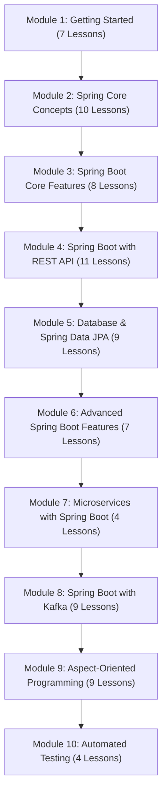

# Spring Boot for Developers (ខេមរភាសា) 🇰🇭

> **វគ្គសិក្សាទី ៤៖ ការអភិវឌ្ឍ Microservices និង Cloud-Native APIs ជាមួយ Spring Boot**

> 🌐 **ភាសា / Language:** 🇰🇭 **[ភាសាខ្មែរ (Khmer)](README.kh.md)** | 🇬🇧 [English](README.md)

[-green.svg)](#-មាតិកាវគ្គសិក្សា-table-of-contents)

---

## 📖 អំពីវគ្គសិក្សា Spring Boot

**Spring Boot** គឺជាបច្ចេកវិទ្យាកម្រិតស្តង់ដារឧស្សាហកម្មសម្រាប់សាងសង់ **Microservices**, **RESTful APIs**, និង **Enterprise Backend Systems** ក្នុងយុគសម័យ Cloud-Native។

វគ្គសិក្សានេះត្រូវបានដកស្រង់ និងចងក្រងយ៉ាងផ្ចិតផ្ចង់ចេញពីកម្មវិធីសិក្សាពេញលេញរបស់ **[GeeksforGeeks Spring Boot Tutorial](https://www.geeksforgeeks.org/advance-java/spring-boot/)** ដោយបែងចែកជា **៧៨ មេរៀន** ស្ថិតក្នុង **១០ ផ្នែកធំៗ (10 Modules)**៖
1. **Module 1: Getting Started with Spring Boot (៧ មេរៀន)**
2. **Module 2: Spring Core Concept (១០ មេរៀន)**
3. **Module 3: Spring Boot Core Features (៨ មេរៀន)**
4. **Module 4: Spring Boot with REST API (១១ មេរៀន)**
5. **Module 5: Spring Boot with Database and Data JPA (៩ មេរៀន)**
6. **Module 6: Advanced Spring Boot Features (៧ មេរៀន)**
7. **Module 7: Microservices with Spring Boot (៤ មេរៀន)**
8. **Module 8: Spring Boot with Kafka (៩ មេរៀន)**
9. **Module 9: Spring Boot with AOP (៩ មេរៀន)**
10. **Module 10: Spring Boot Testing (៤ មេរៀន)**

---

## 🗺️ ផែនទីសិក្សាធំ (Master Course Roadmap)

---

## 📂 គម្រោងកូដគំរូជាក់ស្តែង (Runnable Example Projects)

វគ្គសិក្សានេះផ្តល់ជូននូវ Folder `examples/` ដែលផ្ទុកគម្រោងកូដ Maven ពេញលេញ អាច Clone ឬបើកដំណើរការ (Run) ក្នុង IntelliJ IDEA, Eclipse, ឬ Terminal បានភ្លាមៗ៖

| គម្រោង (Project) | បច្ចេកវិទ្យា (Stack) | ការពិពណ៌នា (Description) | ឯកសារសំខាន់ៗ (Key Files) |
| :--- | :--- | :--- | :--- |
| [**01-rest-api-crud**](examples/01-rest-api-crud) | Spring Boot 3.3, REST, DTO Records, Validation | Bookstore CRUD API ពេញលេញជាមួយ Global Exception Handling | [`BookController.java`](examples/01-rest-api-crud/src/main/java/com/example/bookstore/controller/BookController.java) [`BookService.java`](examples/01-rest-api-crud/src/main/java/com/example/bookstore/service/BookService.java) [`GlobalExceptionHandler.java`](examples/01-rest-api-crud/src/main/java/com/example/bookstore/exception/GlobalExceptionHandler.java) |
| [**02-spring-data-jpa-postgresql**](examples/02-spring-data-jpa-postgresql) | Spring Data JPA, Hibernate, PostgreSQL, H2 | Todo List Persistence API ជាមួយ Transactional Service | [`Todo.java`](examples/02-spring-data-jpa-postgresql/src/main/java/com/example/todo/model/Todo.java) [`TodoRepository.java`](examples/02-spring-data-jpa-postgresql/src/main/java/com/example/todo/repository/TodoRepository.java) [`TodoService.java`](examples/02-spring-data-jpa-postgresql/src/main/java/com/example/todo/service/TodoService.java) |
| [**03-redis-caching**](examples/03-redis-caching) | Spring Cache, Redis, Docker Compose | Redis CacheManager កំណត់ TTL 10 នាទី និង JSON Serializer | [`RedisConfig.java`](examples/03-redis-caching/src/main/java/com/example/cache/config/RedisConfig.java) [`ProductService.java`](examples/03-redis-caching/src/main/java/com/example/cache/service/ProductService.java) [`docker-compose.yml`](examples/03-redis-caching/docker-compose.yml) |
| [**04-kafka-messaging**](examples/04-kafka-messaging) | Spring Kafka, Event-Driven, Docker Compose | Order Event Streaming ជាមួយ KafkaTemplate & `@KafkaListener` | [`OrderEventProducer.java`](examples/04-kafka-messaging/src/main/java/com/example/kafka/producer/OrderEventProducer.java) [`OrderEventConsumer.java`](examples/04-kafka-messaging/src/main/java/com/example/kafka/consumer/OrderEventConsumer.java) [`OrderCreatedEvent.java`](examples/04-kafka-messaging/src/main/java/com/example/kafka/event/OrderCreatedEvent.java) |
| [**05-microservices-ecommerce**](examples/05-microservices-ecommerce) | Spring Cloud, Eureka, Gateway, OpenFeign | ស្ថាបត្យកម្ម Microservices ពាណិជ្ជកម្មអេឡិចត្រូនិច ៤ សេវាកម្ម | [`eureka-server`](examples/05-microservices-ecommerce/eureka-server) [`api-gateway`](examples/05-microservices-ecommerce/api-gateway) [`product-service`](examples/05-microservices-ecommerce/product-service) [`order-service`](examples/05-microservices-ecommerce/order-service) [`docker-compose.yml`](examples/05-microservices-ecommerce/docker-compose.yml) |

> 💡 **គន្លឹះ:** នៅក្នុងមេរៀននីមួយៗ អ្នកអាននឹងឃើញ Banner ភ្ជាប់ទៅកាន់ Project និង File កូដពាក់ព័ន្ធដោយផ្ទាល់ ងាយស្រួលចុចបើកផ្ទៀងផ្ទាត់ពេលកំពុងរៀន។

---

## 📚 មាតិកាវគ្គសិក្សា (Table of Contents - 78 Lessons)

### 📁 [Module 1: ចាប់ផ្តើមដំបូងជាមួយ Spring Boot (Getting Started)](01-getting-started-with-spring-boot/README.kh.md)
*ស្វែងយល់ពីប្រវត្តិ និយមន័យ សសរទ្រូងទាំង ៤ ភាពខុសគ្នារវាង Spring vs Spring Boot vs Spring MVC និងការដំឡើងបរិស្ថានអភិវឌ្ឍន៍លើ STS, Eclipse, និង IntelliJ IDEA។*

| # | មេរៀន (Lesson) | ការពិពណ៌នា (Description) |
| :---: | :--- | :--- |
| **01** | [Introduction to Spring Boot](01-getting-started-with-spring-boot/01-introduction-to-spring-boot/README.kh.md) | និយមន័យ និងសសរទ្រូងទាំង ៤ របស់ Spring Boot |
| **02** | [Spring vs Spring Boot](01-getting-started-with-spring-boot/02-spring-vs-spring-boot/README.kh.md) | ការប្រៀបធៀបស៊ីជម្រៅរវាង Spring Framework និង Spring Boot |
| **03** | [Spring MVC vs Spring Boot](01-getting-started-with-spring-boot/03-spring-mvc-vs-spring-boot/README.kh.md) | បែងចែកឱ្យច្បាស់រវាង Web MVC Layer និង Application Bootstrapper |
| **04** | [Spring Tool Suite (STS) Setup](01-getting-started-with-spring-boot/04-sts-project-setup/README.kh.md) | ការដំឡើង និងបង្កើតគម្រោងដំបូងលើ Spring Tool Suite 4 |
| **05** | [Eclipse IDE Setup](01-getting-started-with-spring-boot/05-eclipse-ide-setup/README.kh.md) | ការតម្លើង Spring Tools Plugin និងបង្កើត Maven Project លើ Eclipse |
| **06** | [IntelliJ IDEA Project Setup](01-getting-started-with-spring-boot/06-intellij-idea-setup/README.kh.md) | ការបង្កើតគម្រោងតាម Spring Initializr លើ IntelliJ IDEA |
| **07** | [Run Spring Boot Application](01-getting-started-with-spring-boot/07-run-spring-boot-application/README.kh.md) | វិធីទាំង ៤ ក្នុងការ Run App (IDE, CLI, Maven Wrapper, JAR) |

---

### 📁 [Module 2: គោលគំនិតគ្រឹះនៃ Spring Core (Spring Core Concepts)](02-spring-core-concept/README.kh.md)
*សិក្សាស៊ីជម្រៅអំពីយន្តការស្នូលរបស់ Spring Framework រួមមាន Inversion of Control (IoC), Dependency Injection, Bean Scopes, Bean Lifecycle, និង DispatcherServlet។*

| # | មេរៀន (Lesson) | ការពិពណ៌នា (Description) |
| :---: | :--- | :--- |
| **01** | [Inversion of Control (IoC)](02-spring-core-concept/01-inversion-of-control/README.kh.md) | ស្វែងយល់អំពីគោលការណ៍ IoC និង IoC Container |
| **02** | [Dependency Injection (DI)](02-spring-core-concept/02-dependency-injection/README.kh.md) | ការអនុវត្ត Dependency Injection ជាក់ស្តែងក្នុង Java |
| **03** | [BeanFactory vs ApplicationContext](02-spring-core-concept/03-beanfactory-vs-applicationcontext/README.kh.md) | ការប្រៀបធៀបប្រភេទ Container ទាំងពីររបស់ Spring |
| **04** | [Spring Bean Lifecycle](02-spring-core-concept/04-spring-bean-lifecycle/README.kh.md) | ដំណាក់កាលទាំង ៧ នៃវដ្តជីវិតរបស់ Spring Bean |
| **05** | [Singleton and Prototype Scopes](02-spring-core-concept/05-singleton-and-prototype-scopes/README.kh.md) | ការយល់ដឹងអំពី Singleton (default) និង Prototype Scope |
| **06** | [Custom Bean Scope in Spring](02-spring-core-concept/06-custom-bean-scope/README.kh.md) | របៀបបង្កើត Scope ផ្ទាល់ខ្លួនតាមតម្រូវការអាជីវកម្ម |
| **07** | [Create a Spring Bean in 3 Ways](02-spring-core-concept/07-create-spring-bean-3-ways/README.kh.md) | វិធីទាំង ៣ ក្នុងការបង្កើត Bean (XML, Java Config, Component Scan) |
| **08** | [Spring Autowiring (@Autowired)](02-spring-core-concept/08-spring-autowiring/README.kh.md) | យន្តការចាក់បញ្ចូល Bean ដោយស្វ័យប្រវត្តិតាម Type/Name |
| **09** | [What is DispatcherServlet in Spring](02-spring-core-concept/09-dispatcherservlet/README.kh.md) | ស្ថាបត្យកម្ម Front Controller និងការគ្រប់គ្រង Web Request |
| **10** | [Build Tools: Maven vs Gradle](02-spring-core-concept/10-build-tools-maven-gradle/README.kh.md) | ការគ្រប់គ្រង Dependencies, Plugins, និង Lifecycle ក្នុង Maven & Gradle |

---

### 📁 [Module 3: លក្ខណៈពិសេសស្នូលរបស់ Spring Boot (Core Features)](03-spring-boot-core-features/README.kh.md)
*ស្វែងយល់ពីបច្ចេកវិទ្យាស្នូលរបស់ Spring Boot៖ ស្ថាបត្យកម្ម Layered, Annotations សំខាន់ៗ, យន្តការ Auto-Configuration, Starters, Properties/YAML, Actuator, និង DevTools។*

| # | មេរៀន (Lesson) | ការពិពណ៌នា (Description) |
| :---: | :--- | :--- |
| **01** | [Spring Boot Architecture](03-spring-boot-core-features/01-spring-boot-architecture/README.kh.md) | ស្ថាបត្យកម្ម 4-Layer និងដំណើរការ Request-Response |
| **02** | [Spring Boot Core Annotations](03-spring-boot-core-features/02-spring-boot-annotations/README.kh.md) | បណ្តុំ Annotations សំខាន់ៗបំផុតដែលត្រូវចេះក្នុង Spring Boot |
| **03** | [Auto-Configuration Deep Dive](03-spring-boot-core-features/03-auto-configuration/README.kh.md) | យន្តការកំណត់រចនាសម្ព័ន្ធស្វ័យប្រវត្តិ និង @Conditional |
| **04** | [Dependency Management & Starters](03-spring-boot-core-features/04-dependency-management/README.kh.md) | ការគ្រប់គ្រង Dependencies តាម Starters និង Spring Boot BOM |
| **05** | [Application Properties Configuration](03-spring-boot-core-features/05-application-properties/README.kh.md) | ការកំណត់ Properties, @Value, និង @ConfigurationProperties |
| **06** | [YAML Configuration (application.yml)](03-spring-boot-core-features/06-yaml-configuration/README.kh.md) | ការប្រើប្រាស់ YAML, Hierarchical structure, និង Multi-Profiles |
| **07** | [Spring Boot Actuator](03-spring-boot-core-features/07-spring-boot-actuator/README.kh.md) | ការត្រួតពិនិត្យសុខភាពប្រព័ន្ធតាម /health, /metrics, /info |
| **08** | [Spring Boot DevTools](03-spring-boot-core-features/08-spring-boot-devtools/README.kh.md) | បង្កើនល្បឿនអភិវឌ្ឍន៍ជាមួយ Automatic Restart និង LiveReload |

---

### 📁 [Module 4: ការកសាង RESTful Web APIs (REST API with Spring Boot)](04-spring-boot-with-rest-api/README.kh.md)
*ស្ថាបត្យកម្ម Web API ទំនើប៖ Controllers, Routing, Request Parameters, Request Body, Jackson JSON, DTO Pattern, Input Validation, និង Global Exception Handling។*

| # | មេរៀន (Lesson) | ការពិពណ៌នា (Description) |
| :---: | :--- | :--- |
| **01** | [Introduction to RESTful Services](04-spring-boot-with-rest-api/01-intro-to-restful-web-services/README.kh.md) | ស្ថាបត្យកម្ម REST គោលការណ៍ HTTP Methods និង Best Practices |
| **02** | [@RestController in Spring Boot](04-spring-boot-with-rest-api/02-rest-controller/README.kh.md) | @RestController vs @Controller និង ResponseBody |
| **03** | [@RequestMapping Deep Dive](04-spring-boot-with-rest-api/03-request-mapping/README.kh.md) | ការកំណត់ Route, Base URL, និង HTTP Method Filtering |
| **04** | [@GetMapping and @PostMapping](04-spring-boot-with-rest-api/04-get-and-post-mapping/README.kh.md) | ការទាញយកទិន្នន័យ (GET) និងការបង្កើត Resource ថ្មី (POST) |
| **05** | [@PutMapping and @DeleteMapping](04-spring-boot-with-rest-api/05-put-and-delete-mapping/README.kh.md) | ការកែប្រែទិន្នន័យទាំងមូល (PUT) និងការលុប (DELETE) |
| **06** | [@PathVariable vs @RequestParam](04-spring-boot-with-rest-api/06-pathvariable-and-requestparam/README.kh.md) | ការចាប់យក URL Path Segments និង Query Parameters |
| **07** | [@RequestBody Payload Extraction](04-spring-boot-with-rest-api/07-requestbody/README.kh.md) | ការទទួល និងបម្លែង JSON Payload មកជា Java Object |
| **08** | [Complete REST API Implementation](04-spring-boot-with-rest-api/08-build-rest-api-example/README.kh.md) | កូដគំរូជាក់ស្តែងពេញលេញនៃការបង្កើត REST API មួយ |
| **09** | [JSON Serialization with Jackson](04-spring-boot-with-rest-api/09-json-serialization-jackson/README.kh.md) | ការបម្លែង JSON, Jackson Annotations, DTOs, និង Java Records |
| **10** | [Global Exception Handling](04-spring-boot-with-rest-api/10-exception-handling/README.kh.md) | ការគ្រប់គ្រង Error កម្រិតសកលជាមួយ @RestControllerAdvice |
| **11** | [Input Validation with Hibernate Validator](04-spring-boot-with-rest-api/11-validation/README.kh.md) | ការផ្ទៀងផ្ទាត់ទិន្នន័យជាមួយ Jakarta Bean Validation (@Valid) |

---

### 📁 [Module 5: ការតភ្ជាប់ Database និង Spring Data JPA (Database & Data JPA)](05-spring-boot-database-and-data-jpa/README.kh.md)
*គ្រប់គ្រងទិន្នន័យ Database ប្រកបដោយប្រសិទ្ធភាព៖ MySQL, PostgreSQL, MongoDB, Spring Data JPA, JDBC Template, Repositories, In-memory H2, និងគម្រោង Todo List CRUD។*

| # | មេរៀន (Lesson) | ការពិពណ៌នា (Description) |
| :---: | :--- | :--- |
| **01** | [Spring Boot with MySQL](05-spring-boot-database-and-data-jpa/01-integration-with-mysql/README.kh.md) | ការតភ្ជាប់ និងកំណត់ DataSource ជាមួយ MySQL Database |
| **02** | [Spring Boot with PostgreSQL](05-spring-boot-database-and-data-jpa/02-integration-with-postgresql/README.kh.md) | ការតភ្ជាប់ និងដំណើរការជាមួយ PostgreSQL Database |
| **03** | [Spring Boot with MongoDB](05-spring-boot-database-and-data-jpa/03-integration-with-mongodb/README.kh.md) | ការតភ្ជាប់ NoSQL Document Database ជាមួយ Spring Data MongoDB |
| **04** | [Spring Data JPA Basics](05-spring-boot-database-and-data-jpa/04-spring-data-jpa-basics/README.kh.md) | ORM Architecture, @Entity, @Table, @Id, @GeneratedValue |
| **05** | [Spring Boot with JDBC (JdbcTemplate)](05-spring-boot-database-and-data-jpa/05-spring-boot-jdbc-jdbctemplate/README.kh.md) | ការប្រើប្រាស់ JdbcTemplate សម្រាប់ High-performance Raw SQL |
| **06** | [CrudRepository vs JpaRepository](05-spring-boot-database-and-data-jpa/06-crudrepository-vs-jparepository/README.kh.md) | ការប្រៀបធៀប Repositories និងការបង្កើត Query Methods |
| **07** | [H2 In-Memory Database for Testing](05-spring-boot-database-and-data-jpa/07-h2-database-for-testing/README.kh.md) | ការប្រើប្រាស់ H2 Console និងការកំណត់ Embedded DB |
| **08** | [CRUD Operations with JPA Repositories](05-spring-boot-database-and-data-jpa/08-crud-operations-jpa/README.kh.md) | ការអនុវត្តប្រតិបត្តិការ Create, Read, Update, Delete ពេញលេញ |
| **09** | [Todo List API Project with MySQL](05-spring-boot-database-and-data-jpa/09-todo-list-api-project/README.kh.md) | គម្រោងជាក់ស្តែង៖ បង្កើត Todo REST API ភ្ជាប់ជាមួយ MySQL |

---

### 📁 [Module 6: មុខងារកម្រិតខ្ពស់របស់ Spring Boot (Advanced Features)](06-advanced-spring-boot-features/README.kh.md)
*មុខងារសំខាន់ៗសម្រាប់ប្រព័ន្ធ Enterprise៖ Task Scheduling, ការផ្ញើ Email តាម SMTP, ការ Upload ឯកសារ, Caching (Redis), Transaction Management (@Transactional), និង DTO Mapping។*

| # | មេរៀន (Lesson) | ការពិពណ៌នា (Description) |
| :---: | :--- | :--- |
| **01** | [Task Scheduling (@Scheduled)](06-advanced-spring-boot-features/01-task-scheduling/README.kh.md) | ការរត់ការងារស្វ័យប្រវត្តិតាម fixedRate, fixedDelay, និង Cron |
| **02** | [Sending Email via SMTP](06-advanced-spring-boot-features/02-sending-email-smtp/README.kh.md) | ការផ្ញើអ៊ីមែលអត្ថបទធម្មតា និង HTML ជាមួយ Spring Mail |
| **03** | [File Uploading & MultipartFile](06-advanced-spring-boot-features/03-file-handling-upload/README.kh.md) | ការទទួល និងរក្សាទុក File Upload ជាមួយ MultipartFile |
| **04** | [Spring Boot Caching Basics](06-advanced-spring-boot-features/04-caching/README.kh.md) | ការបង្កើនល្បឿន API ជាមួយ @Cacheable, @CachePut, @CacheEvict |
| **05** | [Caching with Redis & Other Providers](06-advanced-spring-boot-features/05-caching-providers-redis/README.kh.md) | ការតភ្ជាប់ Distributed Redis Cache និង EhCache |
| **06** | [Transaction Management (@Transactional)](06-advanced-spring-boot-features/06-transaction-management/README.kh.md) | គោលការណ៍ ACID, Rollback Rules, និង Isolation Levels |
| **07** | [Entity to DTO Mapping](06-advanced-spring-boot-features/07-dto-mapping/README.kh.md) | ការបម្លែង Entity ទៅ DTO ជាមួយ ModelMapper, MapStruct, និង Records |

---

### 📁 [Module 7: ស្ថាបត្យកម្ម Microservices ជាមួយ Spring Boot (Microservices)](07-microservices-with-spring-boot/README.kh.md)
*ការកសាងប្រព័ន្ធ Microservices ខ្នាតធំ៖ មូលដ្ឋានគ្រឹះ Microservices, ការប្រាស្រ័យទាក់ទងគ្នា (RestClient, Feign), ការ Deploy លើ AWS Elastic Beanstalk, និងគម្រោង Microservices គំរូ។*

| # | មេរៀន (Lesson) | ការពិពណ៌នា (Description) |
| :---: | :--- | :--- |
| **01** | [Microservices Step-by-Step Guide](07-microservices-with-spring-boot/01-microservices-step-by-step-guide/README.kh.md) | ការស្វែងយល់អំពី Microservices Architecture និងការបំបែក Domain |
| **02** | [Communication Between Microservices](07-microservices-with-spring-boot/02-inter-service-communication/README.kh.md) | ការហៅឆ្លង Service ជាមួយ RestClient, WebClient, និង OpenFeign |
| **03** | [Deploy on AWS Elastic Beanstalk](07-microservices-with-spring-boot/03-deploy-aws-elastic-beanstalk/README.kh.md) | ការវេចខ្ចប់ JAR និងការ Deploy ទៅកាន់ AWS Cloud |
| **04** | [Microservices Sample Project](07-microservices-with-spring-boot/04-microservices-sample-project/README.kh.md) | ស្ថាបត្យកម្មគម្រោងជាក់ស្តែង៖ Order, Product, និង Payment Services |

---

### 📁 [Module 8: ស្ថាបត្យកម្ម Event-Driven ជាមួយ Apache Kafka (Spring Boot with Kafka)](08-spring-boot-with-kafka/README.kh.md)
*ស្ថាបត្យកម្ម Asynchronous Event-Driven៖ Kafka Producers, Consumers, JSON/String Messages, Topic Configurations, Elasticsearch & Grafana integration, និង Dynamic Listeners។*

| # | មេរៀន (Lesson) | ការពិពណ៌នា (Description) |
| :---: | :--- | :--- |
| **01** | [Kafka Producer in Spring Boot](08-spring-boot-with-kafka/01-kafka-producer/README.kh.md) | ការបង្កើត Kafka Producer និងការប្រើប្រាស់ KafkaTemplate |
| **02** | [Kafka Consumer in Spring Boot](08-spring-boot-with-kafka/02-kafka-consumer/README.kh.md) | ការបង្កើត Kafka Consumer ជាមួយ @KafkaListener |
| **03** | [Publishing JSON Messages to Kafka](08-spring-boot-with-kafka/03-publish-json-messages/README.kh.md) | ការបម្លែង Java Object ទៅជា JSON បញ្ជូនទៅ Kafka |
| **04** | [Consuming JSON Messages from Kafka](08-spring-boot-with-kafka/04-consume-json-messages/README.kh.md) | ការទទួល និង Deserializing JSON Event មកជា Java DTO |
| **05** | [Publishing String Messages to Kafka](08-spring-boot-with-kafka/05-publish-string-messages/README.kh.md) | ការផ្ញើសារជា Text/String ធម្មតាទៅកាន់ Topic |
| **06** | [Consuming String Messages from Kafka](08-spring-boot-with-kafka/06-consume-string-messages/README.kh.md) | ការចាប់យក Text Message ពី Topic តាម Consumer Group |
| **07** | [Create and Configure Kafka Topics](08-spring-boot-with-kafka/07-create-configure-topics/README.kh.md) | ការបង្កើត និងគ្រប់គ្រង Partitions & Replicas តាម Java Code |
| **08** | [Kafka, Elasticsearch & Grafana Pipeline](08-spring-boot-with-kafka/08-kafka-elasticsearch-grafana/README.kh.md) | Data Pipeline: ទាញទិន្នន័យពី Kafka រក្សាទុកក្នុង ES និង Plot លើ Grafana |
| **09** | [Start/Stop Kafka Listener Dynamically](08-spring-boot-with-kafka/09-dynamic-kafka-listener/README.kh.md) | ការគ្រប់គ្រង Lifecycle នៃ Kafka Listener Container ក្នុង Runtime |

---

### 📁 [Module 9: Aspect-Oriented Programming ក្នុង Spring Boot (Spring Boot with AOP)](09-spring-boot-with-aop/README.kh.md)
*ការគ្រប់គ្រង Cross-Cutting Concerns៖ គោលការណ៍ AOP, Advices ទាំង ៥ (@Before, @After, @Around, @AfterReturning, @AfterThrowing), Pointcuts, AOP vs OOP, និង AOP vs AspectJ។*

| # | មេរៀន (Lesson) | ការពិពណ៌នា (Description) |
| :---: | :--- | :--- |
| **01** | [Introduction to Spring Boot AOP](09-spring-boot-with-aop/01-aop-introduction/README.kh.md) | មូលដ្ឋានគ្រឹះ AOP, Aspect, JoinPoint, Pointcut, និង Advice |
| **02** | [Spring Boot Advices Overview](09-spring-boot-with-aop/02-aop-advices-overview/README.kh.md) | ការប្រើប្រាស់ Advices ទាំង ៥ ក្នុងគម្រោង AOP ជាក់ស្តែង |
| **03** | [Spring Boot AOP @Before Advice](09-spring-boot-with-aop/03-before-advice/README.kh.md) | ការដំណើរការកូដមុនពេល Method រត់ (Validation, Logging) |
| **04** | [Spring Boot AOP @After Advice](09-spring-boot-with-aop/04-after-advice/README.kh.md) | ការដំណើរការកូដក្រោយពេល Method រត់ចប់ (Finally cleanup) |
| **05** | [Spring Boot AOP @Around Advice](09-spring-boot-with-aop/05-around-advice/README.kh.md) | Advice ខ្លាំងបំផុតសម្រាប់វាស់ស្ទង់ Latency និងកែប្រែ Arguments |
| **06** | [Spring Boot AOP @AfterThrowing](09-spring-boot-with-aop/06-after-throwing-advice/README.kh.md) | ការចាប់ Exception និងការកត់ត្រា Error Logs ស្វ័យប្រវត្តិ |
| **07** | [Spring Boot AOP @AfterReturning](09-spring-boot-with-aop/07-after-returning-advice/README.kh.md) | ការចាប់ Return Value របស់ Method ពេលដំណើរការជោគជ័យ |
| **08** | [Difference between AOP and OOP](09-spring-boot-with-aop/08-aop-vs-oop/README.kh.md) | ការប្រៀបធៀបស្ថាបត្យកម្ម Object-Oriented និង Aspect-Oriented |
| **09** | [Spring AOP vs AspectJ](09-spring-boot-with-aop/09-aop-vs-aspectj/README.kh.md) | ការប្រៀបធៀប Proxy-based AOP និង Bytecode Weaving របស់ AspectJ |

---

### 📁 [Module 10: ការធ្វើតេស្តកម្មវិធី Spring Boot (Spring Boot Testing)](10-spring-boot-testing/README.kh.md)
*ធានាគុណភាពកូដកម្រិតវិស្វកម្ម៖ Unit Testing ជាមួយ JUnit 5, Mockito Test Doubles, Integration Testing ជាមួយ MockMVC, និង ZeroCode Testing Framework។*

| # | មេរៀន (Lesson) | ការពិពណ៌នា (Description) |
| :---: | :--- | :--- |
| **01** | [Unit Testing with JUnit 5](10-spring-boot-testing/01-unit-testing-junit/README.kh.md) | មូលដ្ឋានគ្រឹះ JUnit 5, Assertions, Test Lifecycle (@BeforeEach, @Test) |
| **02** | [Testing with Mockito](10-spring-boot-testing/02-testing-with-mockito/README.kh.md) | ការ Mock Dependencies ជាមួយ @Mock, @InjectMocks, when().thenReturn() |
| **03** | [Integration Testing with MockMVC](10-spring-boot-testing/03-integration-testing-mockmvc/README.kh.md) | ការក្លែងធ្វើជា HTTP Request និងផ្ទៀងផ្ទាត់ JSON Response ជាមួយ MockMvc |
| **04** | [Using ZeroCode for Testing](10-spring-boot-testing/04-zerocode-testing/README.kh.md) | ការធ្វើតេស្ត REST APIs ដោយប្រើ declarative JSON tests ជាមួយ ZeroCode |

---

## 🧭 ការរុករកវគ្គសិក្សា (Course Navigation)

| ថយក្រោយ (Previous) | មាតិកាចម្បង (Main Vault) | វគ្គបន្ទាប់ (Next Course) |
| :--- | :---: | :--- |
| [← Course 03: Spring Framework](../03-spring-framework/README.kh.md) | [🏠 មាតិកាធំ](../README.kh.md) | *បញ្ចប់វគ្គសិក្សា (End of Curriculum)* |

---

## 🔗 ស៊េរីវគ្គសិក្សាពាក់ព័ន្ធ (Sister Repositories)
- 📘 [មូលដ្ឋានគ្រឹះ Java (Basic Java)](https://github.com/sakousa856-sketch/java-basic-for-developers-khmer)
- 📗 [Java កម្រិតខ្ពស់ OOP (Advance Java)](https://github.com/sakousa856-sketch/java-advance-for-developers-khmer)
- 📙 [Spring Framework Core Architecture](https://github.com/sakousa856-sketch/spring-framework-for-developers-khmer)
- 📕 [Spring Boot Enterprise & Microservices](https://github.com/sakousa856-sketch/spring-boot-for-developers-khmer)
- 💼 [Java & Spring Interview Handbook](https://github.com/sakousa856-sketch/java-spring-interview-handbook-khmer)
