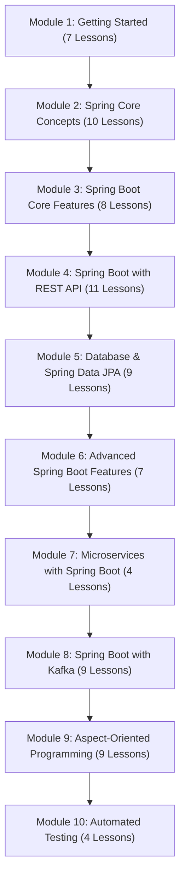

# Spring Boot for Developers 🇬🇧

> **Course 04: Developing Production-Grade Microservices and Cloud-Native APIs with Spring Boot**

> 🌐 **Language / ភាសា:** 🇰🇭 [ភាសាខ្មែរ (Khmer)](README.kh.md) | 🇬🇧 **[English](README.md)**

[-green.svg)](#-course-syllabus-table-of-contents)

---

## 📖 About This Course

**Spring Boot** is the premier enterprise industry standard for architecting **Microservices**, **RESTful APIs**, and **Cloud-Native Backend Systems**.

This complete curriculum is systematically synthesized from the **[GeeksforGeeks Spring Boot Tutorial](https://www.geeksforgeeks.org/advance-java/spring-boot/)**, structured into **78 comprehensive lessons** across **10 modules**:
1. **Module 1: Getting Started with Spring Boot (7 Lessons)**
2. **Module 2: Spring Core Concepts & Fundamentals (10 Lessons)**
3. **Module 3: Spring Boot Core Features & Runtime Engine (8 Lessons)**
4. **Module 4: Building RESTful Web APIs with Spring Boot (11 Lessons)**
5. **Module 5: Database Persistence & Spring Data JPA (9 Lessons)**
6. **Module 6: Advanced Enterprise Features in Spring Boot (7 Lessons)**
7. **Module 7: Microservices Architecture with Spring Boot (4 Lessons)**
8. **Module 8: Event-Driven Messaging with Apache Kafka (9 Lessons)**
9. **Module 9: Aspect-Oriented Programming (AOP) in Spring Boot (9 Lessons)**
10. **Module 10: Automated Testing in Spring Boot (4 Lessons)**

---

## 🗺️ Master Course Roadmap

---

## 📚 Course Syllabus (Table of Contents - 78 Lessons)

### 📁 [Module 1: Getting Started with Spring Boot](01-getting-started-with-spring-boot/README.md)
*Foundational overview of Spring Boot: core motivations, the 4 architectural pillars, Spring vs Spring Boot vs Spring MVC, and workspace setup across STS, Eclipse, and IntelliJ IDEA.*

| # | Lesson | Description |
| :---: | :--- | :--- |
| **01** | [Introduction to Spring Boot](01-getting-started-with-spring-boot/01-introduction-to-spring-boot/README.md) | Core definition and 4 architectural pillars |
| **02** | [Spring vs Spring Boot](01-getting-started-with-spring-boot/02-spring-vs-spring-boot/README.md) | Exhaustive comparison of Spring Framework vs Spring Boot |
| **03** | [Spring MVC vs Spring Boot](01-getting-started-with-spring-boot/03-spring-mvc-vs-spring-boot/README.md) | Distinguishing web framework presentation from holistic bootstrapping |
| **04** | [Spring Tool Suite (STS) Setup](01-getting-started-with-spring-boot/04-sts-project-setup/README.md) | Scaffolding Spring Boot projects inside Spring Tool Suite 4 |
| **05** | [Eclipse IDE Setup](01-getting-started-with-spring-boot/05-eclipse-ide-setup/README.md) | Integrating Spring Tools suite plugins into Eclipse IDE |
| **06** | [IntelliJ IDEA Project Setup](01-getting-started-with-spring-boot/06-intellij-idea-setup/README.md) | Bootstrapping Spring Boot projects via Spring Initializr in IntelliJ |
| **07** | [Run Spring Boot Application](01-getting-started-with-spring-boot/07-run-spring-boot-application/README.md) | 4 execution mechanics: IDE, Maven wrapper, standalone JAR, CLI |

---

### 📁 [Module 2: Spring Core Concepts & Fundamentals](02-spring-core-concept/README.md)
*Deep dive into Spring's architectural engine: Inversion of Control (IoC), Dependency Injection (DI), Bean lifecycles, Bean scopes, Autowiring, and DispatcherServlet.*

| # | Lesson | Description |
| :---: | :--- | :--- |
| **01** | [Inversion of Control (IoC)](02-spring-core-concept/01-inversion-of-control/README.md) | Understanding the Inversion of Control paradigm |
| **02** | [Dependency Injection (DI)](02-spring-core-concept/02-dependency-injection/README.md) | Practical Dependency Injection in enterprise Java |
| **03** | [BeanFactory vs ApplicationContext](02-spring-core-concept/03-beanfactory-vs-applicationcontext/README.md) | Comparing Spring's lightweight BeanFactory and rich ApplicationContext |
| **04** | [Spring Bean Lifecycle](02-spring-core-concept/04-spring-bean-lifecycle/README.md) | The complete lifecycle phases of a managed Spring Bean |
| **05** | [Singleton and Prototype Scopes](02-spring-core-concept/05-singleton-and-prototype-scopes/README.md) | Deep dive into Singleton (default) vs Prototype bean scopes |
| **06** | [Custom Bean Scope in Spring](02-spring-core-concept/06-custom-bean-scope/README.md) | Creating custom bean scopes in Spring |
| **07** | [Create a Spring Bean in 3 Ways](02-spring-core-concept/07-create-spring-bean-3-ways/README.md) | 3 ways to declare beans: XML, Java @Bean, and @Component scan |
| **08** | [Spring Autowiring (@Autowired)](02-spring-core-concept/08-spring-autowiring/README.md) | Automated dependency wiring with @Autowired and @Qualifier |
| **09** | [What is DispatcherServlet in Spring](02-spring-core-concept/09-dispatcherservlet/README.md) | DispatcherServlet: Front Controller pattern and HTTP routing |
| **10** | [Build Tools: Maven vs Gradle](02-spring-core-concept/10-build-tools-maven-gradle/README.md) | Build automation tools: Maven POM vs Gradle DSL |

---

### 📁 [Module 3: Spring Boot Core Features & Runtime Engine](03-spring-boot-core-features/README.md)
*Mastering the runtime engine of Spring Boot: layered architecture, core annotations, auto-configuration conditions, dependency management, YAML profiles, Actuator, and DevTools.*

| # | Lesson | Description |
| :---: | :--- | :--- |
| **01** | [Spring Boot Architecture](03-spring-boot-core-features/01-spring-boot-architecture/README.md) | Layered architecture and internal request-response flow |
| **02** | [Spring Boot Core Annotations](03-spring-boot-core-features/02-spring-boot-annotations/README.md) | Comprehensive guide to indispensable Spring Boot annotations |
| **03** | [Auto-Configuration Deep Dive](03-spring-boot-core-features/03-auto-configuration/README.md) | Under the hood: Auto-Configuration and @Conditional annotations |
| **04** | [Dependency Management & Starters](03-spring-boot-core-features/04-dependency-management/README.md) | Opinionated starter POMs and transitive dependency management |
| **05** | [Application Properties Configuration](03-spring-boot-core-features/05-application-properties/README.md) | Configuration via application.properties and type-safe binding |
| **06** | [YAML Configuration (application.yml)](03-spring-boot-core-features/06-yaml-configuration/README.md) | Configuring application.yml and multi-environment profiles |
| **07** | [Spring Boot Actuator](03-spring-boot-core-features/07-spring-boot-actuator/README.md) | Production telemetry via Actuator health, metrics, and env endpoints |
| **08** | [Spring Boot DevTools](03-spring-boot-core-features/08-spring-boot-devtools/README.md) | Accelerating development with sub-second restarts and LiveReload |

---

### 📁 [Module 4: Building RESTful Web APIs with Spring Boot](04-spring-boot-with-rest-api/README.md)
*Production RESTful API architecture: controllers, semantic routing, parameters, request body binding, Jackson serialization, DTOs, Bean Validation, and centralized exception handling.*

| # | Lesson | Description |
| :---: | :--- | :--- |
| **01** | [Introduction to RESTful Services](04-spring-boot-with-rest-api/01-intro-to-restful-web-services/README.md) | REST architecture, constraints, and HTTP semantics |
| **02** | [@RestController in Spring Boot](04-spring-boot-with-rest-api/02-rest-controller/README.md) | @RestController meta-annotation and JSON conversion |
| **03** | [@RequestMapping Deep Dive](04-spring-boot-with-rest-api/03-request-mapping/README.md) | Path routing, headers, and media type mapping with @RequestMapping |
| **04** | [@GetMapping and @PostMapping](04-spring-boot-with-rest-api/04-get-and-post-mapping/README.md) | Handling read requests with @GetMapping and writes with @PostMapping |
| **05** | [@PutMapping and @DeleteMapping](04-spring-boot-with-rest-api/05-put-and-delete-mapping/README.md) | Resource updates with @PutMapping and removals with @DeleteMapping |
| **06** | [@PathVariable vs @RequestParam](04-spring-boot-with-rest-api/06-pathvariable-and-requestparam/README.md) | Extracting path variables vs query string parameters |
| **07** | [@RequestBody Payload Extraction](04-spring-boot-with-rest-api/07-requestbody/README.md) | Capturing and deserializing incoming request payloads with @RequestBody |
| **08** | [Complete REST API Implementation](04-spring-boot-with-rest-api/08-build-rest-api-example/README.md) | Step-by-step implementation of an end-to-end REST API |
| **09** | [JSON Serialization with Jackson](04-spring-boot-with-rest-api/09-json-serialization-jackson/README.md) | JSON serialization/deserialization, annotations, and Java Records |
| **10** | [Global Exception Handling](04-spring-boot-with-rest-api/10-exception-handling/README.md) | Centralized fault handling with @RestControllerAdvice and RFC 7807 |
| **11** | [Input Validation with Hibernate Validator](04-spring-boot-with-rest-api/11-validation/README.md) | Declarative validation constraints with Jakarta Bean Validation |

---

### 📁 [Module 5: Database Persistence & Spring Data JPA](05-spring-boot-database-and-data-jpa/README.md)
*Robust relational and document persistence: MySQL, PostgreSQL, MongoDB, Spring Data JPA, JdbcTemplate, repository hierarchies, in-memory H2 testing, and a production CRUD project.*

| # | Lesson | Description |
| :---: | :--- | :--- |
| **01** | [Spring Boot with MySQL](05-spring-boot-database-and-data-jpa/01-integration-with-mysql/README.md) | Configuring MySQL drivers, HikariCP, and application.yml settings |
| **02** | [Spring Boot with PostgreSQL](05-spring-boot-database-and-data-jpa/02-integration-with-postgresql/README.md) | Integrating enterprise PostgreSQL with Spring Boot |
| **03** | [Spring Boot with MongoDB](05-spring-boot-database-and-data-jpa/03-integration-with-mongodb/README.md) | NoSQL document persistence with Spring Data MongoDB |
| **04** | [Spring Data JPA Basics](05-spring-boot-database-and-data-jpa/04-spring-data-jpa-basics/README.md) | ORM architecture, JPA annotations, and primary key strategies |
| **05** | [Spring Boot with JDBC (JdbcTemplate)](05-spring-boot-database-and-data-jpa/05-spring-boot-jdbc-jdbctemplate/README.md) | Direct database querying with Spring JdbcTemplate |
| **06** | [CrudRepository vs JpaRepository](05-spring-boot-database-and-data-jpa/06-crudrepository-vs-jparepository/README.md) | Comparing repository abstractions and automated query derivation |
| **07** | [H2 In-Memory Database for Testing](05-spring-boot-database-and-data-jpa/07-h2-database-for-testing/README.md) | In-memory H2 database setup and automated testing configuration |
| **08** | [CRUD Operations with JPA Repositories](05-spring-boot-database-and-data-jpa/08-crud-operations-jpa/README.md) | End-to-end CRUD operations using JpaRepository and services |
| **09** | [Todo List API Project with MySQL](05-spring-boot-database-and-data-jpa/09-todo-list-api-project/README.md) | Hands-on project: Building a complete Todo API backed by MySQL |

---

### 📁 [Module 6: Advanced Enterprise Features in Spring Boot](06-advanced-spring-boot-features/README.md)
*Enterprise capabilities: task scheduling, SMTP email dispatch, file upload handling, caching abstraction and Redis, declarative @Transactional management, and DTO mapping.*

| # | Lesson | Description |
| :---: | :--- | :--- |
| **01** | [Task Scheduling (@Scheduled)](06-advanced-spring-boot-features/01-task-scheduling/README.md) | Automating background jobs with @Scheduled and cron expressions |
| **02** | [Sending Email via SMTP](06-advanced-spring-boot-features/02-sending-email-smtp/README.md) | Configuring JavaMailSender for text and HTML email dispatch |
| **03** | [File Uploading & MultipartFile](06-advanced-spring-boot-features/03-file-handling-upload/README.md) | Handling single and multi-file uploads with MultipartFile |
| **04** | [Spring Boot Caching Basics](06-advanced-spring-boot-features/04-caching/README.md) | Spring Cache abstraction: @Cacheable, @CachePut, and @CacheEvict |
| **05** | [Caching with Redis & Other Providers](06-advanced-spring-boot-features/05-caching-providers-redis/README.md) | Configuring distributed Redis cache and multi-tenant providers |
| **06** | [Transaction Management (@Transactional)](06-advanced-spring-boot-features/06-transaction-management/README.md) | ACID guarantees, declarative @Transactional boundaries, and rollbacks |
| **07** | [Entity to DTO Mapping](06-advanced-spring-boot-features/07-dto-mapping/README.md) | Decoupling persistence models with ModelMapper and MapStruct |

---

### 📁 [Module 7: Microservices Architecture with Spring Boot](07-microservices-with-spring-boot/README.md)
*Architecting distributed systems: microservices principles, inter-service REST communication (RestClient, Feign), deploying to AWS Elastic Beanstalk, and sample project design.*

| # | Lesson | Description |
| :---: | :--- | :--- |
| **01** | [Microservices Step-by-Step Guide](07-microservices-with-spring-boot/01-microservices-step-by-step-guide/README.md) | Step-by-step guide to microservices fundamentals and service boundaries |
| **02** | [Communication Between Microservices](07-microservices-with-spring-boot/02-inter-service-communication/README.md) | Synchronous inter-service communication: RestClient, WebClient, Feign |
| **03** | [Deploy on AWS Elastic Beanstalk](07-microservices-with-spring-boot/03-deploy-aws-elastic-beanstalk/README.md) | Packaging and deploying containerized microservices to AWS Beanstalk |
| **04** | [Microservices Sample Project](07-microservices-with-spring-boot/04-microservices-sample-project/README.md) | Architectural walkthrough of a multi-service eCommerce ecosystem |

---

### 📁 [Module 8: Event-Driven Messaging with Apache Kafka](08-spring-boot-with-kafka/README.md)
*Asynchronous event streaming: Kafka producers, consumers, publishing JSON/String payloads, topic partitioning, Elasticsearch & Grafana observability, and dynamic listeners.*

| # | Lesson | Description |
| :---: | :--- | :--- |
| **01** | [Kafka Producer in Spring Boot](08-spring-boot-with-kafka/01-kafka-producer/README.md) | Configuring KafkaTemplate and emitting streaming records |
| **02** | [Kafka Consumer in Spring Boot](08-spring-boot-with-kafka/02-kafka-consumer/README.md) | Consuming topic events asynchronously with @KafkaListener |
| **03** | [Publishing JSON Messages to Kafka](08-spring-boot-with-kafka/03-publish-json-messages/README.md) | Serializing domain objects into JSON payloads for Kafka topics |
| **04** | [Consuming JSON Messages from Kafka](08-spring-boot-with-kafka/04-consume-json-messages/README.md) | Deserializing incoming JSON payloads into strongly-typed objects |
| **05** | [Publishing String Messages to Kafka](08-spring-boot-with-kafka/05-publish-string-messages/README.md) | Publishing plain-text string payloads to Kafka topics |
| **06** | [Consuming String Messages from Kafka](08-spring-boot-with-kafka/06-consume-string-messages/README.md) | Consuming string messages across consumer group partitions |
| **07** | [Create and Configure Kafka Topics](08-spring-boot-with-kafka/07-create-configure-topics/README.md) | Programmatic topic creation and partition replication configuration |
| **08** | [Kafka, Elasticsearch & Grafana Pipeline](08-spring-boot-with-kafka/08-kafka-elasticsearch-grafana/README.md) | Building a real-time data pipeline from Kafka to Elasticsearch & Grafana |
| **09** | [Start/Stop Kafka Listener Dynamically](08-spring-boot-with-kafka/09-dynamic-kafka-listener/README.md) | Dynamically starting, pausing, and resuming Kafka listeners at runtime |

---

### 📁 [Module 9: Aspect-Oriented Programming (AOP) in Spring Boot](09-spring-boot-with-aop/README.md)
*Decoupling cross-cutting concerns: AOP architecture, all 5 advice types (@Before, @After, @Around, @AfterReturning, @AfterThrowing), pointcuts, AOP vs OOP, and Spring AOP vs AspectJ.*

| # | Lesson | Description |
| :---: | :--- | :--- |
| **01** | [Introduction to Spring Boot AOP](09-spring-boot-with-aop/01-aop-introduction/README.md) | Foundations of Aspect-Oriented Programming in Spring Boot |
| **02** | [Spring Boot Advices Overview](09-spring-boot-with-aop/02-aop-advices-overview/README.md) | Comparative guide to all 5 AOP advice types in a unified project |
| **03** | [Spring Boot AOP @Before Advice](09-spring-boot-with-aop/03-before-advice/README.md) | Executing interceptor logic prior to target method execution |
| **04** | [Spring Boot AOP @After Advice](09-spring-boot-with-aop/04-after-advice/README.md) | Unconditional post-execution cleanup with @After advice |
| **05** | [Spring Boot AOP @Around Advice](09-spring-boot-with-aop/05-around-advice/README.md) | Surrounding method execution with ProceedingJoinPoint and @Around |
| **06** | [Spring Boot AOP @AfterThrowing](09-spring-boot-with-aop/06-after-throwing-advice/README.md) | Intercepting and auditing thrown exceptions with @AfterThrowing |
| **07** | [Spring Boot AOP @AfterReturning](09-spring-boot-with-aop/07-after-returning-advice/README.md) | Capturing and inspecting successful method outputs with @AfterReturning |
| **08** | [Difference between AOP and OOP](09-spring-boot-with-aop/08-aop-vs-oop/README.md) | Comparing Object-Oriented Programming (OOP) and Aspect-Oriented (AOP) |
| **09** | [Spring AOP vs AspectJ](09-spring-boot-with-aop/09-aop-vs-aspectj/README.md) | Evaluating Spring runtime proxy AOP against full-blown AspectJ weaving |

---

### 📁 [Module 10: Automated Testing in Spring Boot](10-spring-boot-testing/README.md)
*Production-grade automated testing: Unit testing with JUnit 5, mock objects via Mockito, web layer integration testing with MockMVC, and declarative API testing with ZeroCode.*

| # | Lesson | Description |
| :---: | :--- | :--- |
| **01** | [Unit Testing with JUnit 5](10-spring-boot-testing/01-unit-testing-junit/README.md) | Core unit testing principles with JUnit 5 annotations and AssertJ |
| **02** | [Testing with Mockito](10-spring-boot-testing/02-testing-with-mockito/README.md) | Creating isolated test doubles using Mockito mocks and verifications |
| **03** | [Integration Testing with MockMVC](10-spring-boot-testing/03-integration-testing-mockmvc/README.md) | Web slice testing and JSON path assertion with MockMvc |
| **04** | [Using ZeroCode for Testing](10-spring-boot-testing/04-zerocode-testing/README.md) | Declarative automated API testing in Spring Boot using ZeroCode |

---

## 🧭 Course Navigation

| Previous | Main Vault | Next Course |
| :--- | :---: | :--- |
| [← Course 03: Spring Framework](../03-spring-framework/README.md) | [🏠 Root Index](../README.md) | *End of Curriculum* |

---

## 📂 Runnable Example Projects

This course provides a standalone `examples/` directory containing complete, production-ready Maven projects ready to import and run immediately in IntelliJ IDEA, Eclipse, or via Terminal:

| Project | Tech Stack | Description | Key Files |
| :--- | :--- | :--- | :--- |
| [**01-rest-api-crud**](examples/01-rest-api-crud) | Spring Boot 3.3, REST, DTO Records, Validation | Complete Bookstore CRUD API with Global Exception Handling | [`BookController.java`](examples/01-rest-api-crud/src/main/java/com/example/bookstore/controller/BookController.java) [`BookService.java`](examples/01-rest-api-crud/src/main/java/com/example/bookstore/service/BookService.java) [`GlobalExceptionHandler.java`](examples/01-rest-api-crud/src/main/java/com/example/bookstore/exception/GlobalExceptionHandler.java) |
| [**02-spring-data-jpa-postgresql**](examples/02-spring-data-jpa-postgresql) | Spring Data JPA, Hibernate, PostgreSQL, H2 | Todo List Persistence API with Transactional Service | [`Todo.java`](examples/02-spring-data-jpa-postgresql/src/main/java/com/example/todo/model/Todo.java) [`TodoRepository.java`](examples/02-spring-data-jpa-postgresql/src/main/java/com/example/todo/repository/TodoRepository.java) [`TodoService.java`](examples/02-spring-data-jpa-postgresql/src/main/java/com/example/todo/service/TodoService.java) |
| [**03-redis-caching**](examples/03-redis-caching) | Spring Cache, Redis, Docker Compose | Redis CacheManager with 10-min TTL and JSON Serializer | [`RedisConfig.java`](examples/03-redis-caching/src/main/java/com/example/cache/config/RedisConfig.java) [`ProductService.java`](examples/03-redis-caching/src/main/java/com/example/cache/service/ProductService.java) [`docker-compose.yml`](examples/03-redis-caching/docker-compose.yml) |
| [**04-kafka-messaging**](examples/04-kafka-messaging) | Spring Kafka, Event-Driven, Docker Compose | Order Event Streaming with KafkaTemplate & `@KafkaListener` | [`OrderEventProducer.java`](examples/04-kafka-messaging/src/main/java/com/example/kafka/producer/OrderEventProducer.java) [`OrderEventConsumer.java`](examples/04-kafka-messaging/src/main/java/com/example/kafka/consumer/OrderEventConsumer.java) [`OrderCreatedEvent.java`](examples/04-kafka-messaging/src/main/java/com/example/kafka/event/OrderCreatedEvent.java) |
| [**05-microservices-ecommerce**](examples/05-microservices-ecommerce) | Spring Cloud, Eureka, Gateway, OpenFeign | 4-Service E-Commerce Cloud Platform with Docker Compose | [`eureka-server`](examples/05-microservices-ecommerce/eureka-server) [`api-gateway`](examples/05-microservices-ecommerce/api-gateway) [`product-service`](examples/05-microservices-ecommerce/product-service) [`order-service`](examples/05-microservices-ecommerce/order-service) [`docker-compose.yml`](examples/05-microservices-ecommerce/docker-compose.yml) |

> 💡 **Tip:** In each lesson, you will find direct links pointing to the relevant project and exact source files for hands-on inspection.

---

## 🔗 Sister Repositories in the Master Curriculum
- 📘 [Basic Java Fundamentals](https://github.com/sakousa856-sketch/java-basic-for-developers-khmer)
- 📗 [Advance Java OOP](https://github.com/sakousa856-sketch/java-advance-for-developers-khmer)
- 📙 [Spring Framework Core Architecture](https://github.com/sakousa856-sketch/spring-framework-for-developers-khmer)
- 📕 [Spring Boot Enterprise & Microservices](https://github.com/sakousa856-sketch/spring-boot-for-developers-khmer)
- 💼 [Java & Spring Interview Handbook](https://github.com/sakousa856-sketch/java-spring-interview-handbook-khmer)
