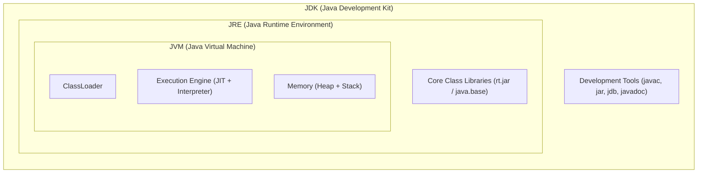
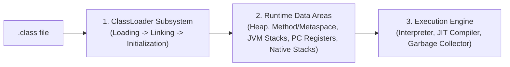
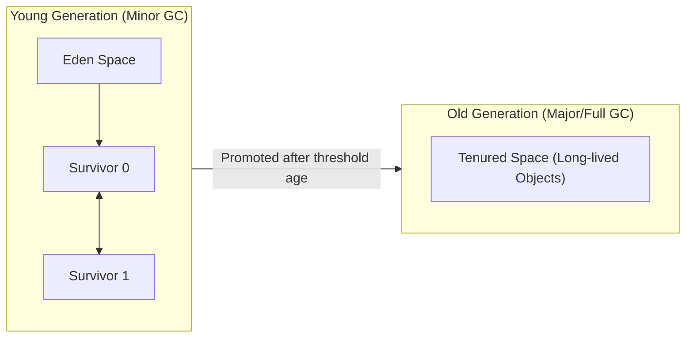

# Module 01: Core Java, Memory Model & JVM Internals (ខេមរភាសា) 🇰🇭

> 🌐 **ភាសា / Language:** 🇰🇭 **[ភាសាខ្មែរ (Khmer)](README.kh.md)** | 🇬🇧 [English](README.md)  
> 🧭 **រុករក:** [📚 មាតិកាចម្បង (Home)](../README.kh.md) | [បន្ទាប់: 02. OOP & Design Patterns →](../02-oop-solid-and-design-patterns/README.kh.md)

---

## មាតិកា (Table of Contents)

1. [សំណួរទី ១៖ តើអ្វីជាភាពខុសគ្នារវាង JDK, JRE, និង JVM?](#សំណួរទី-១-តើអ្វីជាភាពខុសគ្នារវាង-jdk-jre-និង-jvm)
2. [សំណួរទី ២៖ ពន្យល់ពីរចនាសម្ព័ន្ធខាងក្នុងនៃ JVM Architecture និង ClassLoader Subsystem](#សំណួរទី-២-ពន្យល់ពីរចនាសម្ព័ន្ធខាងក្នុងនៃ-jvm-architecture)
3. [សំណួរទី ៣៖ JVM Memory Model៖ Heap, Stack, និង Metaspace ខុសគ្នាយ៉ាងដូចម្តេច?](#សំណួរទី-៣-jvm-memory-model-heap-stack-និង-metaspace)
4. [សំណួរទី ៤៖ តើ Garbage Collection (GC) ដំណើរការយ៉ាងដូចម្តេច? (G1GC vs ZGC)](#សំណួរទី-៤-តើ-garbage-collection-gc-ដំណើរការយ៉ាងដូចម្តេច)
5. [សំណួរទី ៥៖ តើ String Pool ជាអ្វី? ហេតុអ្វី String ក្នុង Java ជា Immutable?](#សំណួរទី-៥-តើ-string-pool-ជាអ្វី)
6. [សំណួរទី ៦៖ Java ជា Pass-by-Value ឬ Pass-by-Reference?](#សំណួរទី-៦-java-ជា-pass-by-value-ឬ-pass-by-reference)
7. [សំណួរទី ៧៖ មុខងារទំនើបៗក្នុង Java 8, 17, និង 21 ដែលគេសួរញឹកញាប់បំផុត](#សំណួរទី-៧-មុខងារទំនើបៗក្នុង-java-8-17-និង-21)
8. [បញ្ហាប្រឈមក្នុង Production & Interviewer Traps](#បញ្ហាប្រឈមក្នុង-production--interviewer-traps)

---

## សំណួរទី ១៖ តើអ្វីជាភាពខុសគ្នារវាង JDK, JRE, និង JVM?



- **JVM (Java Virtual Machine):** ជា Abstract Machine ដែលទទួលបន្ទុកបម្លែង និងដំណើរការ Java Bytecode (`.class`) ទៅជា Machine Code របស់ OS នីមួយៗ។ JVM ធ្វើឱ្យ Java មានលក្ខណៈ *"Write Once, Run Anywhere"* (WORA)។
- **JRE (Java Runtime Environment):** រួមបញ្ចូល JVM + Core Libraries ដែលចាំបាច់សម្រាប់គ្រាន់តែដំណើរការកម្មវិធី Java (មិនមាន Tools សម្រាប់ Compile ទេ)។
- **JDK (Java Development Kit):** កញ្ចប់ពេញលេញសម្រាប់ Developer ដែលរួមមាន JRE + Compiler (`javac`), Debugger, និងឧបករណ៍អភិវឌ្ឍន៍ផ្សេងៗ។

> **💡 អ្វីដែលអ្នកសម្ភាសន៍ចង់ឮ (Interviewer's Insight):**  
> ចាប់ពី **Java 11** មក Oracle លែងចេញ JRE ដាច់ដោយឡែកទៀតហើយ — Developer និង Server ប្រើ JDK ទាំងស្រុង ឬប្រើឧបករណ៍ `jlink` ដើម្បីបង្កើត Custom Minimal Runtime Image តូចបំផុតសម្រាប់ Docker។

---

## សំណួរទី ២៖ ពន្យល់ពីរចនាសម្ព័ន្ធខាងក្នុងនៃ JVM Architecture

JVM ចែកចេញជា **៣ ផ្នែកធំៗ**៖



1. **ClassLoader Subsystem:**
   - **Loading:** បញ្ចូល Class file តាមឋានានុក្រម ៣ ថ្នាក់៖
     - *Bootstrap ClassLoader:* ផ្ទុក Core Java classes (`java.lang.*`)
     - *Extension / Platform ClassLoader:* ផ្ទុក extensions
     - *Application / System ClassLoader:* ផ្ទុក Class ក្នុង Classpath នៃ Project យើង។
   - **Linking:** រួមមាន *Verify* (ពិនិត្យសុវត្ថិភាព Bytecode), *Prepare* (ផ្តល់ default value ដល់ static variables), និង *Resolve* (បម្លែង symbolic references ទៅ direct references)។
   - **Initialization:** ដំណើរការ `static` blocks និង assign តម្លៃពិតប្រាកដដល់ static variables។
2. **Execution Engine:**
   - **Interpreter:** អាន និងដំណើរការ Bytecode មួយជួរម្តងៗ (លឿនពេលចាប់ផ្តើមដំបូង ប៉ុន្តែដំណើរការយឺតពេលរត់យូរ)។
   - **JIT Compiler (Just-In-Time):** ស្វែងរកកូដណាដែលហៅដដែលៗញឹកញាប់ (**Hotspot**) រួច Compile វាទៅជា Native Machine Code ដោយផ្ទាល់ ដើម្បីឱ្យ CPU រត់ល្បឿនអតិបរមា។
   - **Garbage Collector (GC):** ប្រមូលសំរាម និងសម្អាត Memory ដែលលែងប្រើ។

---

## សំណួរទី ៣៖ JVM Memory Model៖ Heap, Stack, និង Metaspace

| Memory Area | ផ្ទុកអ្វីខ្លះ? | ចែករំលែកគ្នា (Shared)? | បញ្ហា Exception ដែលអាចកើតមាន |
| :--- | :--- | :---: | :--- |
| **JVM Stack** | Primitive variables, Local references, Method call frames | **Thread-Safe** (១ Thread មាន Stack ១) | `StackOverflowError` (ឧ. Infinite recursion) |
| **Heap Memory** | All Objects (`new Object()`), Arrays, Instance variables | **Shared គ្រប់ Threads** | `OutOfMemoryError: Java heap space` |
| **Metaspace** | Class Metadata, Bytecode, Static variables (Native Memory) | **Shared គ្រប់ Threads** | `OutOfMemoryError: Metaspace` |

```java
public class MemoryDemo {
    // ស្ថិតក្នុង Metaspace
    private static final String APP_NAME = "MyApp"; 

    public void calculate() {
        int x = 10; // ស្ថិតក្នុង Stack Frame នៃ Thread បច្ចុប្បន្ន
        User user = new User("Dara"); // 'user' reference នៅ Stack, ឯ Object User ពិតប្រាកដនៅ Heap!
    }
}
```

> **💡 អ្វីដែលអ្នកសម្ភាសន៍ចង់ឮ:**  
> កាលពី Java 7 ចុះក្រោម Metadata ត្រូវបានរក្សាទុកក្នុង **PermGen (Permanent Generation)** ដែលមានទំហំកំណត់ថេរ។ ចាប់ពី **Java 8** មក PermGen ត្រូវបានលុបចោលទាំងស្រុង ហើយជំនួសដោយ **Metaspace** ដែលប្រើប្រាស់ **Native OS Memory** ដោយស្វ័យប្រវត្តិ ជៀសវាងបញ្ហា `PermGen OutOfMemoryError` ដ៏ពេញនិយមពីមុន។

---

## សំណួរទី ៤៖ តើ Garbage Collection (GC) ដំណើរការយ៉ាងដូចម្តេច?

Heap Memory ត្រូវបានបែងចែកជា **Generations** ដោយផ្អែកលើ **Weak Generational Hypothesis** (Objects ភាគច្រើនស្លាប់ទៅវិញក្នុងរយៈពេលដ៏ខ្លីបន្ទាប់ពីបង្កើតរួច)៖



- **Minor GC:** សម្អាតក្នុង Young Generation (Eden + Survivor) — ល្បឿនលឿនណាស់ (Millisecond)។
- **Major / Full GC:** សម្អាតក្នុង Old Generation (Tenured) — ចំណាយពេលយូរ និងអាចបណ្តាលឱ្យមាន **Stop-The-World (STW)** pause។

### ក្បួនដោះស្រាយ GC ទំនើបៗ (Modern Collectors):
- **G1GC (Garbage-First GC):** ជាលំនាំដើម (Default) ចាប់ពី Java 9 មក។ វាបំបែក Heap ជាប្លុកតូចៗរាប់ពាន់ (Regions) ហើយជ្រើសរើសសម្អាត Region ណាដែលមានសំរាមច្រើនជាងគេមុនគេ ដើម្បីកាត់បន្ថយ STW pause។
- **ZGC (Z Garbage Collector):** ត្រូវបានណែនាំក្នុង Java 15+ សម្រាប់ប្រព័ន្ធធំៗ (Terabytes of RAM) ដោយធានាថា STW pause មិនឱ្យលើសពី **1 millisecond** ឡើយ!

---

## សំណួរទី ៥៖ តើ String Pool ជាអ្វី? ហេតុអ្វី String ជា Immutable?

```java
String s1 = "Java"; // បង្កើតក្នុង String Constant Pool (Heap)
String s2 = "Java"; // ចង្អុលទៅកាន់ Object តែមួយក្នុង Pool មិនបង្កើតថ្មីឡើយ
String s3 = new String("Java"); // បង្កើត Object ថ្មីដាច់ដោយឡែកក្រៅ Pool!

System.out.println(s1 == s2);      // true (ចង្អុលទៅ Reference តែមួយ)
System.out.println(s1 == s3);      // false (Reference ខុសគ្នា)
System.out.println(s1.equals(s3)); // true (តម្លៃអក្សរដូចគ្នា)
```

### ហេតុអ្វី String ក្នុង Java ជា Immutable (មិនអាចកែប្រែបាន)?
1. **Security:** ព័ត៌មានរសើបដូចជា Database Password, Network Socket URL ត្រូវបានបញ្ជូនជា String — បើ String អាចកែបាន Hacker អាចប្តូរវាពេលកំពុងរត់។
2. **Thread Safety:** ដោយសារ String មិនអាចកែប្រែបាន គ្រប់ Threads អាចអានវាព្រមគ្នាដោយសុវត្ថិភាព ១០០% មិនបាច់ប្រើ `synchronized` ឡើយ។
3. **Caching & HashCode:** `hashCode()` របស់ String ត្រូវបានគណនាតែមួយដងគត់ និង Cache ទុក ធ្វើឱ្យវាមានប្រសិទ្ធភាពខ្ពស់បំផុតពេលប្រើជា Key ក្នុង `HashMap`។

---

## សំណួរទី ៦៖ Java ជា Pass-by-Value ឬ Pass-by-Reference?

> **ចម្លើយច្បាស់ការណ៍ ១០០%៖** **Java គឺជា "Pass-by-Value" ជានិច្ច គ្មានករណីលើកលែងឡើយ!**

ពេលយើងបញ្ជូន Object ទៅកាន់ Method អ្វីដែលត្រូវបានបញ្ជូនគឺ **ច្បាប់ចម្លងនៃ Reference (Memory Address Value Copy)** មិនមែនជា Reference ពិតប្រាកដឡើយ៖

```java
public void modify(User u) {
    u.setName("Piseth"); // កែប្រែទិន្នន័យលើ Object ដើមដែល reference ចង្អុលទៅ
    u = new User("Vannak"); // គ្រាន់តែកែប្រែច្បាប់ចម្លង reference ក្នុង method ប៉ុណ្ណោះ
}
```

---

## សំណួរទី ៧៖ មុខងារទំនើបៗក្នុង Java 8, 17, និង 21

### ១. Java 8 (The Functional Revolution):
- **Stream API & Lambdas:** ការសរសេរកូដបែប Declarative Functional Programming
- **Optional<T>:** ការពារបញ្ហា `NullPointerException`

### ២. Java 17 LTS (Enterprise Standard):
- **Records:** បង្កើត Immutable DTO ដោយសរសេរកូដត្រឹមតែ ១ ជួរ (លែងបាច់សរសេរ Getter, Setter, `equals()`, `hashCode()`)
  ```java
  public record UserResponse(Long id, String username, String email) {}
  ```
- **Pattern Matching for `switch` & `instanceof`:**
  ```java
  if (obj instanceof String s) {
      System.out.println(s.toUpperCase()); // លែងបាច់ Cast ដូចមុន
  }
  ```

### ៣. Java 21 LTS (The Concurrency Revolution):
- **Virtual Threads (Project Loom):** Thread ទម្ងន់ស្រាលបំផុតដែលគ្រប់គ្រងដោយ JVM ផ្ទាល់ (មិនមែន OS Thread ទេ) អនុញ្ញាតឱ្យរត់ Thread រាប់លានក្នុងពេលតែមួយបានដោយមិនបារម្ភរឿងអស់ RAM!

---

## បញ្ហាប្រឈមក្នុង Production & Interviewer Traps

> **💡 អន្ទាក់អ្នកសម្ភាសន៍ (Interviewer Trap):**  
> *"តើយើងអាចបង្ខំឱ្យ Garbage Collection ដំណើរការបានទេ?"*  
> **ចម្លើយត្រូវ៖** យើងអាចហៅ `System.gc()` ឬ `Runtime.getRuntime().gc()` បាន ប៉ុន្តែវាគ្រាន់តែជា **ការស្នើសុំ (Hint/Suggestion)** ទៅកាន់ JVM ប៉ុណ្ណោះ។ JVM មិនធានាថានឹងរត់ GC ភ្លាមៗនោះទេ ហើយការហៅ `System.gc()` ក្នុង Production Code គឺជា Bad Practice ដ៏ធ្ងន់ធ្ងរ ព្រោះវាអាចបង្កើន Stop-The-World pause ឥតប្រយោជន៍!
