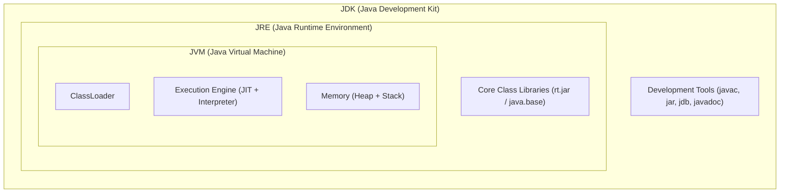
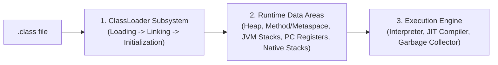
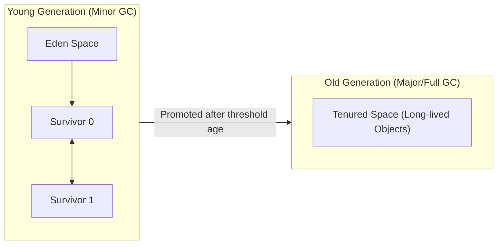

# Module 01: Core Java, Memory Model & JVM Internals

> 🌐 **Language / ភាសា:** 🇬🇧 **[English](README.md)** | 🇰🇭 [ភាសាខ្មែរ (Khmer)](README.kh.md)  
> 🧭 **Navigation:** [📚 Home](../README.md) | [Next: 02. OOP & Design Patterns →](../02-oop-solid-and-design-patterns/README.md)

---

## Table of Contents

1. [Question 1: What is the difference between JDK, JRE, and JVM?](#question-1-what-is-the-difference-between-jdk-jre-and-jvm)
2. [Question 2: Explain the internal architecture of the JVM and ClassLoader Subsystem](#question-2-explain-the-internal-architecture-of-the-jvm)
3. [Question 3: JVM Memory Model: Heap, Stack, and Metaspace deep dive](#question-3-jvm-memory-model-heap-stack-and-metaspace)
4. [Question 4: How does Garbage Collection (GC) work? (G1GC vs ZGC)](#question-4-how-does-garbage-collection-gc-work)
5. [Question 5: What is the String Pool? Why is String immutable in Java?](#question-5-what-is-the-string-pool)
6. [Question 6: Is Java Pass-by-Value or Pass-by-Reference?](#question-6-is-java-pass-by-value-or-pass-by-reference)
7. [Question 7: High-frequency Java 8, 17, and 21 features asked in interviews](#question-7-high-frequency-java-8-17-and-21-features)
8. [Production Pitfalls & Interviewer Traps](#production-pitfalls--interviewer-traps)

---

## Question 1: What is the difference between JDK, JRE, and JVM?



- **JVM (Java Virtual Machine):** The abstract computing machine that executes compiled Java bytecode (`.class`). It handles hardware abstraction, JIT compilation, and automatic memory management, providing the *"Write Once, Run Anywhere"* guarantee.
- **JRE (Java Runtime Environment):** Bundles the JVM with the core Java runtime class libraries required to execute compiled programs.
- **JDK (Java Development Kit):** The complete software development package containing the JRE plus compilers (`javac`), documentation tools (`javadoc`), and debugging utilities.

> **💡 Interviewer's Insight:**  
> Since **Java 11**, Oracle no longer distributes standalone JREs. In production containerization, engineers either bundle a headless JDK or use `jlink` to produce custom, stripped-down runtime images.

---

## Question 2: Explain the internal architecture of the JVM

The JVM is divided into three primary subsystems:



1. **ClassLoader Subsystem:**
   - **Loading:** Loads `.class` files via delegation hierarchy: *Bootstrap*, *Platform/Extension*, and *Application/System* ClassLoaders.
   - **Linking:** Subdivided into *Verification* (bytecode safety check), *Preparation* (allocating memory and default values for static fields), and *Resolution* (transforming symbolic references into direct memory pointers).
   - **Initialization:** Executes `static` initializer blocks and assigns explicit initial values to static variables.
2. **Execution Engine:**
   - **Interpreter:** Interprets bytecode line by line for fast cold-start execution.
   - **JIT Compiler (Just-In-Time):** Profiles runtime behavior, identifies frequently executed code paths (**hotspots**), and compiles them directly into native CPU machine instructions.
   - **Garbage Collector (GC):** Periodically reclaims heap memory occupied by unreachable objects.

---

## Question 3: JVM Memory Model: Heap, Stack, and Metaspace

| Memory Area | Content Stored | Concurrency / Sharing | Common Exceptions |
| :--- | :--- | :---: | :--- |
| **JVM Stack** | Primitive local variables, reference handles, method stack frames | **Thread-confined** (1 stack per thread) | `StackOverflowError` (e.g. infinite recursion) |
| **Heap Memory** | All instantiated objects (`new Object()`), arrays, instance variables | **Shared across all threads** | `OutOfMemoryError: Java heap space` |
| **Metaspace** | Class definitions, method bytecode, annotations, static fields | **Shared across all threads** | `OutOfMemoryError: Metaspace` |

```java
public class MemoryAllocationDemo {
    private static final String APP_NAME = "MyApp"; // Stored in Metaspace

    public void processData() {
        int count = 42; // Allocated on the current thread's Stack frame
        User user = new User("Alice"); // 'user' handle on Stack; actual User object on Heap!
    }
}
```

> **💡 What Interviewers Look For:**  
> Prior to Java 8, class metadata was housed in **PermGen (Permanent Generation)**, which had a contiguous, fixed size limit leading to frequent `java.lang.OutOfMemoryError: PermGen space`. Java 8 replaced PermGen with **Metaspace**, which allocates from native operating system memory by default.

---

## Question 4: How does Garbage Collection (GC) work?

The JVM Heap relies on the **Weak Generational Hypothesis** (most objects become unreachable shortly after allocation):



- **Minor GC:** Collects short-lived objects from the Young Generation (Eden and Survivor spaces); fast and frequent (milliseconds).
- **Major / Full GC:** Collects objects from the Old Generation (Tenured space); causes longer **Stop-The-World (STW)** pauses.

### Modern Collectors:
- **G1GC (Garbage-First):** Default since Java 9. Partitions the heap into thousands of equal-sized regions and collects regions with the highest proportion of garbage first to meet target pause times.
- **ZGC (Z Garbage Collector):** A scalable, low-latency collector introduced for high-throughput enterprise workloads, ensuring STW pauses below **1 millisecond** even across multi-terabyte heaps.

---

## Question 5: What is the String Pool? Why is String immutable?

```java
String s1 = "Java"; // Stored in String Constant Pool (Heap)
String s2 = "Java"; // Reuses reference from pool
String s3 = new String("Java"); // Explicit new heap allocation outside pool

System.out.println(s1 == s2);      // true (same reference)
System.out.println(s1 == s3);      // false (distinct references)
System.out.println(s1.equals(s3)); // true (equivalent character sequence)
```

### Why String is Immutable:
1. **Security:** Network sockets, database connection strings, and file paths are passed as Strings. Immutability prevents malicious tampering across system calls.
2. **Thread Safety:** Immutable objects are inherently thread-safe without synchronization locks.
3. **Hash Code Caching:** The hash code of a String is computed once lazily and cached, delivering unmatched lookup performance in `HashMap` and `HashSet`.

---

## Question 6: Is Java Pass-by-Value or Pass-by-Reference?

> **The Definitive Answer:** **Java is ALWAYS strictly Pass-by-Value.**

When an object is passed to a method, the parameter receives a **copy of the reference bits** (the memory pointer value), not the reference variable itself:

```java
public void modify(User u) {
    u.setName("Bob"); // Mutates the object on the heap referenced by the pointer copy
    u = new User("Charlie"); // Reassigning 'u' modifies only the local stack variable!
}
```

---

## Question 7: High-Frequency Java 8, 17, and 21 Features

- **Java 8:** Stream API (`map`, `filter`, `reduce`), Lambda expressions, `Optional<T>`.
- **Java 17 LTS:** `record` classes (concise immutable DTOs), sealed classes (`sealed interface Shape permits Circle, Square`), Pattern Matching for `switch` and `instanceof`.
- **Java 21 LTS:** **Virtual Threads (Project Loom)**—lightweight user-mode threads managed directly by the JVM that dramatically scale I/O-bound throughput without thread pool exhaustion.

---

## Production Pitfalls & Interviewer Traps

> **💡 Interviewer's Trap:**  
> *"Can we force Garbage Collection to execute by calling `System.gc()`?"*  
> **Accurate Response:** Calling `System.gc()` or `Runtime.getRuntime().gc()` is merely a non-binding request or hint to the JVM. The JVM is free to ignore it. In high-throughput production services, invoking `System.gc()` is considered an anti-pattern as it may trigger an uncoordinated Full GC Stop-The-World pause.
