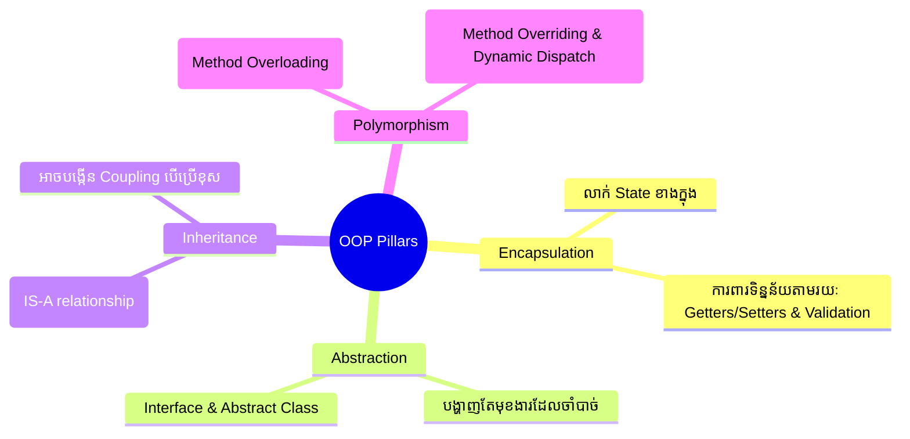
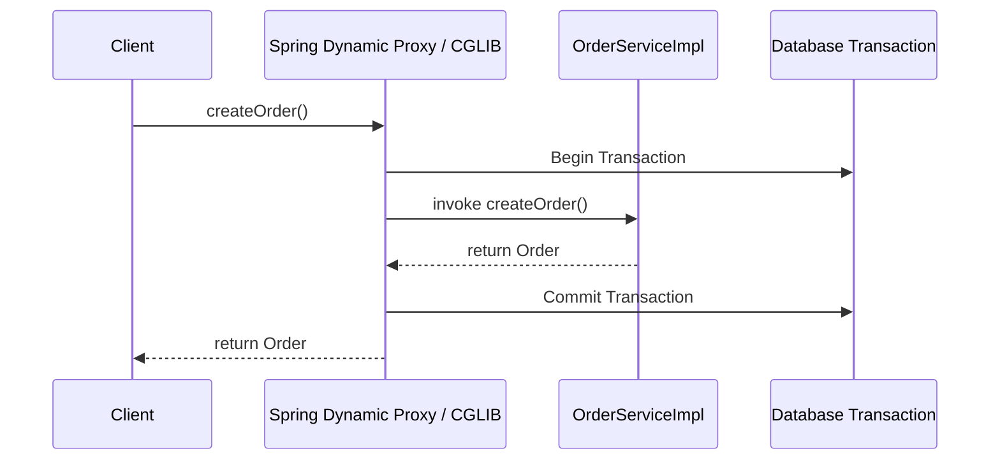

# Module 02: OOP, SOLID Principles & Design Patterns (ខេមរភាសា) 🇰🇭

> 🌐 **ភាសា / Language:** 🇰🇭 **[ភាសាខ្មែរ (Khmer)](README.kh.md)** | 🇬🇧 [English](README.md)  
> 🧭 **រុករក:** [← 01. Core Java & JVM](../01-core-java-and-jvm-internals/README.kh.md) | [📚 Home](../README.kh.md) | [បន្ទាប់: 03. Concurrency & Threads →](../03-concurrency-multithreading-virtual-threads/README.kh.md)

---

## មាតិកា (Table of Contents)

1. [សសរទ្រូងទាំង ៤ នៃ OOP ក្នុងទស្សនៈវិស្វកម្មជាក់ស្តែង](#១-សសរទ្រូងទាំង-៤-នៃ-oop-ក្នុងទស្សនៈវិស្វកម្មជាក់ស្តែង)
2. [ហេតុអ្វីបានជាគេតែងតែផ្តល់អនុសាសន៍ "Composition over Inheritance"?](#២-composition-over-inheritance)
3. [គោលការណ៍ SOLID ទាំង ៥ បកស្រាយជាមួយកូដ Java ជាក់ស្តែង](#៣-គោលការណ៍-solid-ទាំង-៥)
4. [Design Patterns ស្នូលដែលសួរញឹកញាប់បំផុតក្នុងការសម្ភាសន៍](#៤-design-patterns-ស្នូល)
   - [Singleton Pattern (Thread-safe Double-Checked Locking)](#-singleton-pattern)
   - [Factory & Abstract Factory Pattern](#-factory-pattern)
   - [Builder Pattern](#-builder-pattern)
   - [Strategy Pattern](#-strategy-pattern)
   - [Proxy Pattern (បេះដូងនៃ Spring AOP & @Transactional)](#-proxy-pattern)
5. [អន្ទាក់អ្នកសម្ភាសន៍ (Interviewer Traps) & Code Refactoring](#៥-អន្ទាក់អ្នកសម្ភាសន៍-interviewer-traps)

---

## ១. សសរទ្រូងទាំង ៤ នៃ OOP ក្នុងទស្សនៈវិស្វកម្មជាក់ស្តែង



1. **Encapsulation (ការវេចខ្ចប់ និងលាក់កំបាំងទិន្នន័យ):**
   - ដាក់ fields ជា `private` និងផ្តល់សិទ្ធិចូលមើលតាមរយៈ public methods ដែលមាន logic ត្រួតពិនិត្យ (Data Validation)។
2. **Abstraction (ការទាញសង្ខេប):**
   - លាក់ភាពស្មុគស្មាញនៃ Implementation ដោយបង្ហាញតែ Contract (`Interface` ឬ `abstract class`)។
3. **Inheritance (ការទទួលមរតកកូដ):**
   - បង្កើត Subclass ចេញពី Superclass តាមរយៈ `extends` (IS-A relationship)។
4. **Polymorphism (ពហុរូបភាព):**
   - **Static (Compile-time):** Method Overloading (ឈ្មោះដូចគ្នា parameters ខុសគ្នា)។
   - **Dynamic (Runtime):** Method Overriding (Subclass កែប្រែ behavior របស់ Superclass) ដោយប្រើ Dynamic Method Dispatch របស់ JVM។

---

## ២. Composition over Inheritance

> **💡 អ្វីដែលអ្នកសម្ភាសន៍ចង់ឮ:**  
> ហេតុអ្វីបានជាវិស្វករជាន់ខ្ពស់តែងតែជ្រើសរើស **Composition (HAS-A)** ជាជាង **Inheritance (IS-A)**?

- **បញ្ហានៃ Inheritance (Fragile Base Class Problem):**
  - Inheritance បង្កើត **Tight Coupling** ខ្លាំងបំផុត។ ប្រសិនបើ Superclass ផ្លាស់ប្តូរបន្តិច គ្រប់ Subclasses ទាំងអស់អាចនឹងខូច (Broken) ដោយមិនដឹងខ្លួន។
- **ដំណោះស្រាយដោយ Composition:**
  - ជំនួសឱ្យការ `extends` យើងចាក់បញ្ចូល (Inject) Object ជំនួយតាមរយៈ Constructor (Dependency Injection)។

```java
// ❌ មិនល្អ៖ Tight coupling តាមរយៈ Inheritance
public class OrderService extends PaymentGateway { ... }

// ✅ ត្រឹមត្រូវ៖ Loose coupling តាមរយៈ Composition
public class OrderService {
    private final PaymentGateway paymentGateway; // HAS-A relationship

    public OrderService(PaymentGateway paymentGateway) {
        this.paymentGateway = paymentGateway;
    }
}
```

---

## ៣. គោលការណ៍ SOLID ទាំង ៥

| អក្សរកាត់ | គោលការណ៍ (Principle) | អត្ថន័យខ្លឹមសារក្នុងវិស្វកម្ម |
| :---: | :--- | :--- |
| **S** | **Single Responsibility Principle (SRP)** | Class មួយ គួរតែមាន **ហេតុផលតែមួយគត់ក្នុងការផ្លាស់ប្តូរ** (មានទំនួលខុសត្រូវតែមួយ)។ |
| **O** | **Open/Closed Principle (OCP)** | Software entities គួរតែ **បើកចំហចំពោះការបន្ថែមមុខងារថ្មី (Extension)** ប៉ុន្តែ **បិទចំពោះការកែប្រែកូដចាស់ (Modification)**។ |
| **L** | **Liskov Substitution Principle (LSP)** | Subclass ត្រូវតែអាចជំនួសកន្លែង Superclass បានគ្រប់ពេល ដោយមិនធ្វើឱ្យប្រព័ន្ធខូច logic ឡើយ។ |
| **I** | **Interface Segregation Principle (ISP)** | អតិថិជន (Client) មិនគួរត្រូវបានបង្ខំឱ្យពឹងផ្អែកលើ Methods ណាដែលខ្លួនមិនប្រើឡើយ (បំបែក Interface ធំៗជា Interface តូចៗ)។ |
| **D** | **Dependency Inversion Principle (DIP)** | High-level modules មិនត្រូវពឹងផ្អែកលើ Low-level modules ឡើយ — ទាំងពីរត្រូវតែពឹងផ្អែកលើ **Abstractions (Interfaces)**។ |

### ឧទាហរណ៍ជាក់ស្តែងនៃ OCP & Strategy Pattern:
```java
// Interface បើកចំហចំពោះ Implementation ថ្មី
public interface PaymentStrategy {
    void pay(BigDecimal amount);
}

// Extension ថ្មីៗដោយមិនប៉ះពាល់កូដចាស់
@Component("bakongPayment")
public class BakongPaymentStrategy implements PaymentStrategy {
    public void pay(BigDecimal amount) { /* KHQR Processing */ }
}

@Component("creditCardPayment")
public class CreditCardPaymentStrategy implements PaymentStrategy {
    public void pay(BigDecimal amount) { /* Visa/Mastercard Processing */ }
}
```

---

## ៤. Design Patterns ស្នូល

### ១. Singleton Pattern (Thread-Safe Double-Checked Locking)
អ្នកសម្ភាសន៍នឹងសុំឱ្យអ្នកសរសេរ Singleton ដោយដៃនៅលើក្តារខៀន (Whiteboard):

```java
public class DatabaseConnectionPool {
    // ត្រូវតែមាន volatile ដើម្បីការពារ Instruction Reordering របស់ JVM
    private static volatile DatabaseConnectionPool instance;

    private DatabaseConnectionPool() {
        // private constructor ការពារការហៅ new ពីក្រៅ
    }

    public static DatabaseConnectionPool getInstance() {
        if (instance == null) { // ត្រួតពិនិត្យលើកទី ១ (គ្មាន overhead នៃ lock)
            synchronized (DatabaseConnectionPool.class) {
                if (instance == null) { // ត្រួតពិនិត្យលើកទី ២ (Thread-safe)
                    instance = new DatabaseConnectionPool();
                }
            }
        }
        return instance;
    }
}
```

### ២. Factory Pattern
ជួយលាក់ Logic នៃការបង្កើត Object ពីអ្នកហៅប្រើប្រាស់៖
```java
public class NotificationFactory {
    public static Notification createNotification(String channel) {
        return switch (channel.toUpperCase()) {
            case "SMS" -> new SmsNotification();
            case "EMAIL" -> new EmailNotification();
            case "TELEGRAM" -> new TelegramNotification();
            default -> throw new IllegalArgumentException("Unknown channel: " + channel);
        };
    }
}
```

### ៣. Builder Pattern
ដោះស្រាយបញ្ហា **Telescoping Constructor** (ពេល Class មាន parameters ច្រើនពេក)៖
```java
User user = User.builder()
    .id(1L)
    .username("sokha")
    .email("sokha@example.com")
    .verified(true)
    .build();
```

### ៤. Proxy Pattern (បេះដូងនៃ Spring AOP & @Transactional)


> **💡 អ្វីដែលអ្នកសម្ភាសន៍ចង់ឮ:**  
> នៅពេលយើងដាក់ `@Transactional` លើ Method មួយក្នុង Spring Boot, Spring មិនដំណើរការ Class របស់យើងដោយផ្ទាល់ឡើយ ប៉ុន្តែវាបង្កើត **Dynamic Proxy Object** (តាមរយៈ CGLIB ឬ JDK Dynamic Proxy) ដើម្បីរុំជុំវិញ Method នោះ សម្រាប់បើក `beginTransaction()` មុនហៅកូដយើង និង `commit()` ឬ `rollback()` ក្រោយកូដយើងចប់!

---

## ៥. អន្ទាក់អ្នកសម្ភាសន៍ (Interviewer Traps)

> **💡 សំណួរសម្ភាសន៍កម្រិត Senior:**  
> *"ប្រសិនបើយើងហៅ method ដែលមាន `@Transactional` ចេញពី method ផ្សេងទៀតនៅក្នុង Class ដដែល (Self-Invocation) តើ Transaction នឹងដំណើរការដែរឬទេ?"*  
> **ចម្លើយត្រូវ៖** **អត់ដំណើរការទេ (Will NOT work)!**  
> ពីព្រោះការហៅពី method មួយទៅ method មួយទៀតក្នុង class តែមួយ (`this.methodB()`) គឺជាការហៅខាងក្នុងផ្ទាល់ ដោយមិនបានឆ្លងកាត់ **Spring Proxy Object** ឡើយ។ ដូច្នេះ Proxy គ្មានឱកាសចាប់ផ្តើម Transaction នោះទេ!
