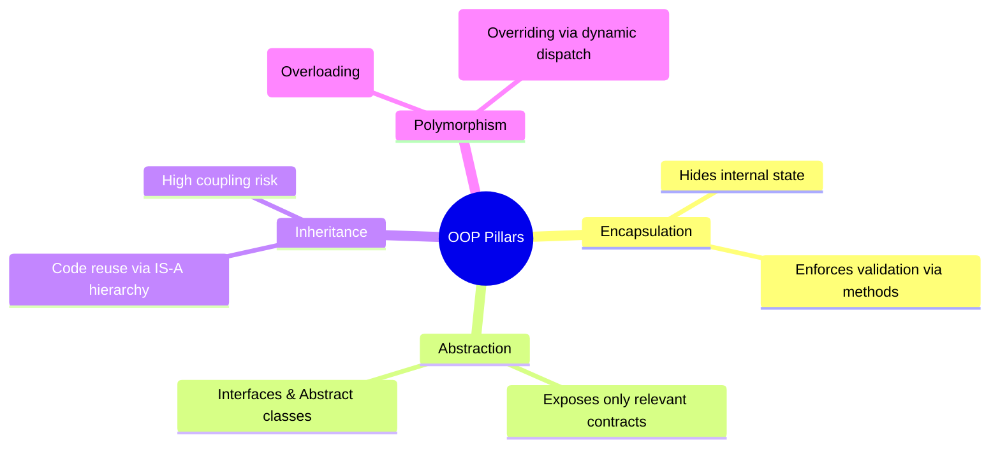
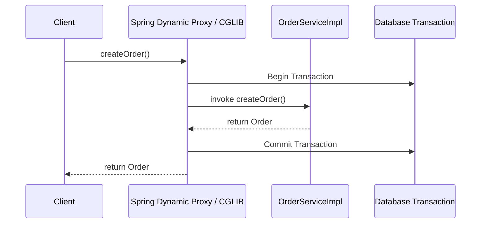

# Module 02: OOP, SOLID Principles & Design Patterns

> 🌐 **Language / ភាសា:** 🇬🇧 **[English](README.md)** | 🇰🇭 [ភាសាខ្មែរ (Khmer)](README.kh.md)  
> 🧭 **Navigation:** [← 01. Core Java & JVM](../01-core-java-and-jvm-internals/README.md) | [📚 Home](../README.md) | [Next: 03. Concurrency & Threads →](../03-concurrency-multithreading-virtual-threads/README.md)

---

## Table of Contents

1. [The 4 Pillars of OOP from an Enterprise Engineering Standpoint](#1-the-4-pillars-of-oop-from-an-enterprise-engineering-standpoint)
2. [Why Engineers Prefer "Composition over Inheritance"](#2-why-engineers-prefer-composition-over-inheritance)
3. [The 5 SOLID Principles with Concrete Java Examples](#3-the-5-solid-principles-with-concrete-java-examples)
4. [High-Frequency Design Patterns in Technical Interviews](#4-high-frequency-design-patterns-in-technical-interviews)
   - [Singleton Pattern (Thread-safe Double-Checked Locking)](#1-singleton-pattern-thread-safe-double-checked-locking)
   - [Factory & Abstract Factory Pattern](#2-factory-pattern)
   - [Builder Pattern](#3-builder-pattern)
   - [Strategy Pattern](#4-strategy-pattern)
   - [Proxy Pattern (Heart of Spring AOP & @Transactional)](#5-proxy-pattern-heart-of-spring-aop--transactional)
5. [Interviewer Traps & Self-Invocation Pitfalls](#5-interviewer-traps--self-invocation-pitfalls)

---

## 1. The 4 Pillars of OOP from an Enterprise Engineering Standpoint



1. **Encapsulation:** Keeps state fields `private` and controls access through accessor methods containing domain integrity validations.
2. **Abstraction:** Decouples interfaces from implementation details, allowing callers to program against contracts rather than concrete classes.
3. **Inheritance:** Enables code reuse across sub-types through `extends` (IS-A relationship).
4. **Polymorphism:** Enables a single interface to represent multiple underlying implementations (dynamic method dispatch at runtime).

---

## 2. Why Engineers Prefer "Composition over Inheritance"

> **💡 What Interviewers Look For:**  
> The fragility of the base class problem.

- **Inheritance Fragility:** Subclasses inherit implementation details of the parent. If parent behavior evolves, subclasses can silently break or inherit unwanted functionality.
- **Composition Flexibility:** Encapsulating dependencies via interfaces and injecting them (HAS-A relationship) provides loose coupling, runtime interchangeability, and clean unit testing.

```java
// ❌ Poor: Tight coupling via inheritance
public class OrderService extends PaymentGateway { ... }

// ✅ Best Practice: Loose coupling via composition
public class OrderService {
    private final PaymentGateway paymentGateway;

    public OrderService(PaymentGateway paymentGateway) {
        this.paymentGateway = paymentGateway;
    }
}
```

---

## 3. The 5 SOLID Principles with Concrete Java Examples

| Principle | Core Meaning |
| :---: | :--- |
| **S** - Single Responsibility (SRP) | A class should have **only one reason to change**. |
| **O** - Open/Closed (OCP) | Software entities should be **open for extension, but closed for modification**. |
| **L** - Liskov Substitution (LSP) | Subtypes must be substitutable for their base types without altering program correctness. |
| **I** - Interface Segregation (ISP) | Clients should not be forced to depend upon interfaces they do not use. |
| **D** - Dependency Inversion (DIP) | High-level modules must depend on **abstractions**, not on concrete low-level implementations. |

---

## 4. High-Frequency Design Patterns in Technical Interviews

### 1. Singleton Pattern (Thread-Safe Double-Checked Locking)

```java
public class DatabaseConnectionPool {
    // 'volatile' prevents CPU instruction reordering
    private static volatile DatabaseConnectionPool instance;

    private DatabaseConnectionPool() {
        // Prevent reflection instantiation
    }

    public static DatabaseConnectionPool getInstance() {
        if (instance == null) { // 1st check without locking overhead
            synchronized (DatabaseConnectionPool.class) {
                if (instance == null) { // 2nd check within lock
                    instance = new DatabaseConnectionPool();
                }
            }
        }
        return instance;
    }
}
```

### 2. Factory Pattern
Decouples object creation from client consumption:
```java
public class NotificationFactory {
    public static Notification createNotification(String channel) {
        return switch (channel.toUpperCase()) {
            case "SMS" -> new SmsNotification();
            case "EMAIL" -> new EmailNotification();
            case "TELEGRAM" -> new TelegramNotification();
            default -> throw new IllegalArgumentException("Unsupported channel: " + channel);
        };
    }
}
```

### 3. Builder Pattern
Eliminates telescoping constructors and mutable setter chains:
```java
User user = User.builder()
    .id(1L)
    .username("john_doe")
    .email("john@example.com")
    .verified(true)
    .build();
```

### 4. Strategy Pattern
Enforces OCP by dynamically interchanging business algorithms:
```java
public interface PaymentStrategy {
    void pay(BigDecimal amount);
}

@Component("bakongPayment")
public class BakongPaymentStrategy implements PaymentStrategy {
    public void pay(BigDecimal amount) { /* KHQR processing */ }
}
```

### 5. Proxy Pattern (Heart of Spring AOP & @Transactional)



---

## 5. Interviewer Traps & Self-Invocation Pitfalls

> **💡 Senior Interview Question:**  
> *"If method A calls method B in the same class, and method B is annotated with `@Transactional`, will the transaction start?"*  
> **Accurate Answer:** **NO, it will NOT start.**  
> Spring creates transactions by wrapping your bean in a **Dynamic Proxy Object**. When an internal method calls another method on `this` (`this.methodB()`), the invocation bypasses the Spring proxy completely, so no transaction interceptor can execute!
