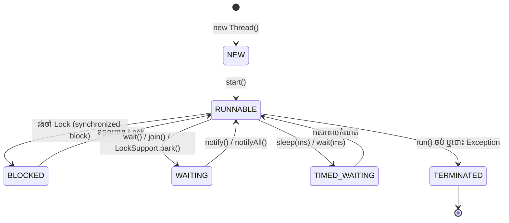
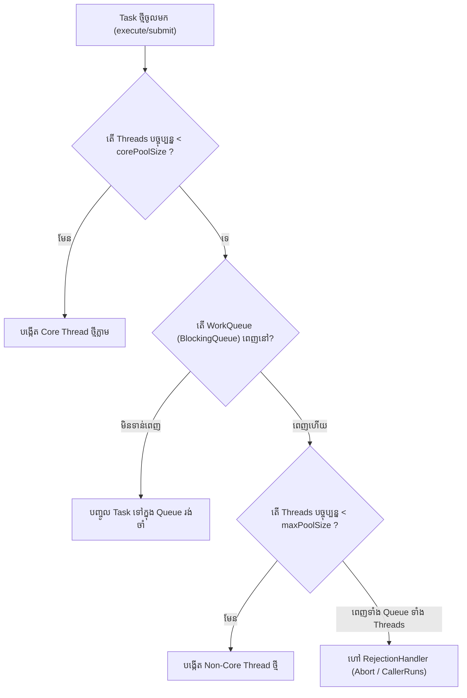
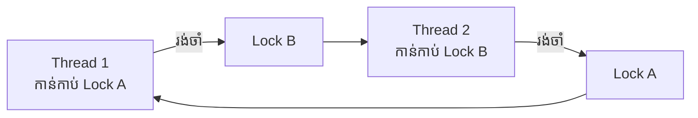

# Module 03: Concurrency, Multithreading & Virtual Threads (ខេមរភាសា) 🇰🇭

> 🌐 **ភាសា / Language:** 🇰🇭 **[ភាសាខ្មែរ (Khmer)](README.kh.md)** | 🇬🇧 [English](README.md)  
> 🧭 **រុករក:** [← 02. OOP & Design Patterns](../02-oop-solid-and-design-patterns/README.kh.md) | [📚 Home](../README.kh.md) | [បន្ទាប់: 04. Spring Core Architecture →](../04-spring-framework-core-architecture/README.kh.md)

---

## មាតិកា (Table of Contents)

1. [Thread Lifecycle និងស្ថានភាពទាំង ៦ នៃ Thread ក្នុង Java](#១-thread-lifecycle)
2. [ការប្រៀបធៀប៖ synchronized vs ReentrantLock vs volatile vs Atomic](#២-ការប្រៀបធៀប-concurrency-primitives)
3. [ស្ថាបត្យកម្មខាងក្នុងនៃ ThreadPoolExecutor (បេះដូងនៃ Backend Thread Management)](#៣-ស្ថាបត្យកម្មខាងក្នុងនៃ-threadpoolexecutor)
4. [ការវិភាគ Deadlock៖ របៀបស្វែងរក និងការពារកុំឱ្យកើតមាន](#៤-ការវិភាគ-deadlock)
5. [CompletableFuture និង Asynchronous Non-blocking Programming](#៥-completablefuture)
6. [បដិវត្តន៍ Java 21៖ Virtual Threads (Project Loom) ដំណើរការយ៉ាងដូចម្តេច?](#៦-បដិវត្តន៍-java-21-virtual-threads)
7. [អន្ទាក់អ្នកសម្ភាសន៍ (Interviewer Traps)](#៧-អន្ទាក់អ្នកសម្ភាសន៍-interviewer-traps)

---

## ១. Thread Lifecycle

Java Thread មាន **៦ ស្ថានភាព (States)** តាមរយៈ `java.lang.Thread.State`៖



---

## ២. ការប្រៀបធៀប Concurrency Primitives

| យន្តការ (Primitive) | កម្រិតការពារ | ការទប់ស្កាត់ Race Condition | ការទប់ស្កាត់ Reordering | Overhead |
| :--- | :--- | :---: | :---: | :---: |
| **`volatile`** | Visibility នៃ Variable តែមួយ | ❌ មិនការពារ Compound Actions (ឧ. `count++`) | ✅ បង្កើត Memory Barrier | ទាបបំផុត |
| **`AtomicInteger`** | Lock-Free CAS (Compare-And-Swap) | ✅ ធានា Atomicity លើ single operations | ✅ ធានា Visibility | មធ្យម |
| **`synchronized`** | Block / Method Level Lock | ✅ ធានា Mutual Exclusion | ✅ ធានា Visibility | មធ្យម-ខ្ពស់ |
| **`ReentrantLock`** | Explicit Lock (Fairness, TryLock) | ✅ អាច Interruptible, Timeouts | ✅ ធានា Visibility | បត់បែនបំផុត |

```java
// ឧទាហរណ៍ Lock-Free Counter ជាមួយ Atomic
public class RequestCounter {
    private final AtomicInteger count = new AtomicInteger(0);

    public int increment() {
        return count.incrementAndGet(); // ដំណើរការតាម hardware-level CAS instruction
    }
}
```

---

## ៣. ស្ថាបត្យកម្មខាងក្នុងនៃ ThreadPoolExecutor

អ្នកសម្ភាសន៍ចូលចិត្តសួរលម្អិតបំផុតពីរបៀបដែល `ThreadPoolExecutor` ដំណើរការនៅពេល Task ថ្មីចូលមក៖



### Rejection Policies ទាំង ៤៖
1. **AbortPolicy (Default):** បោះ `RejectedExecutionException` ភ្លាមៗ។
2. **CallerRunsPolicy:** បង្ខំឱ្យ Thread របស់អ្នកហៅ (ឧ. HTTP Request Thread) រត់ Task នោះដោយខ្លួនឯង — ជួយកាត់បន្ថយសម្ពាធ (Backpressure)។
3. **DiscardPolicy:** លុប Task ចោលស្ងាត់ៗដោយមិនប្រាប់ដំណឹង។
4. **DiscardOldestPolicy:** លុប Task ចាស់ជាងគេក្នុង Queue ចោល រួចព្យាយាមបញ្ចូល Task ថ្មី។

---

## ៤. ការវិភាគ Deadlock

**Deadlock** កើតឡើងនៅពេល Threads ពីរ ឬច្រើន រង់ចាំ Lock របស់គ្នាទៅវិញទៅមកជាវដ្ត (Circular Dependency)៖



### របៀបដោះស្រាយ និងការពារ៖
1. **Lock Ordering (ក្បួនចម្បង):** ធានាថាគ្រប់ Threads ទាំងអស់ត្រូវតែទាមទារ Lock តាមលំដាប់លំដោយតែមួយ (Acquire locks in a globally consistent order)។
2. **Timeouts:** ប្រើ `ReentrantLock.tryLock(timeout, unit)` ជំនួសឱ្យ `synchronized`។
3. **Thread Dump Analysis:** ប្រើឧបករណ៍ `jcmd <PID> Thread.dump_to_file` ឬ `jstack` ដើម្បីស្វែងរកបន្ទាត់កូដដែលជាប់ Deadlock ក្នុង Production។

---

## ៥. CompletableFuture (Asynchronous Programming)

`CompletableFuture` ជួយឱ្យយើងអាចដំណើរការកិច្ចការច្រើនស្របគ្នា (In Parallel) ដោយមិនបាច់រង់ចាំ (Non-Blocking)៖

```java
CompletableFuture<UserProfile> profileFuture = CompletableFuture.supplyAsync(() -> userService.getProfile(id));
CompletableFuture<OrderHistory> ordersFuture  = CompletableFuture.supplyAsync(() -> orderService.getOrders(id));

// ដំណើរការស្របគ្នា រួចផ្គុំទិន្នន័យបញ្ចូលគ្នាពេលទាំងពីរចប់
CompletableFuture<DashboardDTO> dashboardFuture = profileFuture.thenCombine(ordersFuture, 
    (profile, orders) -> new DashboardDTO(profile, orders));
```

---

## ៦. បដិវត្តន៍ Java 21៖ Virtual Threads (Project Loom)

កាលពីមុន (Platform Threads)៖
- **1 Java Thread = 1 OS Thread (Kernel Thread)** ដែលស៊ី RAM ចន្លោះពី **1MB ទៅ 2MB** ក្នុង ១ Thread។ Server ដែលមាន RAM 4GB អាចទ្រទ្រង់បានត្រឹមតែ ២,០០០ ទៅ ៤,០០០ Threads ប៉ុណ្ណោះ មុនពេលជួប `OutOfMemoryError`។

ក្នុង **Java 21 (Virtual Threads)**៖
- **Virtual Thread** គឺជា Thread ទម្ងន់ស្រាលបំផុតដែលគ្រប់គ្រងដោយ JVM (User-space Thread)។
- វាកាន់កាប់ RAM ត្រឹមតែ **ពីរបីរយ Bytes** ប៉ុណ្ណោះ។
- នៅពេល Virtual Thread ជួបប្រតិបត្តិការទប់ស្កាត់ (Blocking I/O ដូចជា query database ឬហៅ REST API), JVM នឹង **Unmount (ផ្អាក)** Virtual Thread នោះចេញពី OS Thread (Carrier Thread) ដើម្បីឱ្យ Carrier Thread នោះអាចរត់កិច្ចការផ្សេងទៀតបាន!

```java
// បង្កើត Virtual Thread executor ក្នុង Java 21
try (var executor = Executors.newVirtualThreadPerTaskExecutor()) {
    IntStream.range(0, 100_000).forEach(i -> {
        executor.submit(() -> {
            Thread.sleep(Duration.ofSeconds(1)); // I/O simulation
            return i;
        });
    });
} // ដំណើរការ Threads ចំនួន ១០០,០០០ ក្នុងពេលតែមួយបានយ៉ាងស្រួល!
```

---

## ៧. អន្ទាក់អ្នកសម្ភាសន៍ (Interviewer Traps)

> **💡 សំណួរសម្ភាសន៍៖**  
> *"តើយើងគួរប្រើ Thread Pool (ឧ. `Executors.newFixedThreadPool`) សម្រាប់ Virtual Threads ក្នុង Java 21 ដែរឬទេ?"*  
> **ចម្លើយត្រូវ៖** **មិនគួរប្រើឡើយ (NO Pool for Virtual Threads)!**  
> ពីព្រោះគោលបំណងនៃ Thread Pool គឺដើម្បីទប់ស្កាត់ការបង្កើត Platform Threads ថ្លៃៗច្រើនពេក។ ប៉ុន្តែ Virtual Threads មានតម្លៃថោកបំផុត (Cheap to create and destroy) ដូច្នេះគោលការណ៍ត្រឹមត្រូវគឺ **បង្កើត Virtual Thread ថ្មីមួយសម្រាប់គ្រប់ Task នីមួយៗ** (`Executors.newVirtualThreadPerTaskExecutor()`) ដោយមិនចាំបាច់ Pool ឡើយ!
