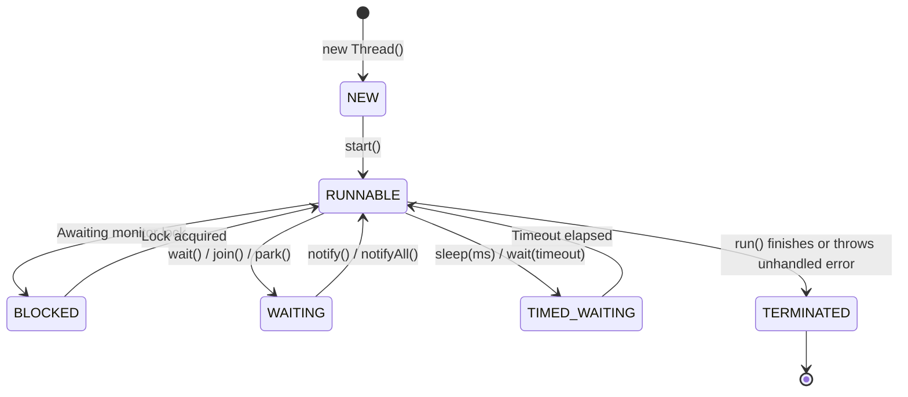
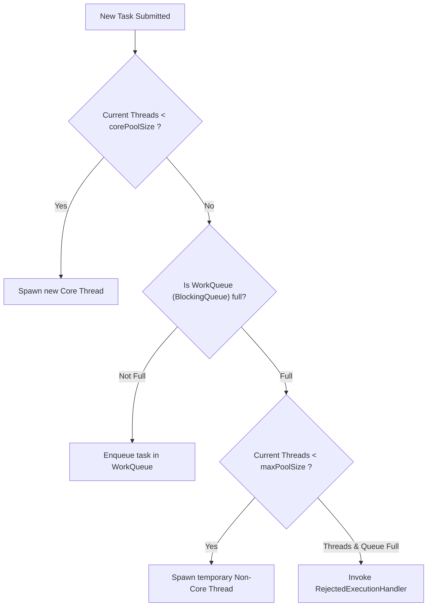
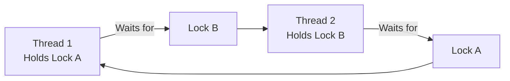

# Module 03: Concurrency, Multithreading & Virtual Threads

> 🌐 **Language / ភាសា:** 🇬🇧 **[English](README.md)** | 🇰🇭 [ភាសាខ្មែរ (Khmer)](README.kh.md)  
> 🧭 **Navigation:** [← 02. OOP & Design Patterns](../02-oop-solid-and-design-patterns/README.md) | [📚 Home](../README.md) | [Next: 04. Spring Core Architecture →](../04-spring-framework-core-architecture/README.md)

---

## Table of Contents

1. [Thread Lifecycle and the 6 States of Java Threads](#1-thread-lifecycle)
2. [Concurrency Primitives: synchronized vs ReentrantLock vs volatile vs Atomic](#2-concurrency-primitives-comparison)
3. [ThreadPoolExecutor Internal Architecture & Rejection Policies](#3-threadpoolexecutor-internal-architecture)
4. [Deadlock Diagnostics, Prevention, and Thread Dump Analysis](#4-deadlock-diagnostics-and-prevention)
5. [CompletableFuture and Asynchronous Non-blocking Pipelines](#5-completablefuture-and-async-pipelines)
6. [The Java 21 Revolution: Virtual Threads (Project Loom)](#6-the-java-21-revolution-virtual-threads)
7. [Interviewer Traps: Pooling Virtual Threads Anti-pattern](#7-interviewer-traps)

---

## 1. Thread Lifecycle

Java threads transition through 6 formal states governed by `java.lang.Thread.State`:



---

## 2. Concurrency Primitives Comparison

| Primitive | Scope | Mutual Exclusion (Atomicity) | Memory Visibility | Performance Overhead |
| :--- | :--- | :---: | :---: | :---: |
| **`volatile`** | Single variable | ❌ No atomicity on compound ops (`count++`) | ✅ Guarantees CPU cache flush | Minimal |
| **`AtomicInteger`** | Single variable | ✅ Lock-free CAS (Compare-And-Swap) | ✅ Guarantees visibility | Moderate |
| **`synchronized`** | Method / Block | ✅ Full mutual exclusion | ✅ Guarantees visibility | Moderate to high |
| **`ReentrantLock`** | Explicit code blocks | ✅ Advanced features (timed, fair, interruptible) | ✅ Guarantees visibility | Highly flexible |

```java
// Lock-free atomic counter example
public class RequestMetricsCounter {
    private final AtomicInteger requestCount = new AtomicInteger(0);

    public int increment() {
        return requestCount.incrementAndGet(); // Emits lock-free hardware CAS instructions
    }
}
```

---

## 3. ThreadPoolExecutor Internal Architecture

When a task is submitted via `execute()` or `submit()`:



### The 4 Rejection Policies:
1. **`AbortPolicy` (Default):** Throws `RejectedExecutionException`.
2. **`CallerRunsPolicy`:** Forces the submitting thread (e.g., the HTTP request thread) to run the task itself, applying natural backpressure.
3. **`DiscardPolicy`:** Silently drops the task with no notification.
4. **`DiscardOldestPolicy`:** Evicts the oldest unhandled task from the queue to accommodate the newly submitted task.

---

## 4. Deadlock Diagnostics and Prevention

A deadlock occurs when two or more threads circular-wait for locks held by each other:



### Prevention Guidelines:
- **Global Lock Ordering:** Enforce an immutable global sequence for lock acquisition across your codebase.
- **Lock Timeouts:** Utilize `ReentrantLock.tryLock(timeout, timeUnit)` rather than un-timed `synchronized` monitors.
- **Production Diagnostics:** Generate a thread dump via `jcmd <PID> Thread.dump_to_file` or analyze thread contention with JDK Flight Recorder (JFR).

---

## 5. CompletableFuture and Async Pipelines

`CompletableFuture` allows non-blocking composition of asynchronous tasks:

```java
CompletableFuture<UserProfile> profileFuture = CompletableFuture.supplyAsync(() -> userService.getProfile(id));
CompletableFuture<OrderHistory> ordersFuture  = CompletableFuture.supplyAsync(() -> orderService.getOrders(id));

// Combine parallel computations asynchronously without blocking worker threads
CompletableFuture<DashboardDTO> dashboardFuture = profileFuture.thenCombine(ordersFuture, 
    (profile, orders) -> new DashboardDTO(profile, orders));
```

---

## 6. The Java 21 Revolution: Virtual Threads

- **Platform Threads (Classic):** 1:1 mapping with OS kernel threads. Heavyweight (~1-2MB stack per thread). High memory overhead limits concurrency to several thousand threads.
- **Virtual Threads (Loom):** Lightweight user-mode threads scheduled by the JVM over a small pool of carrier OS threads. Stack frames are stored in the heap and dynamically sized (~few hundred bytes).
- **Non-blocking Behavior:** When a virtual thread performs blocking I/O (JDBC, REST call, socket read), the JVM unmounts it from the carrier thread until the I/O event completes, freeing the OS thread to process other workloads.

```java
// Java 21: High-concurrency virtual thread executor
try (var executor = Executors.newVirtualThreadPerTaskExecutor()) {
    IntStream.range(0, 100_000).forEach(i -> {
        executor.submit(() -> {
            Thread.sleep(Duration.ofSeconds(1)); // I/O simulation
            return i;
        });
    });
} // Gracefully manages 100,000 parallel concurrent tasks with negligible memory
```

---

## 7. Interviewer Traps

> **💡 Senior Interview Question:**  
> *"Should we pool Virtual Threads using `Executors.newFixedThreadPool(1000)`?"*  
> **Accurate Response:** **Never pool virtual threads!**  
> Thread pools exist solely to amortize the costly initialization overhead of OS platform threads. Because virtual threads are lightweight and inexpensive to instantiate and destroy, the intended pattern is **Thread-per-Task** using `Executors.newVirtualThreadPerTaskExecutor()`.
