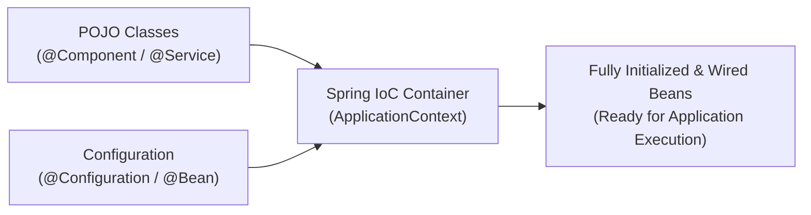
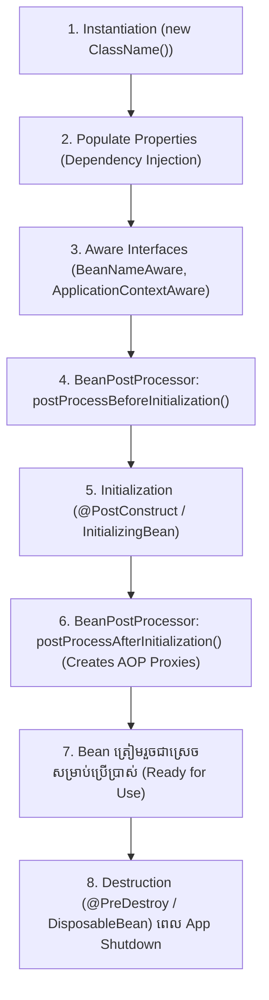
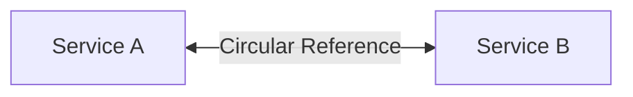

# Module 04: Spring Framework Core Architecture (ខេមរភាសា) 🇰🇭

> 🌐 **ភាសា / Language:** 🇰🇭 **[ភាសាខ្មែរ (Khmer)](README.kh.md)** | 🇬🇧 [English](README.md)  
> 🧭 **រុករក:** [← 03. Concurrency & Threads](../03-concurrency-multithreading-virtual-threads/README.kh.md) | [📚 Home](../README.kh.md) | [បន្ទាប់: 05. Spring Boot Deep Dive →](../05-spring-boot-deep-dive-and-production/README.kh.md)

---

## មាតិកា (Table of Contents)

1. [Inversion of Control (IoC) និង ApplicationContext vs BeanFactory](#១-inversion-of-control-ioc)
2. [ហេតុអ្វី Constructor Injection ជាជម្រើសលេខ ១ ក្នុង Enterprise Code?](#២-ហេតុអ្វី-constructor-injection-ជាជម្រើសលេខ-១)
3. [Spring Bean Lifecycle ពេញលេញពីកំណើតដល់ស្លាប់](#៣-spring-bean-lifecycle-ពេញលេញ)
4. [Bean Scopes ទាំង ៦ និងបញ្ហា Prototype Bean ក្នុង Singleton Bean](#៤-bean-scopes-ទាំង-៦)
5. [របៀបដែល Spring ដោះស្រាយ Circular Dependencies (3-Level Cache)](#៥-របៀបដែល-spring-ដោះស្រាយ-circular-dependencies)
6. [Aspect-Oriented Programming (AOP) & Proxy Generation Mechanics](#៦-aspect-oriented-programming-aop)
7. [អន្ទាក់អ្នកសម្ភាសន៍ (Interviewer Traps)](#៧-អន្ទាក់អ្នកសម្ភាសន៍-interviewer-traps)

---

## ១. Inversion of Control (IoC)

នៅក្នុងកូដធម្មតា យើងជាអ្នកបង្កើត Object ដោយប្រើ `new` (Caller controls dependencies)។ នៅក្នុង **IoC (Inversion of Control)** ការគ្រប់គ្រងការបង្កើត និងចងភ្ជាប់ Object ត្រូវបានប្រគល់ទៅឱ្យ **Spring IoC Container** ជាអ្នកចាត់ចែងជំនួសវិញ (Hollywood Principle: *"Don't call us, we'll call you"*):



### ApplicationContext vs BeanFactory:
- **BeanFactory:** ជា Container មូលដ្ឋានទម្ងន់ស្រាលបំផុត។ វាប្រើ **Lazy Loading** (បង្កើត Bean នៅពេលហៅ `getBean()`)។
- **ApplicationContext (Advanced):** ជា Sub-interface របស់ BeanFactory ដែលផ្តល់នូវ **Eager Loading** (បង្កើត Singleton Beans ទាំងអស់តាំងពីពេល Boot កម្មវិធី), គាំទ្រ Internationalization (i18n), Event Publishing, និងការរួមបញ្ចូល AOP ពេញលេញ។

---

## ២. ហេតុអ្វី Constructor Injection ជាជម្រើសលេខ ១?

| ប្រភេទ Injection | ឧទាហរណ៍ | គុណវិបត្តិ |
| :--- | :--- | :--- |
| **Field Injection** | `@Autowired private OrderRepo repo;` | ❌ មិនអាចដាក់ `final` បាន, ពិបាកធ្វើ Unit Test បើគ្មាន Spring Context, លាក់បាំង Circular Dependency។ |
| **Setter Injection** | `@Autowired public void setRepo(..)` | ❌ Object អាចស្ថិតក្នុងស្ថានភាពមិនពេញលេញ (Incomplete/Mutable State)។ |
| **Constructor Injection** | `public OrderService(OrderRepo repo)` | ✅ **ល្អឥតខ្ចោះ៖** អាចដាក់ `final` (Immutable), បរាជ័យភ្លាមពេល Boot បើខ្វះ Bean, ងាយស្រួល Test! |

```java
// ✅ ស្តង់ដារ Enterprise ទំនើបជាមួយ Lombok
@Service
@RequiredArgsConstructor
public class OrderService {
    private final OrderRepository orderRepository; // Immutable & Thread-safe!
    private final PaymentGateway paymentGateway;
}
```

---

## ៣. Spring Bean Lifecycle ពេញលេញ

ដំណើរការបង្កើត Bean ក្នុង Spring Container មានដំណាក់កាលច្បាស់លាស់៖



> **💡 អ្វីដែលអ្នកសម្ភាសន៍ចង់ឮ:**  
> `BeanPostProcessor.postProcessAfterInitialization()` គឺជាកន្លែងដែលវេទមន្តនៃ **Spring AOP** និង **`@Transactional`** កើតឡើង! នៅត្រង់ជំហាននេះ Spring ពិនិត្យមើលថាតើ Bean របស់យើងមាន Annotation `@Transactional` ឬ Security ដែរឬទេ — បើមាន វានឹង **រុំព័ទ្ធ Bean ពិតប្រាកដ ដោយបង្កើត Dynamic Proxy Object** ជំនួសវិញ!

---

## ៤. Bean Scopes ទាំង ៦

1. **`singleton` (Default):** មាន Instance តែមួយគត់ក្នុង Spring Container ទាំងមូល។
2. **`prototype`:** បង្កើត Instance ថ្មីរាល់ពេលហៅ `getBean()` ឬ Inject។
3. **`request`:** Instance ថ្មីមួយសម្រាប់រាល់ HTTP Request មួយ (Web-aware)។
4. **`session`:** Instance ថ្មីមួយសម្រាប់រាល់ HTTP Session មួយ។
5. **`application`:** សម្រាប់ Lifecycle នៃ `ServletContext`។
6. **`websocket`:** សម្រាប់ Lifecycle នៃ WebSocket session។

### បញ្ហាប្រឈម៖ Inject Prototype Bean ចូលក្នុង Singleton Bean
> **សំណួរសម្ភាសន៍៖** បើយើង Inject Prototype Bean ចូលទៅក្នុង Singleton Bean តើយើងនឹងទទួលបាន Instance ថ្មីរាល់ពេលហៅ Method ដែរឬទេ?  
> **ចម្លើយ៖** **អត់ទេ!** ពីព្រោះ Singleton Bean ត្រូវបាន Instantiate តែម្តងគត់កាលពីពេល Boot ដូច្នេះ Prototype Bean ដែលចាក់បញ្ចូលទៅក៏នៅជាប់តែមួយនោះរហូត។  
> **ដំណោះស្រាយ៖** ប្រើប្រាស់ **`@Lookup` method injection** ឬ **`ObjectProvider<T>` / `ObjectFactory<T>`**។

---

## ៥. របៀបដែល Spring ដោះស្រាយ Circular Dependencies

នៅពេល Class A ត្រូវការ Class B ហើយ Class B ត្រូវការ Class A វិញ (A ⟷ B)៖



### ប្រព័ន្ធឃ្លាំងសម្ងាត់ ៣ ថ្នាក់របស់ Spring (The 3-Level Cache):
1. **First-Level Cache (`singletonObjects`):** ផ្ទុក Beans ពេញលេញដែលបង្កើត និង Inject រួចរាល់ ១០០%។
2. **Second-Level Cache (`earlySingletonObjects`):** ផ្ទុក Raw Object ដែលទើបតែបាន Instantiate តែមិនទាន់បាន Populate Properties ពេញលេញ (Early reference)។
3. **Third-Level Cache (`singletonFactories`):** ផ្ទុក `ObjectFactory` សម្រាប់បង្កើត Proxy ឬ Early Reference ដើម្បីដោះស្រាយ Circular Dependency។

> **ចំណាំសំខាន់៖** Spring អាចដោះស្រាយ Circular Dependency បាន **តែក្នុង Setter/Field Injection ប៉ុណ្ណោះ**។ ប្រសិនបើប្រើ **Constructor Injection** វានឹងគាំងបោះ `BeanCurrentlyInCreationException` ភ្លាមៗ (ហើយនេះជារឿងល្អ ព្រោះវាបង្ខំឱ្យយើងរៀបចំ Architecture កុំឱ្យជាប់ជំពាក់គ្នា)!

---

## ៦. Aspect-Oriented Programming (AOP)

AOP ជួយបំបែក Cross-Cutting Concerns (Logging, Security, Transaction, Metrics) ចេញពី Core Business Logic៖

```java
@Aspect
@Component
@Slf4j
public class LoggingAspect {

    // Pointcut: កំណត់កន្លែងដែលត្រូវអនុវត្ត
    @Pointcut("execution(* com.example.service.*.*(..))")
    public void serviceLayer() {}

    // Advice: អ្វីដែលត្រូវធ្វើ និងពេលណាត្រូវធ្វើ
    @Around("serviceLayer()")
    public Object profileMethod(ProceedingJoinPoint pjp) throws Throwable {
        long start = System.currentTimeMillis();
        Object result = pjp.proceed(); // ដំណើរការ Method ដើម
        log.info("{} completed in {} ms", pjp.getSignature().getName(), System.currentTimeMillis() - start);
        return result;
    }
}
```

---

## ៧. អន្ទាក់អ្នកសម្ភាសន៍ (Interviewer Traps)

> **💡 សំណួរសម្ភាសន៍កម្រិត Senior៖**  
> *"តើអ្វីជាភាពខុសគ្នារវាង JDK Dynamic Proxy និង CGLIB Proxy ក្នុង Spring?"*  
> **ចម្លើយត្រូវ៖**  
> - **JDK Dynamic Proxy:** អាចបង្កើត Proxy បាន **លុះត្រាតែ Target Class នោះអនុវត្ត Interface (implements Interface)** ពីព្រោះវាពឹងផ្អែកលើ `java.lang.reflect.Proxy`។
> - **CGLIB Proxy:** បង្កើត Proxy ដោយការ **Subclassing (បង្កើត Subclass ពី Target Class ដោយផ្ទាល់)** តាមរយៈការកែប្រែ Bytecode។ (ដូច្នេះ Target Class ឬ Method មិនអាចជា `final` បានឡើយ)។  
> ចាប់ពី **Spring Boot 2.x/3.x** មក Spring Boot បានកំណត់យក **CGLIB Proxy ជា Default** សម្រាប់គ្រប់ Bean ទាំងអស់!
