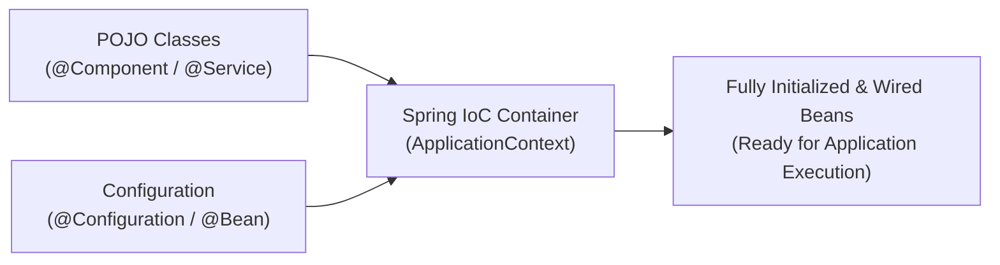
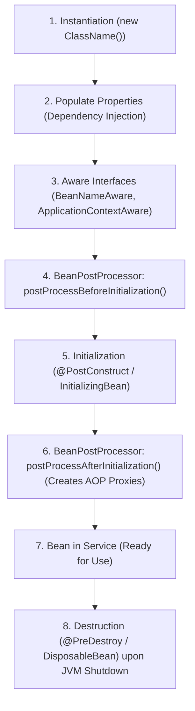
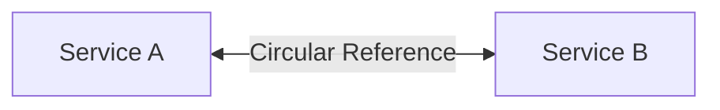

# Module 04: Spring Framework Core Architecture

> 🌐 **Language / ភាសា:** 🇬🇧 **[English](README.md)** | 🇰🇭 [ភាសាខ្មែរ (Khmer)](README.kh.md)  
> 🧭 **Navigation:** [← 03. Concurrency & Threads](../03-concurrency-multithreading-virtual-threads/README.md) | [📚 Home](../README.md) | [Next: 05. Spring Boot Deep Dive →](../05-spring-boot-deep-dive-and-production/README.md)

---

## Table of Contents

1. [Inversion of Control (IoC) and ApplicationContext vs BeanFactory](#1-inversion-of-control-ioc)
2. [Why Constructor Injection is the Industry Standard](#2-why-constructor-injection-is-the-industry-standard)
3. [The Complete Spring Bean Lifecycle](#3-the-complete-spring-bean-lifecycle)
4. [The 6 Bean Scopes and the Prototype-in-Singleton Dilemma](#4-the-6-bean-scopes-and-prototype-in-singleton)
5. [Circular Dependency Resolution via 3-Level Cache](#5-circular-dependency-resolution-via-3-level-cache)
6. [Aspect-Oriented Programming (AOP) & Proxy Generation](#6-aspect-oriented-programming-aop)
7. [Interviewer Traps: JDK Dynamic Proxy vs CGLIB](#7-interviewer-traps-jdk-dynamic-proxy-vs-cglib)

---

## 1. Inversion of Control (IoC)

Instead of individual components instantiating dependencies using `new`, the control over object instantiation and dependency wiring is inverted to the **Spring IoC Container**:



### ApplicationContext vs BeanFactory:
- **`BeanFactory`:** The foundational, lightweight IoC container. Implements **Lazy Loading** (instantiates beans on explicit invocation of `getBean()`).
- **`ApplicationContext`:** An enterprise-grade extension of BeanFactory. Implements **Eager Loading** for singleton beans at startup, alongside integrated event publishing, message source internationalization (i18n), and seamless AOP interception.

---

## 2. Why Constructor Injection is the Industry Standard

| Injection Type | Syntax | Trade-offs & Risks |
| :--- | :--- | :--- |
| **Field Injection** | `@Autowired private OrderRepository repo;` | ❌ Cannot mark dependencies `final`; prone to NPE in plain unit tests; conceals circular dependencies. |
| **Setter Injection** | `@Autowired public void setRepo(...)` | ❌ Exposes bean to mutable, incomplete states after instantiation. |
| **Constructor Injection** | `public OrderService(OrderRepo repo)` | ✅ **Best Practice:** Enforces immutability (`final`), guarantees failsafe unit tests, and exposes architectural coupling early. |

```java
// Production standard using Project Lombok
@Service
@RequiredArgsConstructor
public class OrderService {
    private final OrderRepository orderRepository; // Immutable, thread-safe, compile-time validated
    private final PaymentGateway paymentGateway;
}
```

---

## 3. The Complete Spring Bean Lifecycle



> **💡 What Interviewers Look For:**  
> `BeanPostProcessor.postProcessAfterInitialization()` is where Spring creates runtime proxies for `@Transactional` and custom AOP interceptors!

---

## 4. The 6 Bean Scopes and Prototype-in-Singleton

1. **`singleton` (Default):** Exactly one instance per Spring container.
2. **`prototype`:** Creates a new bean instance on every injection or retrieval.
3. **`request`:** One instance per HTTP request lifecycle (web-aware).
4. **`session`:** One instance per HTTP session lifecycle.
5. **`application`:** Bound to the lifecycle of the `ServletContext`.
6. **`websocket`:** Bound to the lifecycle of an open WebSocket.

### The Prototype-in-Singleton Dilemma:
When injecting a `prototype` bean into a `singleton` bean, the prototype is instantiated only once during the singleton's startup initialization. Subsequent method calls reuse that initial instance.  
**Solution:** Use **`@Lookup` method injection** or inject an **`ObjectProvider<T>`**.

---

## 5. Circular Dependency Resolution via 3-Level Cache



Spring resolves circular references for Setter/Field injection using a 3-level caching mechanism in `DefaultSingletonBeanRegistry`:
1. **`singletonObjects` (1st Level):** Holds fully initialized singleton beans.
2. **`earlySingletonObjects` (2nd Level):** Holds partially instantiated instances (raw instances before property population).
3. **`singletonFactories` (3rd Level):** Holds `ObjectFactory` instances allowing early proxy wrapping if required.

> **Note:** Spring Boot disables circular references by default (`spring.main.allow-circular-references=false`). Constructor injection naturally prevents circular references by failing fast with a `BeanCurrentlyInCreationException`.

---

## 6. Aspect-Oriented Programming (AOP)

AOP isolates cross-cutting concerns (logging, security, metrics, distributed tracing) from primary business logic:

```java
@Aspect
@Component
@Slf4j
public class PerformanceMonitoringAspect {

    @Pointcut("execution(* com.example.service.*.*(..))")
    public void serviceLayerMethods() {}

    @Around("serviceLayerMethods()")
    public Object profileMethod(ProceedingJoinPoint joinPoint) throws Throwable {
        long start = System.currentTimeMillis();
        Object result = joinPoint.proceed();
        log.info("{} finished in {} ms", joinPoint.getSignature().toShortString(), System.currentTimeMillis() - start);
        return result;
    }
}
```

---

## 7. Interviewer Traps: JDK Dynamic Proxy vs CGLIB

> **💡 Senior Technical Interview Question:**  
> *"What is the difference between JDK Dynamic Proxies and CGLIB in Spring, and which is the default in Spring Boot?"*  
> **Accurate Answer:**  
> - **JDK Dynamic Proxy:** Native to the JDK. Requires target classes to implement an interface. Proxies are created implementing that interface.
> - **CGLIB (Code Generation Library):** Generates runtime subclasses of the target bean by altering bytecode directly. It does not require an interface, but target classes/methods must not be `final`.  
> Starting with **Spring Boot 2.x/3.x**, Spring Boot sets **CGLIB proxies as the default** (`spring.aop.proxy-target-class=true`).
