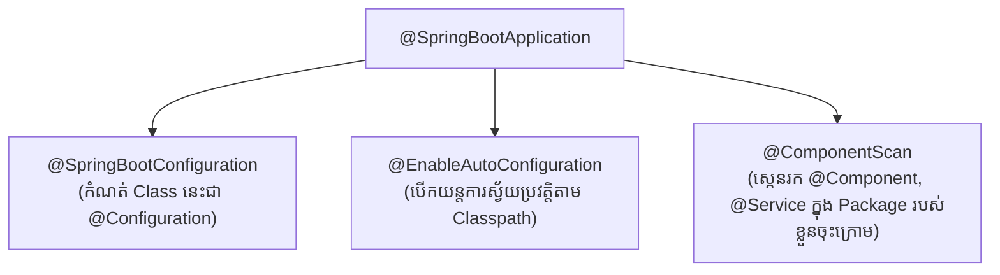
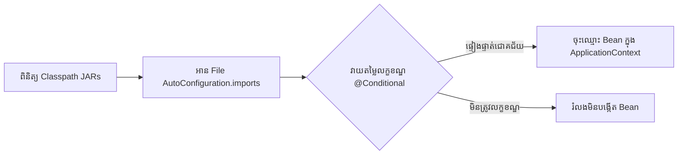

# Module 05: Spring Boot Deep Dive & Production Ready (ខេមរភាសា) 🇰🇭

> 🌐 **ភាសា / Language:** 🇰🇭 **[ភាសាខ្មែរ (Khmer)](README.kh.md)** | 🇬🇧 [English](README.md)  
> 🧭 **រុករក:** [← 04. Spring Core Architecture](../04-spring-framework-core-architecture/README.kh.md) | [📚 Home](../README.kh.md) | [បន្ទាប់: 06. SQL, Indexing & Spring Data JPA →](../06-sql-database-indexing-spring-data-jpa/README.kh.md)

---

## មាតិកា (Table of Contents)

1. [តើអ្វីខ្លះកើតឡើងនៅខាងក្នុង Annotation @SpringBootApplication?](#១-តើអ្វីខ្លះកើតឡើងនៅខាងក្នុង-springbootapplication)
2. [យន្តការខាងក្នុងនៃ Spring Boot Auto-Configuration (Under the Hood)](#២-យន្តការខាងក្នុងនៃ-auto-configuration)
3. [Spring Boot Starters និង Bill of Materials (BOM)](#៣-spring-boot-starters-និង-bom)
4. [Embedded Tomcat ដំណើរការយ៉ាងដូចម្តេច? (ServletWebServerFactory)](#៤-embedded-tomcat-ដំណើរការយ៉ាងដូចម្តេច)
5. [ការគ្រប់គ្រង Multi-Profile Configuration (Dev, UAT, Prod)](#៥-ការគ្រប់គ្រង-multi-profile-configuration)
6. [Spring Boot Actuator & Production Metrics (Prometheus / Grafana)](#៦-spring-boot-actuator)
7. [អន្ទាក់អ្នកសម្ភាសន៍ (Interviewer Traps)](#៧-អន្ទាក់អ្នកសម្ភាសន៍-interviewer-traps)

---

## ១. តើអ្វីខ្លះកើតឡើងនៅខាងក្នុង @SpringBootApplication?

`@SpringBootApplication` គឺជា **Meta-Annotation** ដែលរួមបញ្ចូលនូវ Annotations ស្នូលធំៗចំនួន ៣៖



1. **`@SpringBootConfiguration`:** បញ្ជាក់ថា Class នេះជាប្រភពកំណត់ Bean Definitions (ស្មើនឹង `@Configuration`)។
2. **`@EnableAutoConfiguration`:** ប្រាប់ Spring Boot ឱ្យពិនិត្យមើល Classpath ហើយរៀបចំ Beans លំនាំដើមឱ្យដោយស្វ័យប្រវត្តិ។
3. **`@ComponentScan`:** ស្កេនគ្រប់ Class ដែលមាន `@Component`, `@Service`, `@Repository`, `@RestController` នៅក្នុង Package ដែល Main Class ស្ថិតនៅ និង sub-packages ខាងក្រោមវា។

---

## ២. យន្តការខាងក្នុងនៃ Auto-Configuration

> **💡 សំណួរសម្ភាសន៍កម្រិត Senior៖**  
> *"តើ Spring Boot ដឹងដោយរបៀបណាថាពេលណាត្រូវបង្កើត DataSource Bean ឬ Tomcat Server ដោយស្វ័យប្រវត្តិ?"*



### ដំណើរការ ៣ ជំហាន៖
1. **ស្វែងរក Candidates:**  
   - ក្នុង **Spring Boot 3.x** វានឹងអានឯកសារ `META-INF/spring/org.springframework.boot.autoconfigure.AutoConfiguration.imports` ពីបណ្ណាល័យ dependencies។
2. **ត្រួតពិនិត្យលក្ខខណ្ឌ (Conditional Evaluation):**  
   Auto-configuration classes នីមួយៗត្រូវបានការពារដោយ **Conditional Annotations**៖
   - `@ConditionalOnClass(DataSource.class)`: ដំណើរការតែពេលណាឃើញ Driver ក្នុង Classpath។
   - `@ConditionalOnMissingBean(DataSource.class)`: ដំណើរការតែពេលដែល Developer មិនទាន់បានបង្កើត Custom Bean ដោយដៃផ្ទាល់ខ្លួនប៉ុណ្ណោះ!
   - `@ConditionalOnProperty(name = "feature.enabled", havingValue = "true")`
3. **ការចុះឈ្មោះ Bean:** ប្រសិនបើលក្ខខណ្ឌទាំងអស់ពិត វានឹងបង្កើត Bean នោះដាក់ចូលក្នុង Spring Container។

---

## ៣. Spring Boot Starters និង BOM

- **Starters (ឧ. `spring-boot-starter-web`):** ជាកញ្ចប់ Descriptor ដែលប្រមូលផ្តុំ dependencies ដែលត្រូវគ្នាជាស្រេច។ ជំនួសឱ្យការ Add Tomcat, Jackson, Spring MVC ដាច់ដោយឡែក យើងគ្រាន់តែ Add Starter មួយគត់។
- **BOM (Bill of Materials):** តាមរយៈ `spring-boot-dependencies` BOM Spring Boot គ្រប់គ្រង Version នៃបណ្ណាល័យរាប់រយ។ ដូច្នេះក្នុង `pom.xml` យើង **មិនចាំបាច់សរសេរ `<version>` ឡើយ** ដែលការពារបញ្ហា Jar Version Incompatibility (Jar Hell)។

---

## ៤. Embedded Tomcat ដំណើរការយ៉ាងដូចម្តេច?

កាលពីមុន យើងត្រូវដំឡើង Apache Tomcat ខាងក្រៅនៅលើ Server រួច Export កូដជា `.war` យកទៅដាក់ក្នុងថត `webapps/`។

នៅក្នុង Spring Boot៖
1. Spring Boot ប្រើប្រាស់ **`ServletWebServerApplicationContext`**។
2. វាកំណត់រកឃើញ `TomcatServletWebServerFactory` ក្នុង Classpath។
3. វានឹង Start Tomcat Server ដោយកូដ Java ផ្ទាល់ (Programmatic Tomcat bootstrap) នៅលើ Port `8080` (ឬតាម `server.port`)។
4. កម្មវិធីទាំងមូលត្រូវបានវេចខ្ចប់ជា **Executable JAR** ឯករាជ្យ ដែលអាចដំណើរការបានដោយពាក្យបញ្ជាតែមួយ៖
   ```bash
   java -jar my-application.jar
   ```

---

## ៥. ការគ្រប់គ្រង Multi-Profile Configuration

នៅក្នុង Production យើងត្រូវបំបែកការកំណត់ (DB URL, Password, Log level) តាម Environment៖

```
resources/
├── application.yml         # Shared Common Configs
├── application-dev.yml     # Local / Development Database
├── application-uat.yml     # Testing / Staging Environment
└── application-prod.yml    # Production High-Security Database
```

### របៀប Activate Profile ក្នុង Container/Production៖
```bash
# តាមរយៈ Environment Variable (ស្តង់ដារ Docker / Kubernetes)
export SPRING_PROFILES_ACTIVE=prod
java -jar app.jar

# ឬតាមរយៈ Command-line argument
java -jar app.jar --spring.profiles.active=prod
```

---

## ៦. Spring Boot Actuator

Actuator ផ្តល់នូវ Endpoints ស្រាប់ៗសម្រាប់ត្រួតពិនិត្យសុវត្ថិភាព និងសុខភាពកម្មវិធីកម្រិត Production៖

```yaml
management:
  endpoints:
    web:
      exposure:
        include: health, info, metrics, prometheus
  endpoint:
    health:
      show-details: always
```

- `/actuator/health`: ត្រួតពិនិត្យសុខភាពប្រព័ន្ធ និងស្ថានភាពភ្ជាប់ទៅកាន់ Database, Redis, Kafka (Liveness & Readiness Probes សម្រាប់ Kubernetes)។
- `/actuator/prometheus`: បញ្ចេញ Metrics ក្នុងទម្រង់ដែល Prometheus អាចទាញយកទៅបង្ហាញលើ **Grafana Dashboards** (CPU, Heap memory usage, HTTP request latencies)។

---

## ៧. អន្ទាក់អ្នកសម្ភាសន៍ (Interviewer Traps)

> **💡 អន្ទាក់អ្នកសម្ភាសន៍៖**  
> *"ប្រសិនបើយើងបើក `/actuator/env` ឬ `/actuator/heapdump` ដោយសេរីក្នុង Production តើមានគ្រោះថ្នាក់អ្វីខ្លះ?"*  
> **ចម្លើយត្រូវ៖**  
> នេះជា **ចន្លោះប្រហោងសុវត្ថិភាពធ្ងន់ធ្ងរបំផុត (Severe Security Vulnerability)**!  
> - Endpoint `/actuator/env` អាចបង្ហាញ Environment Variables, Database Passwords, និង Secret Keys ប្រសិនបើមិនបាន Mask ឱ្យបានត្រឹមត្រូវ។
> - Endpoint `/actuator/heapdump` អនុញ្ញាតឱ្យ Hacker ទាញយក Heap Memory ទាំងមូល ដែលអាចផ្ទុក Credit Card Numbers, Passwords, និង User PII data មកវិភាគបាន។  
> **ដំណោះស្រាយ៖** ត្រូវការពារ Actuator Endpoints ដោយប្រើ **Spring Security**, ដាក់ឱ្យដំណើរការលើ Port ខាងក្នុងដាច់ដោយឡែក (`management.server.port=9090`), និងបើកបង្ហាញតែ `health` និង `prometheus` ប៉ុណ្ណោះសម្រាប់សាធារណៈ។
