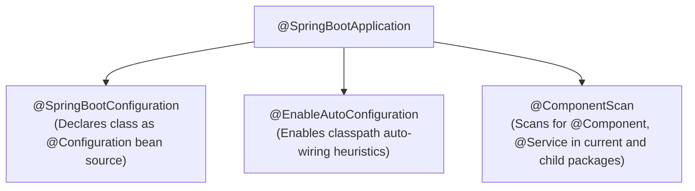
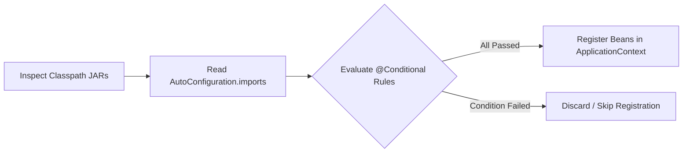

# Module 05: Spring Boot Deep Dive & Production Ready

> 🌐 **Language / ភាសា:** 🇬🇧 **[English](README.md)** | 🇰🇭 [ភាសាខ្មែរ (Khmer)](README.kh.md)  
> 🧭 **Navigation:** [← 04. Spring Core Architecture](../04-spring-framework-core-architecture/README.md) | [📚 Home](../README.md) | [Next: 06. SQL, Indexing & Spring Data JPA →](../06-sql-database-indexing-spring-data-jpa/README.md)

---

## Table of Contents

1. [Under the Hood of @SpringBootApplication](#1-under-the-hood-of-springbootapplication)
2. [Spring Boot Auto-Configuration Internal Mechanics](#2-spring-boot-auto-configuration-internal-mechanics)
3. [Spring Boot Starters & Bill of Materials (BOM)](#3-spring-boot-starters--bill-of-materials-bom)
4. [How Embedded Tomcat Boots (ServletWebServerFactory)](#4-how-embedded-tomcat-boots)
5. [Multi-Profile Management (Dev, UAT, Production)](#5-multi-profile-management)
6. [Spring Boot Actuator & Production Observability](#6-spring-boot-actuator--production-observability)
7. [Interviewer Traps: The Vulnerability of Unsecured Actuator Endpoints](#7-interviewer-traps-unsecured-actuator-endpoints)

---

## 1. Under the Hood of @SpringBootApplication

`@SpringBootApplication` is a composite meta-annotation encapsulating three primary directives:



1. **`@SpringBootConfiguration`:** Variant of `@Configuration` indicating the source of bean definitions.
2. **`@EnableAutoConfiguration`:** Activates auto-configuration by scanning classpath libraries.
3. **`@ComponentScan`:** Configures component scanning from the current package down the directory tree.

---

## 2. Spring Boot Auto-Configuration Internal Mechanics



### The 3-Step Lifecycle:
1. **Candidate Discovery:** In **Spring Boot 3.x**, candidates are read from `META-INF/spring/org.springframework.boot.autoconfigure.AutoConfiguration.imports`.
2. **Conditional Evaluation:** Candidates are filtered using **`@Conditional` annotations**:
   - `@ConditionalOnClass(DataSource.class)`: Evaluates to true only if the class exists on the runtime classpath.
   - `@ConditionalOnMissingBean(DataSource.class)`: Backs off if the application has explicitly declared a custom bean.
   - `@ConditionalOnProperty(prefix = "spring.cache", name = "type", havingValue = "redis")`
3. **Bean Registration:** If all conditions hold, the configuration executes and registers beans in the context.

---

## 3. Spring Boot Starters & Bill of Materials (BOM)

- **Starters:** Pre-packaged dependency descriptors aggregating compatible transitive dependencies (e.g., `spring-boot-starter-web` provides Tomcat, Jackson, Spring MVC, and validation).
- **BOM (Bill of Materials):** Controlled via `spring-boot-dependencies`. Developers omit `<version>` tags in `pom.xml`, eliminating dependency conflicts across libraries.

---

## 4. How Embedded Tomcat Boots

1. During bootstrap, Spring Boot initializes a `ServletWebServerApplicationContext`.
2. It detects a `TomcatServletWebServerFactory` bean on the classpath.
3. It instantiates an embedded Apache Tomcat instance programmatically, registers the `DispatcherServlet`, binds network ports (`server.port`), and starts the connector.
4. Applications package as self-contained executable JARs with embedded Tomcat:
   ```bash
   java -jar application.jar
   ```

---

## 5. Multi-Profile Management

```
resources/
├── application.yml         # Shared common properties
├── application-dev.yml     # Local database and debug loggers
├── application-uat.yml     # Staging configuration
└── application-prod.yml    # Hardened connection pools and secrets
```

### Production Profile Activation:
```bash
# Via standard container environment variable
export SPRING_PROFILES_ACTIVE=prod
java -jar application.jar
```

---

## 6. Spring Boot Actuator & Production Observability

```yaml
management:
  endpoints:
    web:
      exposure:
        include: health, info, metrics, prometheus
  endpoint:
    health:
      show-details: always
```

- `/actuator/health`: Provides liveness and readiness probes for Kubernetes orchestrators, testing database and cache connectivity.
- `/actuator/prometheus`: Formats JVM memory, garbage collection, and HTTP latency metrics for **Prometheus** scraping and **Grafana** visualization.

---

## 7. Interviewer Traps: Unsecured Actuator Endpoints

> **💡 Senior Technical Interview Question:**  
> *"What security risks arise if `/actuator/env` or `/actuator/heapdump` are exposed publicly in production?"*  
> **Accurate Response:**  
> Exposing sensitive actuator endpoints creates critical vulnerabilities:  
> - `/actuator/env` may expose unmasked environment variables, database credentials, and cloud API keys.  
> - `/actuator/heapdump` allows attackers to download full JVM heap dumps containing cached cleartext credentials, auth tokens, and personally identifiable information (PII).  
> **Mitigation:** Protect actuator endpoints behind Spring Security, isolate them on a separate administrative internal port (`management.server.port=9090`), and expose only `/health` and `/prometheus` externally.
