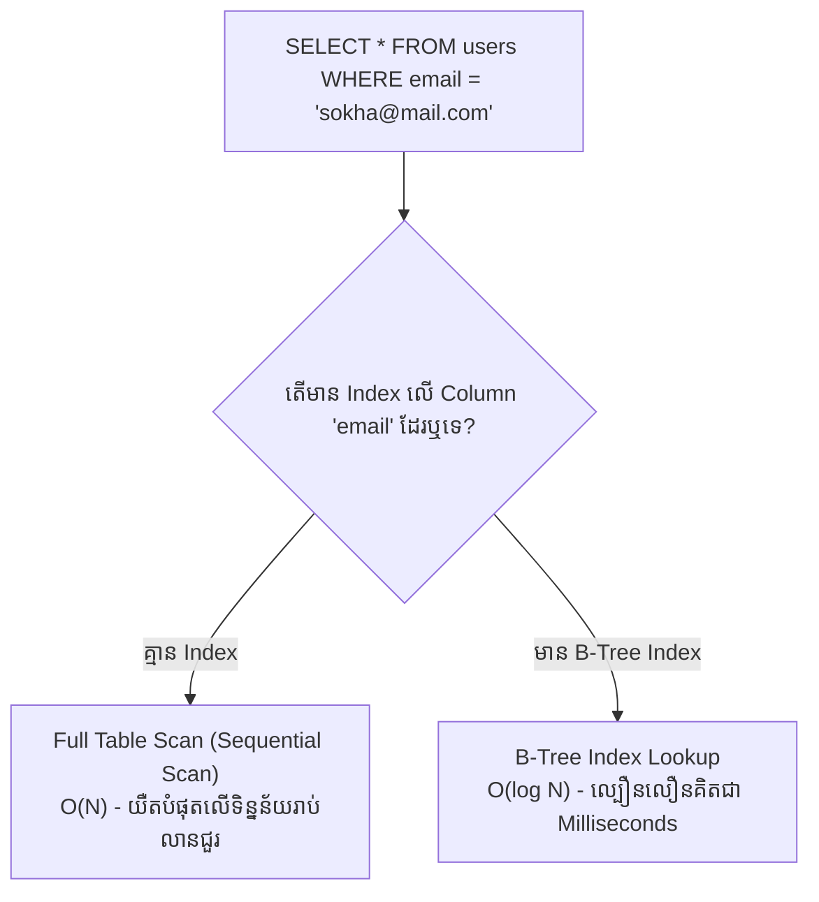
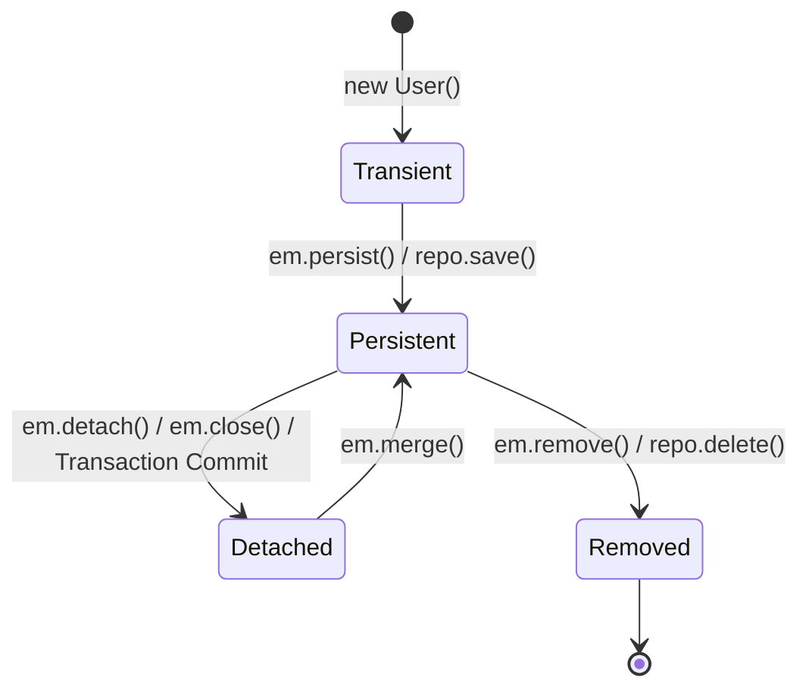
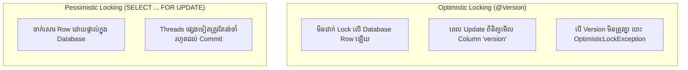

# Module 06: SQL, Database Indexing & Spring Data JPA (ខេមរភាសា) 🇰🇭

> 🌐 **ភាសា / Language:** 🇰🇭 **[ភាសាខ្មែរ (Khmer)](README.kh.md)** | 🇬🇧 [English](README.md)  
> 🧭 **រុករក:** [← 05. Spring Boot Deep Dive](../05-spring-boot-deep-dive-and-production/README.kh.md) | [📚 Home](../README.kh.md) | [បន្ទាប់: 07. Microservices & System Design →](../07-microservices-and-system-design-patterns/README.kh.md)

---

## មាតិកា (Table of Contents)

1. [Database Indexing៖ យន្តការ B-Tree Indexes និងច្បាប់ Leftmost Prefix](#១-database-indexing)
2. [ACID Properties និង Transaction Isolation Levels ទាំង ៤](#២-acid-properties-និង-isolation-levels)
3. [Spring @Transactional Propagation & Rollback Rules](#៣-spring-transactional-propagation)
4. [ស្ថានភាពទាំង ៤ នៃ Hibernate Entity Lifecycle & Caching Levels](#៤-hibernate-entity-lifecycle)
5. [បញ្ហាដ៏ល្បីល្បាញ៖ The N+1 Query Problem និងដំណោះស្រាយទាំង ៣](#៥-the-n1-query-problem)
6. [Optimistic Locking (@Version) vs Pessimistic Locking ក្នុងប្រព័ន្ធទូទាត់ប្រាក់](#៦-optimistic-vs-pessimistic-locking)
7. [អន្ទាក់អ្នកសម្ភាសន៍ (Interviewer Traps)](#៧-អន្ទាក់អ្នកសម្ភាសន៍-interviewer-traps)

---

## ១. Database Indexing



### ច្បាប់ Leftmost Prefix នៃ Composite Index:
ប្រសិនបើយើងបង្កើត Index រួមគ្នា `CREATE INDEX idx_user ON users(last_name, first_name)`៖
- `WHERE last_name = 'Chan' AND first_name = 'Dara'` ➡️ **ប្រើប្រាស់ Index ពេញលេញ**
- `WHERE last_name = 'Chan'` ➡️ **ប្រើប្រាស់ Index បាន**
- `WHERE first_name = 'Dara'` ➡️ **មិនដំណើរការ Index ឡើយ (Full Table Scan)** ពីព្រោះមិនបានចាប់ផ្តើមពី Column ខាងឆ្វេងបំផុត (Leftmost Prefix Rule)!

---

## ២. ACID Properties និង Isolation Levels

### គ្រោះថ្នាក់ទិន្នន័យពេលរត់ Concurrency៖
1. **Dirty Read:** Thread A អានទិន្នន័យដែល Thread B ទើបតែកែប្រែ ប៉ុន្តែមិនទាន់បាន Commit (បើ Thread B Rollback នោះទិន្នន័យក្លាយជាក្លែងក្លាយ)។
2. **Non-Repeatable Read:** Thread A អានជួរដេកមួយបានតម្លៃ X, ស្រាប់តែ Thread B ចូលមកកែប្រែជា Y រួច Commit ធ្វើឱ្យ Thread A អានជួរដដែលលើកទីពីរបានតម្លៃ Y ផ្សេងពីមុន។
3. **Phantom Read:** Thread A ធ្វើការ Query រាប់ចំនួនជួរដេកឃើញ ១០ ជួរ, ស្រាប់តែ Thread B Insert ជួរដេកថ្មី ១ ថែមទៀត ធ្វើឱ្យ Thread A Query លើកក្រោយឃើញ ១១ ជួរ។

| Isolation Level | Dirty Read | Non-Repeatable Read | Phantom Read | Performance |
| :--- | :---: | :---: | :---: | :---: |
| **READ UNCOMMITTED** | ⚠️ កើតមាន | ⚠️ កើតមាន | ⚠️ កើតមាន | លឿនបំផុត |
| **READ COMMITTED** *(PostgreSQL/Oracle Default)* | 🛡️ ទប់ស្កាត់ | ⚠️ កើតមាន | ⚠️ កើតមាន | ល្អមធ្យម |
| **REPEATABLE READ** *(MySQL InnoDB Default)* | 🛡️ ទប់ស្កាត់ | 🛡️ ទប់ស្កាត់ | 🛡️ ទប់ស្កាត់ (ដោយ MVCC) | មធ្យម |
| **SERIALIZABLE** | 🛡️ ទប់ស្កាត់ | 🛡️ ទប់ស្កាត់ | 🛡️ ទប់ស្កាត់ | យឺតបំផុត (Heavy Locks) |

---

## ៣. Spring @Transactional Propagation

```java
@Transactional(propagation = Propagation.REQUIRED, rollbackFor = Exception.class)
public void processOrder(OrderRequest request) { ... }
```

- **`REQUIRED` (Default):** បើមាន Transaction រួចហើយ វានឹងចូលរួមជាមួយគេ។ បើគ្មានទេ វានឹងបង្កើត Transaction ថ្មីមួយ។
- **`REQUIRES_NEW`:** ផ្អាក (Suspend) Transaction ចាស់ រួចបង្កើត Transaction ថ្មីដាច់ដោយឡែកមួយដែលឯករាជ្យទាំងស្រុង (ឧ. សម្រាប់ Audit Logging ទោះ Order បរាជ័យ ក៏ Audit Log នៅតែ Commit)។

> **💡 អន្ទាក់អ្នកសម្ភាសន៍ (Interviewer Trap):**  
> *"ហេតុអ្វីពេល Method បោះ `Exception` (Checked Exception) ស្រាប់តែ Spring `@Transactional` មិនព្រម Rollback ទិន្នន័យ?"*  
> **ចម្លើយត្រូវ៖** តាមលំនាំដើម (Default) Spring Rollback តែពេលជួប **`RuntimeException` (Unchecked Exceptions)** និង **`Error`** ប៉ុណ្ណោះ! ប្រសិនបើបោះ Checked Exception (ដូចជា `IOException`, `SQLException`), Spring នឹងនៅតែ Commit ធម្មតា!  
> **ដំណោះស្រាយ៖** ត្រូវតែបន្ថែម **`rollbackFor = Exception.class`** ជានិច្ច!

---

## ៤. Hibernate Entity Lifecycle



- **First-Level Cache (L1 Cache):** ស្ថិតនៅក្នុងកម្រិត Hibernate `Session` / `EntityManager` នីមួយៗ (Transactional Scope)។ បើ Query Object ដដែលក្នុង Transaction តែមួយ វាមិនហៅ SQL ទៅកាន់ DB លើកទីពីរឡើយ។

---

## ៥. The N+1 Query Problem

> **សំណួរពេញនិយមបំផុត៖** តើ N+1 Problem គឺជាអ្វី? ហេតុអ្វីបានជាកើតមាន?

ឧបមាថាយើងមាន Table `Author` (មាន ១០ នាក់) ហើយ Author ម្នាក់ៗមានសៀវភៅ `Book` ជាច្រើន (`@OneToMany`)៖
```java
List<Author> authors = authorRepository.findAll(); // បាញ់ SQL ១ ដង (Query 1)
for (Author author : authors) {
    System.out.println(author.getBooks().size()); // បាញ់ SQL N ដងទៀត! (N Queries)
}
// សរុប៖ 1 + 10 = 11 SQL Queries បាញ់ទៅកាន់ Database!
```

### ដំណោះស្រាយវិស្វកម្មទាំង ៣៖
1. **ដំណោះស្រាយទី ១ (JOIN FETCH ក្នុង JPQL):**
   ```java
   @Query("SELECT a FROM Author a JOIN FETCH a.books")
   List<Author> findAllAuthorsWithBooks(); // បាញ់ SQL តែម្តងគត់ជាមួយ SQL INNER/LEFT JOIN!
   ```
2. **ដំណោះស្រាយទី ២ (@EntityGraph):**
   ```java
   @EntityGraph(attributePaths = {"books"})
   List<Author> findAll();
   ```
3. **ដំណោះស្រាយទី ៣ (Batch Fetching):**
   ```yaml
   spring.jpa.properties.hibernate.default_batch_fetch_size: 20
   ```

---

## ៦. Optimistic vs Pessimistic Locking

ក្នុងប្រព័ន្ធធនាគារ ឬកាត់ស្តុក E-Commerce កាលណាមាន Users ពីរនាក់ព្យាយាមដកលុយ ឬទិញទំនិញក្នុងពេលតែមួយ (Race Condition)៖



```java
// ឧទាហរណ៍ Pessimistic Write Lock លើ Wallet ក្នុង Spring Data JPA
public interface WalletRepository extends JpaRepository<Wallet, Long> {
    
    @Lock(LockModeType.PESSIMISTIC_WRITE)
    @Query("SELECT w FROM Wallet w WHERE w.id = :id")
    Optional<Wallet> findByIdForUpdate(@Param("id") Long id);
}
```
