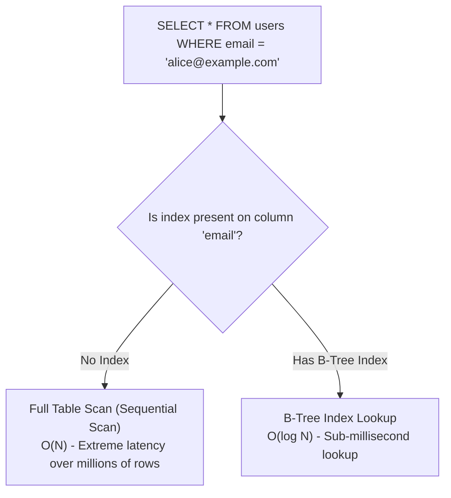
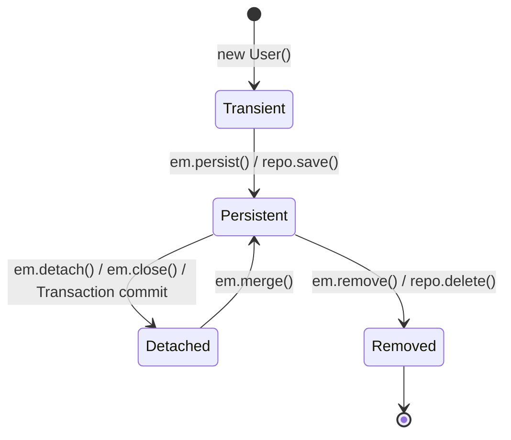
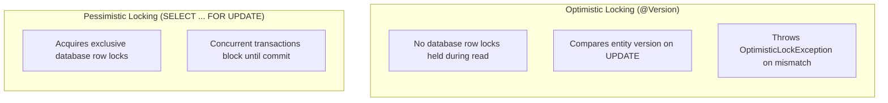

# Module 06: SQL, Database Indexing & Spring Data JPA

> 🌐 **Language / ភាសា:** 🇬🇧 **[English](README.md)** | 🇰🇭 [ភាសាខ្មែរ (Khmer)](README.kh.md)  
> 🧭 **Navigation:** [← 05. Spring Boot Deep Dive](../05-spring-boot-deep-dive-and-production/README.md) | [📚 Home](../README.md) | [Next: 07. Microservices & System Design →](../07-microservices-and-system-design-patterns/README.md)

---

## Table of Contents

1. [Database Indexing: B-Tree Indexes and the Leftmost Prefix Rule](#1-database-indexing)
2. [ACID Guarantees and Transaction Isolation Levels](#2-acid-guarantees-and-transaction-isolation-levels)
3. [Spring @Transactional Propagation & Rollback Rules](#3-spring-transactional-propagation--rollback-rules)
4. [Hibernate Entity Lifecycle States and L1/L2 Caching](#4-hibernate-entity-lifecycle-states)
5. [The N+1 Query Problem and the 3 Definitive Architectural Solutions](#5-the-n1-query-problem)
6. [Optimistic Locking (@Version) vs Pessimistic Locking in Financial Systems](#6-optimistic-locking-vs-pessimistic-locking)
7. [Interviewer Traps: Checked Exceptions Rollback Failure](#7-interviewer-traps-checked-exceptions-rollback)

---

## 1. Database Indexing



### The Leftmost Prefix Rule on Composite Indexes:
For an index defined as `CREATE INDEX idx_user ON users(last_name, first_name)`:
- `WHERE last_name = 'Smith' AND first_name = 'John'` ➡️ **Optimal index hit**
- `WHERE last_name = 'Smith'` ➡️ **Index hit**
- `WHERE first_name = 'John'` ➡️ **Index missed (Full table scan)** because the query violates the leftmost column prefix requirement.

---

## 2. ACID Guarantees and Transaction Isolation Levels

### Concurrency Anomalies:
1. **Dirty Read:** Reading uncommitted mutations from concurrent transactions.
2. **Non-Repeatable Read:** Re-reading the same row within a single transaction yields mutated values committed concurrently by another transaction.
3. **Phantom Read:** Re-executing a range query returns newly inserted rows committed concurrently by another transaction.

| Isolation Level | Dirty Reads | Non-Repeatable Reads | Phantom Reads | Performance |
| :--- | :---: | :---: | :---: | :---: |
| **READ UNCOMMITTED** | ⚠️ Permitted | ⚠️ Permitted | ⚠️ Permitted | Maximum |
| **READ COMMITTED** *(PostgreSQL/Oracle default)* | 🛡️ Prevented | ⚠️ Permitted | ⚠️ Permitted | High |
| **REPEATABLE READ** *(MySQL InnoDB default)* | 🛡️ Prevented | 🛡️ Prevented | 🛡️ Prevented (via MVCC) | Moderate |
| **SERIALIZABLE** | 🛡️ Prevented | 🛡️ Prevented | 🛡️ Prevented | Slowest (Heavy locking) |

---

## 3. Spring @Transactional Propagation & Rollback Rules

- **`REQUIRED` (Default):** Executes within an existing physical transaction or spawns a new transaction if none exists.
- **`REQUIRES_NEW`:** Suspends the outer transaction and initiates an autonomous physical transaction (ideal for audit logs and security telemetry).

---

## 4. Hibernate Entity Lifecycle States



- **First-Level Cache (L1 Cache):** Bound to the Hibernate `Session` / `EntityManager` lifecycle. Reading an identical entity within the same active transaction reuses the cached instance without emitting redundant SQL queries.

---

## 5. The N+1 Query Problem

Occurs when traversing lazy-loaded `@OneToMany` collections:
```java
List<Author> authors = authorRepository.findAll(); // 1 initial query retrieving 10 authors
for (Author author : authors) {
    System.out.println(author.getBooks().size()); // 10 secondary queries (N queries)
}
// Total: 1 + 10 = 11 separate round-trips to the database!
```

### The 3 Definitive Solutions:
1. **`JOIN FETCH` in JPQL:**
   ```java
   @Query("SELECT a FROM Author a JOIN FETCH a.books")
   List<Author> findAllAuthorsWithBooks();
   ```
2. **`@EntityGraph` Annotation:**
   ```java
   @EntityGraph(attributePaths = {"books"})
   List<Author> findAll();
   ```
3. **Batch Fetching via Hibernate Config:**
   ```yaml
   spring.jpa.properties.hibernate.default_batch_fetch_size: 20
   ```

---

## 6. Optimistic Locking vs Pessimistic Locking



```java
// Pessimistic write lock on user wallet
public interface WalletRepository extends JpaRepository<Wallet, Long> {
    
    @Lock(LockModeType.PESSIMISTIC_WRITE)
    @Query("SELECT w FROM Wallet w WHERE w.id = :id")
    Optional<Wallet> findByIdForUpdate(@Param("id") Long id);
}
```

---

## 7. Interviewer Traps: Checked Exceptions Rollback

> **💡 Senior Technical Interview Question:**  
> *"Why does Spring's `@Transactional` fail to roll back transactions when a checked exception (e.g., `IOException` or `SQLException`) is thrown?"*  
> **Accurate Response:**  
> By default, Spring transaction interceptors roll back transactions **only on unchecked exceptions** (`RuntimeException` and its subclasses) and JVM `Error`. If your code throws a checked exception, Spring commits the transaction unless explicitly configured with:  
> ```java
> @Transactional(rollbackFor = Exception.class)
> ```
