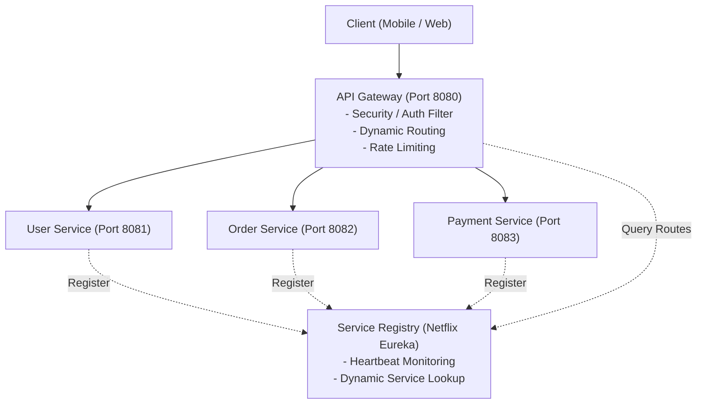
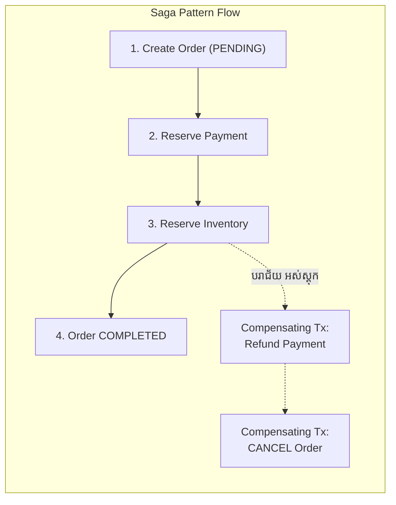
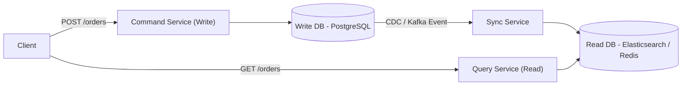
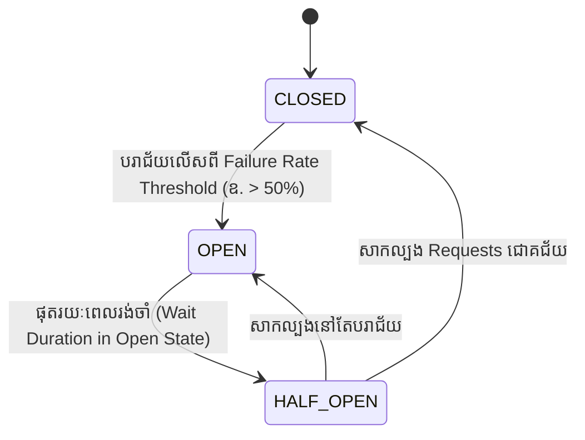

# Module 07: Microservices Architecture & System Design (ខេមរភាសា) 🇰🇭

> 🌐 **ភាសា / Language:** 🇰🇭 **[ភាសាខ្មែរ (Khmer)](README.kh.md)** | 🇬🇧 [English](README.md)  
> 🧭 **រុករក:** [← 06. SQL, Indexing & JPA](../06-sql-database-indexing-spring-data-jpa/README.kh.md) | [📚 Home](../README.kh.md) | [បន្ទាប់: 08. Event-Driven & Kafka →](../08-event-driven-architecture-and-kafka/README.kh.md)

---

## មាតិកា (Table of Contents)

1. [Monolith vs Microservices៖ ពេលណាគួរប្រើ និងពេលណាដែលមិនគួរប្រើ?](#១-monolith-vs-microservices)
2. [Service Discovery និង API Gateway ក្នុង Spring Cloud](#២-service-discovery-និង-api-gateway)
3. [Database-per-Service, CAP Theorem និងបញ្ហា Distributed Transactions](#៣-database-per-service-និង-cap-theorem)
4. [Saga Pattern៖ Choreography vs Orchestration (ការដោះស្រាយ Distributed Transactions)](#៤-saga-pattern)
5. [CQRS (Command Query Responsibility Segregation) & Event Sourcing](#៥-cqrs-pattern)
6. [Resilience4j Circuit Breaker៖ ស្ថានភាពទាំង ៣ (CLOSED, OPEN, HALF_OPEN)](#៦-resilience4j-circuit-breaker)
7. [អន្ទាក់អ្នកសម្ភាសន៍ (Interviewer Traps)](#៧-អន្ទាក់អ្នកសម្ភាសន៍-interviewer-traps)

---

## ១. Monolith vs Microservices

> **💡 សំណួរសម្ភាសន៍កម្រិត Lead Architect៖**  
> *"តើយើងគួរចាប់ផ្តើមគម្រោងថ្មីមួយដោយប្រើ Microservices ភ្លាមៗដែរឬទេ?"*  
> **ចម្លើយត្រូវ៖** **មិនគួរឡើយ (Martin Fowler's MonolithFirst Principle)!**  
> ការចាប់ផ្តើមជាមួយ Microservices លើប្រព័ន្ធថ្មីដែលមិនទាន់យល់ច្បាស់ពី Domain នឹងនាំឱ្យមាន **Distributed Monolith** (ប្រព័ន្ធដែលជាប់ជំពាក់គ្នាតាម Network តែគ្មានអត្ថប្រយោជន៍នៃភាពឯករាជ្យ)។ គោលការណ៍ត្រឹមត្រូវគឺ ចាប់ផ្តើមដោយ Monolith ដែលមាន Modular Architecture រឹងមាំ រួចបំបែកចេញជា Microservices តាម **Strangler Fig Pattern** នៅពេលប្រព័ន្ធធំ និងមានក្រុមការងារ (Team) ច្រើន។

---

## ២. Service Discovery & API Gateway

- **Eureka Server:** ដើរតួជាសៀវភៅទូរស័ព្ទ (Phonebook) ដែលកត់ត្រា IP និង Port នៃគ្រប់ Service instances។
- **Spring Cloud Gateway:** ដើរតួជាច្រកចេញចូលតែមួយគត់ ការពារសេវាខាងក្នុងមិនឱ្យប៉ះពាល់ផ្ទាល់ជាមួយពិភពខាងក្រៅ និងធ្វើការ Load Balancing ដោយស្វ័យប្រវត្តិ (`lb://ORDER-SERVICE`)។

---

## ៣. Database-per-Service និង CAP Theorem

- នៅក្នុង Microservices សេវាកម្មនីមួយៗ **ត្រូវតែមាន Database ផ្ទាល់ខ្លួនដាច់ដោយឡែក**។
- **CAP Theorem:** ក្នុងប្រព័ន្ធចែកចាយ (Distributed System) នៅពេលមានបញ្ហាដាច់បណ្តាញ (**Partition Tolerance - P**), យើងត្រូវតែជ្រើសរើសរវាង៖
  - **CP (Consistency & Partition Tolerance):** ធានាថាទិន្នន័យត្រឹមត្រូវ ១០០% ប៉ុន្តែអាចបដិសេធសំណើបើមិនទាន់ Sync ចប់ (ឧ. Banking Core)។
  - **AP (Availability & Partition Tolerance):** ធានាថាប្រព័ន្ធឆ្លើយតបជានិច្ច ទោះបីទិន្នន័យនៅសេវាខ្លះមិនទាន់ Sync ទាន់ភ្លាមៗក៏ដោយ (Eventual Consistency - ឧ. Social Media, Product Reviews)។

---

## ៤. Saga Pattern (Distributed Transactions)

នៅក្នុងប្រព័ន្ធ Microservices យើងមិនអាចប្រើ `@Transactional` ធម្មតាកាត់ Database ច្រើនបានឡើយ (Two-Phase Commit យឺត និងងាយជាប់ Deadlock)។ ដំណោះស្រាយគឺ **Saga Pattern**៖

### គំរូទាំង ២ នៃ Saga៖
1. **Choreography (ផ្អែកលើ Event តាម Kafka):**  
   - Order Service បង្កើត Order រួចបាញ់ Event `OrderCreated`។
   - Payment Service ស្តាប់ Event នោះ រួចកាត់លុយ ហើយបាញ់ Event `PaymentReceived`។
   - គុណសម្បត្តិ៖ Loose Coupling, គ្មាន Single Point of Failure។
2. **Orchestration (ផ្អែកលើអ្នកសម្របសម្រួលកណ្តាល):**  
   - មាន **Saga Orchestrator** មួយធ្វើជាមេបញ្ជាការ ប្រាប់សេវានីមួយៗឱ្យធ្វើការ និងបញ្ជាឱ្យធ្វើ **Compensating Transactions (Rollback)** ប្រសិនបើមានជំហានណាមួយបរាជ័យ។

---

## ៥. CQRS Pattern (Command Query Responsibility Segregation)

បំបែកប្រតិបត្តិការ **សរសេរ (Write/Mutate - Command)** ចេញពីប្រតិបត្តិការ **អាន (Read/Query)** ៖

---

## ៦. Resilience4j Circuit Breaker

Circuit Breaker ការពារកុំឱ្យ Service មួយដែលគាំង នាំឱ្យរលំដួលដល់ Service ផ្សេងៗទៀត (Cascading Outages)៖

- **CLOSED:** ដំណើរការធម្មតា គ្រប់ Requests ត្រូវបានបញ្ជូនទៅគោលដៅ។
- **OPEN:** កាត់ផ្តាច់ភ្លាមៗ — រាល់ Requests ត្រូវបានបង្វែរទៅកាន់ **Fallback Method** ដោយមិនបាច់រង់ចាំ Network Timeout ឡើយ!
- **HALF_OPEN:** អនុញ្ញាតឱ្យ Requests ចំនួនកំណត់មួយចំនួនតូចឆ្លងកាត់ ដើម្បីស្ទង់មើលថាតើសេវាគោលដៅរស់ឡើងវិញហើយឬនៅ។
