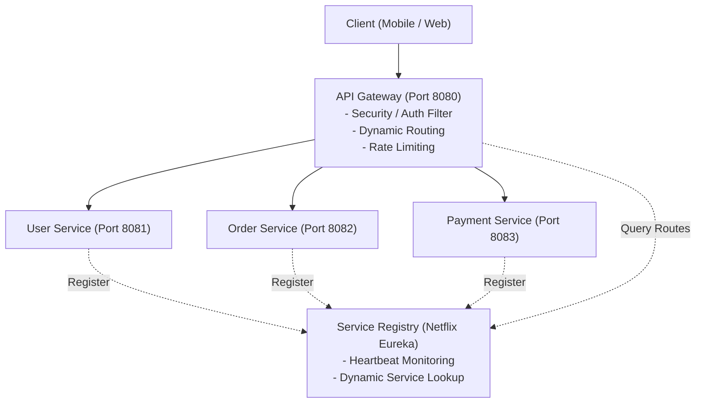
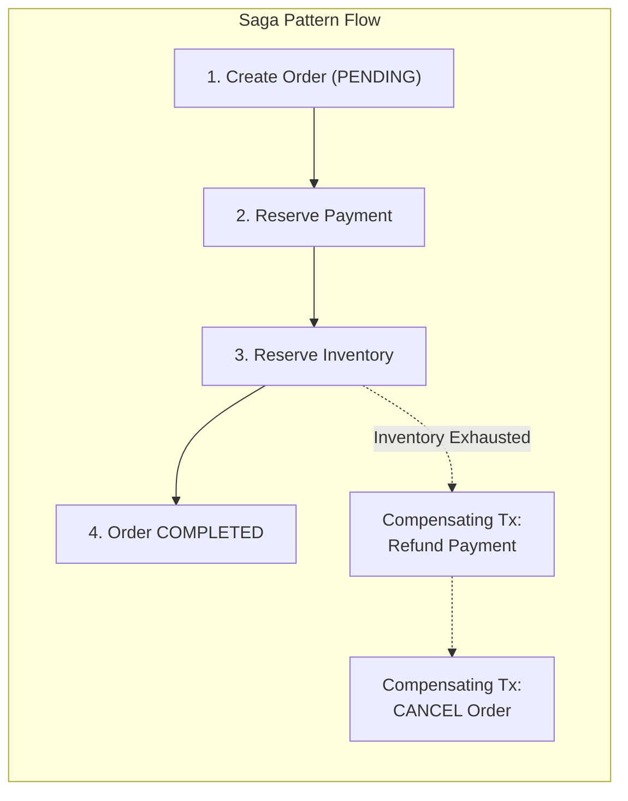
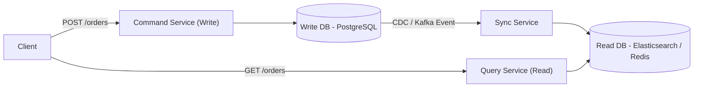
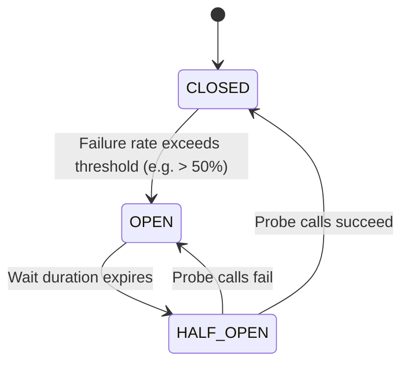

# Module 07: Microservices Architecture & System Design

> 🌐 **Language / ភាសា:** 🇬🇧 **[English](README.md)** | 🇰🇭 [ភាសាខ្មែរ (Khmer)](README.kh.md)  
> 🧭 **Navigation:** [← 06. SQL, Indexing & JPA](../06-sql-database-indexing-spring-data-jpa/README.md) | [📚 Home](../README.md) | [Next: 08. Event-Driven & Kafka →](../08-event-driven-architecture-and-kafka/README.md)

---

## Table of Contents

1. [Monolith vs Microservices: Architectural Pragmatism](#1-monolith-vs-microservices)
2. [Service Discovery and API Gateway in Spring Cloud](#2-service-discovery-and-api-gateway)
3. [Database-per-Service, CAP Theorem, and Data Consistency](#3-database-per-service-and-cap-theorem)
4. [The Saga Pattern: Choreography vs Orchestration](#4-the-saga-pattern)
5. [CQRS (Command Query Responsibility Segregation) & Event Sourcing](#5-cqrs-pattern)
6. [Resilience4j Circuit Breaker: State Transitions (CLOSED, OPEN, HALF_OPEN)](#6-resilience4j-circuit-breaker)
7. [Interviewer Traps: The Distributed Monolith Anti-pattern](#7-interviewer-traps-distributed-monolith)

---

## 1. Monolith vs Microservices

> **💡 Lead Architect Interview Question:**  
> *"Should we start greenfield systems as microservices from day one?"*  
> **Accurate Response:** **Almost never (Martin Fowler's MonolithFirst rule).**  
> Initiating a system with microservices before establishing domain boundaries frequently produces a **Distributed Monolith**—the operational overhead and network latency of distributed systems without any deployment autonomy. The recommended path is to design a cleanly modularized monolith and decompose it via the **Strangler Fig Pattern** as scaling requirements emerge.

---

## 2. Service Discovery & API Gateway

- **Netflix Eureka Server:** Dynamic registry tracking IP/port allocations and health heartbeats.
- **Spring Cloud Gateway:** Centralized edge routing, SSL termination, and client load-balancing (`lb://ORDER-SERVICE`).

---

## 3. Database-per-Service and CAP Theorem

- In microservices, services must strictly own their databases; cross-database joins are forbidden.
- **CAP Theorem:** In the presence of a network partition (**P**), distributed systems must trade off between:
  - **CP (Consistency):** Rejects requests if replication cannot be validated (e.g., Core Banking ledger).
  - **AP (Availability):** Accepts writes and serves reads, accepting **Eventual Consistency** across distributed state (e.g., E-Commerce catalog, user feeds).

---

## 4. The Saga Pattern

Two-Phase Commit (2PC) locks database tables and does not scale across microservices. The **Saga Pattern** coordinates distributed workflows through local transactions and **Compensating Transactions** on failure:

1. **Choreography (Event-Driven via Kafka):** Services react to domain events published by preceding services.
2. **Orchestration (Central Coordinator):** A dedicated Saga Orchestrator directs services via command/reply messaging and dispatches rollbacks upon exceptions.

---

## 5. CQRS Pattern

Separates write workloads (**Commands**) from read workloads (**Queries**):

---

## 6. Resilience4j Circuit Breaker

Prevents cascading service failures across microservice call chains:

- **CLOSED:** Standard operation; requests route normally.
- **OPEN:** Fast-fail state; downstream calls are immediately redirected to **Fallback methods** without blocking threads on network timeouts.
- **HALF_OPEN:** Permits a controlled number of trial executions to evaluate downstream recovery.
