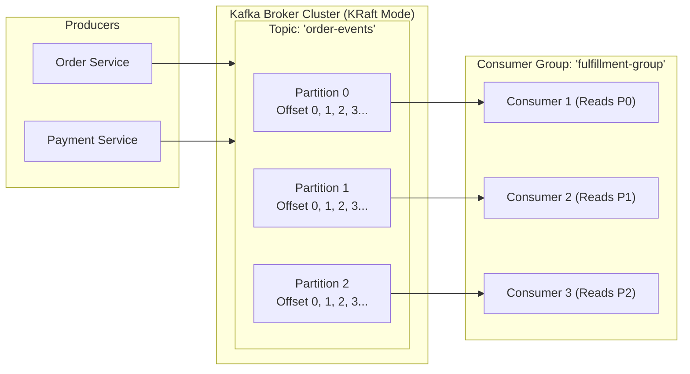

# Module 08: Event-Driven Architecture & Apache Kafka (ខេមរភាសា) 🇰🇭

> 🌐 **ភាសា / Language:** 🇰🇭 **[ភាសាខ្មែរ (Khmer)](README.kh.md)** | 🇬🇧 [English](README.md)  
> 🧭 **រុករក:** [← 07. Microservices & System Design](../07-microservices-and-system-design-patterns/README.kh.md) | [📚 Home](../README.kh.md) | [បន្ទាប់: 09. Spring Security, JWT & OAuth2 →](../09-spring-security-jwt-and-oauth2/README.kh.md)

---

## មាតិកា (Table of Contents)

1. [ស្ថាបត្យកម្ម Apache Kafka៖ Topics, Partitions, Offsets, និង KRaft](#១-ស្ថាបត្យកម្ម-apache-kafka)
2. [Consumer Groups និងយន្តការ Partition Assignment (ការ Scale)](#២-consumer-groups)
3. [ការធានានូវលំដាប់លំដោយសារ (Message Ordering Guarantee)](#៣-ការធានានូវលំដាប់លំដោយសារ)
4. [Delivery Semantics៖ At-least-once, At-most-once, និង Exactly-Once (EOS)](#៤-delivery-semantics)
5. [ការគ្រប់គ្រងកំហុសក្នុង Spring Kafka៖ Dead Letter Topic (DLT)](#៥-spring-kafka-error-handling--dlt)
6. [ការប្រៀបធៀប៖ Apache Kafka vs RabbitMQ](#៦-apache-kafka-vs-rabbitmq)
7. [អន្ទាក់អ្នកសម្ភាសន៍ (Interviewer Traps)](#៧-អន្ទាក់អ្នកសម្ភាសន៍-interviewer-traps)

---

## ១. ស្ថាបត្យកម្ម Apache Kafka

Apache Kafka គឺជា **Distributed Event Streaming Platform** ដែលត្រូវបានរចនាឡើងសម្រាប់ដំណើរការទិន្នន័យរាប់លាន Messages ក្នុងមួយវិនាទី ជាមួយ High Throughput និង Low Latency៖



- **Topic:** ជាឈ្មោះនៃបន្ទប់ទិន្នន័យ (Category/Feed Name) សម្រាប់ផ្ទុក Events។
- **Partition:** Topic មួយត្រូវបានបំបែកជា Partitions ច្រើន ដែលរត់ចែករំលែកគ្នានៅលើ Kafka Brokers ផ្សេងៗគ្នា (ជាគន្លឹះនៃ Horizontal Scalability)។
- **Offset:** លេខសម្គាល់លំដាប់លំដោយថេរនៃ Message នីមួយៗក្នុង Partition។
- **KRaft Mode:** ចាប់ពី Kafka 3.3 ឡើងទៅ Kafka បានដកចេញ **ZooKeeper** ទាំងស្រុង ហើយគ្រប់គ្រង Metadata ដោយខ្លួនឯងតាមរយៈក្បួនដោះស្រាយ **Raft Consensus**។

---

## ២. Consumer Groups

> **💡 សំណួរសម្ភាសន៍ស្នូល៖**  
> *"ប្រសិនបើយើងមាន Topic មួយដែលមាន ៣ Partitions ហើយយើងដាក់ Consumers ចំនួន ៥ នាក់ក្នុង Consumer Group តែមួយ តើមានអ្វីកើតឡើង?"*

- **ចម្លើយ៖**  
  - ក្នុង Consumer Group មួយ **Partition មួយអាចត្រូវបានអានដោយ Consumer តែម្នាក់គត់** ក្នុងពេលតែមួយ។
  - ដូច្នេះ Consumers ៣ នាក់ នឹងទទួលបន្ទុកអាន Partition ទាំង ៣។
  - រីឯ **Consumers ២ នាក់ទៀត នឹងស្ថិតក្នុងស្ថានភាពនៅស្ងៀម (Idle / Standby)**! ពួកវានឹងធ្វើការតែពេលដែល Consumer ណាមួយក្នុងចំណោម ៣ នាក់នោះគាំងដួល (Failover/Rebalance)។

---

## ៣. ការធានានូវលំដាប់លំដោយសារ (Message Ordering)

> **ច្បាប់ដែកថែបរបស់ Kafka៖**  
> **Kafka ធានានូវលំដាប់លំដោយនៃ Messages តែនៅក្នុងកម្រិត PARTITION តែមួយគត់ (Ordering is guaranteed ONLY within a partition)! គ្មានការធានាលំដាប់ឆ្លងកាត់ Partitions ខុសគ្នាឡើយ!**

### ដំណោះស្រាយក្នុងវិស្វកម្ម៖
ដើម្បីឱ្យ Events ទាំងអស់របស់ Order ដដែល (ឧ. `OrderCreated`, `OrderPaid`, `OrderDelivered`) រត់តាមលំដាប់លំដោយជានិច្ច យើងត្រូវកំណត់ **Message Key** (ឧ. `orderId`) ពេលផ្ញើ៖
```java
// Kafka ប្រើ Murmur2 Hash លើ Key: hash(orderId) % partition_count
// ធានាថាគ្រប់ Event ដែលមាន orderId ដូចគ្នា នឹងធ្លាក់ចូលទៅកាន់ Partition តែមួយជានិច្ច!
kafkaTemplate.send("order-events", order.getId().toString(), eventPayload);
```

---

## ៤. Delivery Semantics

1. **At-most-once:** Commit Offset មុនពេលដំណើរការទិន្នន័យ — មិនមានសារស្ទួនទេ ប៉ុន្តែអាចបាត់បង់ទិន្នន័យបើ Server រលំពេលកំពុងដំណើរការ។
2. **At-least-once (Default):** ដំណើរការទិន្នន័យរួចរាល់ ទើប Commit Offset — គ្មានការបាត់បង់ទិន្នន័យឡើយ ប៉ុន្តែអាចមានសារស្ទួន (Duplicate Messages) ពេល Network Timeout។  
   *(តម្រូវឱ្យ Consumer ត្រូវតែមាន **Idempotent Logic** ឧ. ពិនិត្យមើល UUID ក្នុង Database)*។
3. **Exactly-Once Semantics (EOS):**  
   - កំណត់ Producer: `enable.idempotence=true` (ការពារ Producer Retry មិនឱ្យស្ទួន)
   - ប្រើប្រាស់ Kafka Transactions (`transactional.id`): ធានាថា Read-Process-Write ដំណើរការក្នុង Transaction តែមួយ។

---

## ៥. Spring Kafka Error Handling & DLT

នៅពេល Consumer មិនអាចដំណើរការ Message បាន (ឧ. ដោយសារ Database Down ឬទិន្នន័យ Invalid), យើងប្រើប្រាស់ **Dead Letter Topic (DLT)** ដើម្បីកុំឱ្យស្ទះ Partition៖

```java
@Service
@Slf4j
public class OrderEventConsumer {

    // ព្យាយាម Retry ៣ ដងដោយមានចន្លោះពេល ១ វិនាទី បើនៅតែបរាជ័យ បញ្ជូនទៅ DLT ស្វ័យប្រវត្តិ!
    @RetryableTopic(
        attempts = "3",
        backoff = @Backoff(delay = 1000, multiplier = 2.0),
        dltStrategy = DltStrategy.FAIL_ON_ERROR
    )
    @KafkaListener(topics = "order-events", groupId = "order-fulfillment-group")
    public void consumeOrder(String orderPayload) {
        log.info("Processing order: {}", orderPayload);
        // បើបោះ Exception វានឹង Retry រួចទម្លាក់ចូល "order-events-dlt"
        orderService.fulfillOrder(orderPayload);
    }
}
```

---

## ៦. Apache Kafka vs RabbitMQ

| ចំណុចប្រៀបធៀប | Apache Kafka | RabbitMQ |
| :--- | :--- | :--- |
| **គំរូស្ថាបត្យកម្ម (Model)** | **Append-Only Distributed Commit Log (Pull)** | **Message Broker / Smart Broker, Dumb Consumer (Push)** |
| **ការរក្សាទុកទិន្នន័យ** | រក្សាទុកលើ Disk តាម Retention Period (ទោះអានរួចក៏នៅទុក) | សម្អាតចោលភ្លាមៗបន្ទាប់ពី Consumer បញ្ជាក់ (Ack) |
| **សមត្ថភាពចរាចរណ៍** | **លឿនមហិមា (High Throughput - រាប់លាន msgs/s)** | មធ្យម (រាប់សិបពាន់ msgs/s) |
| **Routing ស្មុគស្មាញ** | Topic & Partition Key ធម្មតា | **បត់បែនខ្លាំង (Exchange: Topic, Direct, Fanout, Headers)** |
| **ករណីប្រើប្រាស់ល្អបំផុត**| Event Sourcing, Log Aggregation, Real-time Stream Analytics | Complex task queueing, Request/Reply, Fine-grained routing |

---

## ៧. អន្ទាក់អ្នកសម្ភាសន៍ (Interviewer Traps)

> **💡 សំណួរសម្ភាសន៍កម្រិត Senior៖**  
> *"ហេតុអ្វីបានជា Apache Kafka មានល្បឿនលឿនខ្លាំងដល់ម្ល៉េះ (High Performance)? តើវាប្រើបច្ចេកវិទ្យាអ្វីនៅពីក្រោយ?"*  
> **ចម្លើយត្រូវ៖**  
> 1. **Sequential I/O (Disk):** Kafka សរសេរទិន្នន័យបន្តគ្នាក្នុង Log File (Append-only) ដែលល្បឿន Disk Sequential ស្មើនឹងល្បឿន Memory Random Access!
> 2. **Page Cache (OS Memory):** ប្រើប្រាស់ Cache របស់ Linux OS ដោយផ្ទាល់ ជៀសវាង JVM Garbage Collection Overhead។
> 3. **Zero-Copy Optimization:** ប្រើ Linux System Call `sendfile()` ដើម្បីបញ្ជូនទិន្នន័យពី Page Cache ទៅកាន់ Network Socket ដោយផ្ទាល់ **ដោយមិនបាច់ Copy ចូល User-space Memory របស់ JVM ឡើយ**!
