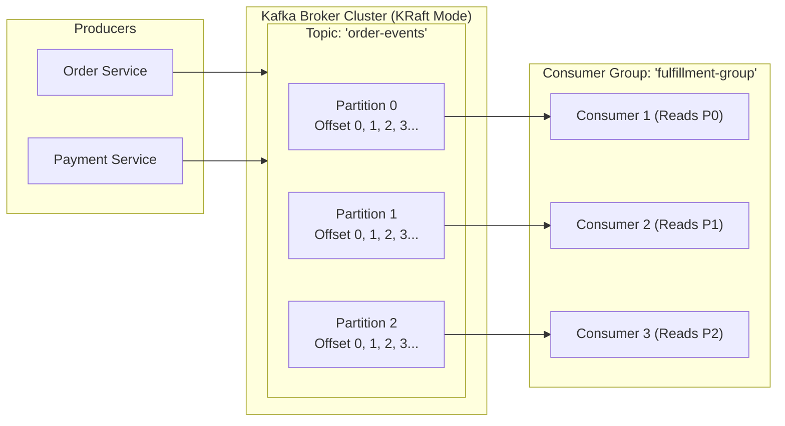

# Module 08: Event-Driven Architecture & Apache Kafka

> 🌐 **Language / ភាសា:** 🇬🇧 **[English](README.md)** | 🇰🇭 [ភាសាខ្មែរ (Khmer)](README.kh.md)  
> 🧭 **Navigation:** [← 07. Microservices & System Design](../07-microservices-and-system-design-patterns/README.md) | [📚 Home](../README.md) | [Next: 09. Spring Security, JWT & OAuth2 →](../09-spring-security-jwt-and-oauth2/README.md)

---

## Table of Contents

1. [Apache Kafka Core Architecture: Topics, Partitions, Offsets, and KRaft](#1-apache-kafka-core-architecture)
2. [Consumer Groups and Partition Assignment Mechanics](#2-consumer-groups-and-partition-assignment)
3. [Message Ordering Guarantees in Distributed Partitioning](#3-message-ordering-guarantees)
4. [Delivery Semantics: At-least-once, At-most-once, and Exactly-Once (EOS)](#4-delivery-semantics)
5. [Error Handling in Spring Kafka: Non-blocking Retries & Dead Letter Topics (DLT)](#5-error-handling-in-spring-kafka)
6. [Architectural Comparison: Apache Kafka vs RabbitMQ](#6-architectural-comparison-kafka-vs-rabbitmq)
7. [Interviewer Traps: Zero-Copy and Sequential I/O Performance Secrets](#7-interviewer-traps-zero-copy-performance)

---

## 1. Apache Kafka Core Architecture

Apache Kafka is a distributed event streaming platform architected for high-throughput, fault-tolerant ingestion:



- **Topic:** Logical channel categorization for messages.
- **Partition:** Parallel, ordered, immutable commit log spread across cluster brokers.
- **Offset:** Monotonically increasing sequence number assigned to each record within a partition.
- **KRaft Mode:** Modern Kafka replaces ZooKeeper with internal event-driven consensus via Raft metadata quorums.

---

## 2. Consumer Groups and Partition Assignment

> **💡 High-Frequency Interview Question:**  
> *"If a topic has 3 partitions and a consumer group contains 5 active consumer instances, what happens?"*  
> **Accurate Response:**  
> Within a consumer group, each partition is allocated to **strictly at most one consumer instance**. Thus, 3 consumers read from the 3 partitions, while the remaining **2 consumers remain idle**, serving as immediate hot-standbys for partition rebalancing if an active consumer fails.

---

## 3. Message Ordering Guarantees

> **The Inflexible Kafka Rule:**  
> **Ordering is guaranteed strictly within a single partition, never across multiple partitions of a topic.**

To guarantee ordering for a specific domain entity (e.g., all lifecycle events for an `orderId`), assign the entity identifier as the **Kafka Record Key**:
```java
// Default partitioner applies Murmur2 hash over the key:
// hash(orderId) % partitionCount -> guarantees identical partition mapping
kafkaTemplate.send("order-events", order.getId().toString(), orderEventPayload);
```

---

## 4. Delivery Semantics

1. **At-most-once:** Offsets commit before payload processing; prevents duplicate deliveries, but records are lost during unexpected worker crashes.
2. **At-least-once (Default):** Offsets commit after processing succeeds; prevents data loss, but duplicate deliveries can occur on network timeouts (requires consumer **Idempotency**).
3. **Exactly-Once Semantics (EOS):** Combines idempotent producer deduplication (`enable.idempotence=true`) with transactional producer boundaries spanning atomic read-process-write loops.

---

## 5. Error Handling in Spring Kafka

Prevent head-of-line partition blocking using Spring Kafka's non-blocking retries and dead-letter topics:

```java
@Service
@Slf4j
public class OrderEventConsumer {

    @RetryableTopic(
        attempts = "3",
        backoff = @Backoff(delay = 1000, multiplier = 2.0),
        dltStrategy = DltStrategy.FAIL_ON_ERROR
    )
    @KafkaListener(topics = "order-events", groupId = "order-fulfillment-group")
    public void consumeOrder(String orderPayload) {
        log.info("Processing order payload: {}", orderPayload);
        orderService.fulfillOrder(orderPayload);
    }
}
```

---

## 6. Architectural Comparison: Kafka vs RabbitMQ

| Dimension | Apache Kafka | RabbitMQ |
| :--- | :--- | :--- |
| **Model** | **Distributed append-only commit log (Pull-based)** | **Message Broker (Push-based smart broker)** |
| **Persistence** | Immutable log retained on disk across configured retention | Messages deleted immediately after consumer acknowledgment |
| **Throughput** | **Millions of messages/sec** | Tens of thousands of messages/sec |
| **Routing** | Partition keys only | Complex exchange routing (Direct, Topic, Fanout, Headers) |
| **Best For** | Event streaming, CDC, replayable event sourcing | Complex task queues, RPC patterns, fine-grained routing |

---

## 7. Interviewer Traps: Zero-Copy Performance

> **💡 Senior Technical Interview Question:**  
> *"Why is Kafka significantly faster than traditional message brokers?"*  
> **Accurate Response:**  
> 1. **Sequential Disk I/O:** Kafka structures topics as append-only logs, matching memory random-access speeds.
> 2. **OS Page Cache:** Relies on kernel page cache instead of Java heap memory, eliminating garbage collection pauses.
> 3. **Zero-Copy Architecture:** Employs the Linux `sendfile()` system call to stream data straight from page cache to network socket buffers without copying bytes into JVM user-space memory.
